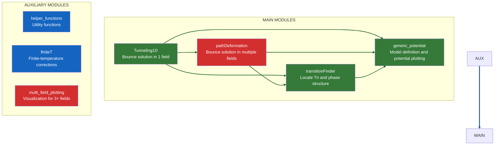
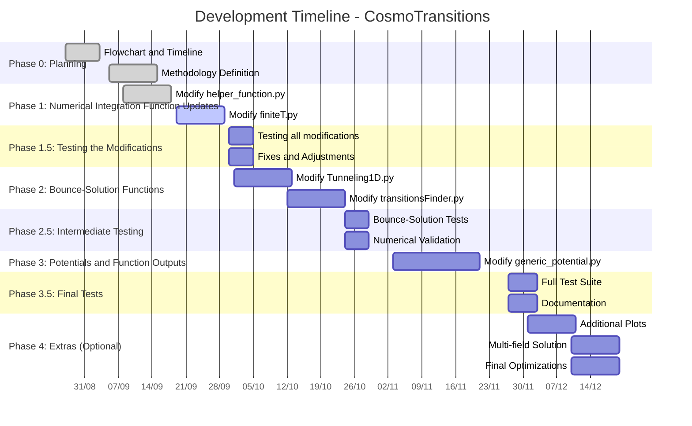
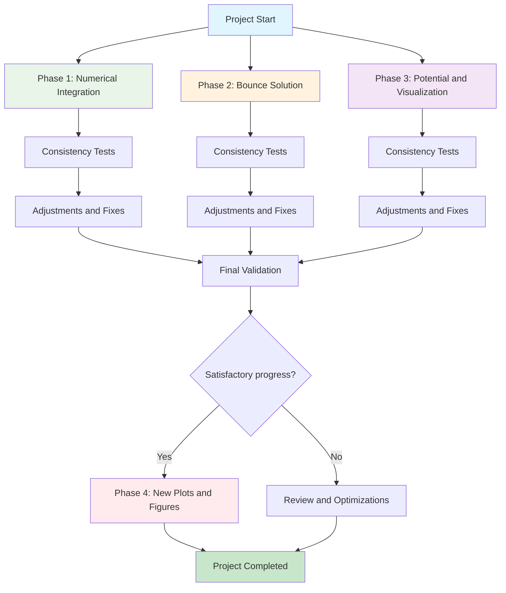

# GW_FOPT_Simulation

With the emergence and rapid development of gravitational waves (GW's) detectors such as LIGO, LISA, Einstein Telescope [e.g., Virgo, KAGRA, Cosmic Explorer], studies of GW's generation mechanisms and sources have become essential and quite “hot” in the field of physics over the last few years. Cosmology is, of course, part of this effort. One of the mechanisms that has received growing attention is the production of GW's from first-order phase transitions (FOPTs). This mechanism can generate a cosmological stochastic background of GW's which, if detected, can probe the scalar sector and high energy scales still inaccessible to terrestrial colliders, offering insights into the early-universe dynamics, and provide a way to test theories beyond the Standard Model (that make FOPTs).

However, FOPTs face a central challenge: starting from a model’s effective potential, one must find bounce solutions and the thermodynamic parameters that characterize the phase transition in order to finally predict the gravitational wave spectrum, its peak frequencies, and other properties. This requires robust numerical codes to simulate the theory and obtain reliable results, so that we can assess detectability and frequency bands of the GWs.

Today, several codes are used in the literature toward this goal: AnyBubble, BubbleProfiles, FindBounce, and others—mostly written in C++. Notably, there is also **CosmoTransitions**, written in Python.

Because it is simple, open, and implemented in a widely used language, CosmoTransitions remains a common choice in the literature, even though its author, Carroll L. Wainwright, left the field and the code dates back to 2011 (i.e., it is no longer up to date).[Original repo: GitHub:https://github.com/clwainwright/CosmoTransitions]

Recognizing the code’s relevance to the community, and to my Master’s project on FOPTs, I, Igor Almeida da Silva Gouvêa Stellet, together with my advisor, Felipe Tovar Falciano, set out to update it to a modern Python version (3.13), improving its syntax, indentation, and incode explanations across modules. Most importantly, I am adding examples and plots for every function in each module, as a new layer of consistency checks that did not exist in the original version. I am also adding clearer error handling in functions, so users can more easily diagnose where something “breaks.” Thanks to the previous author's work in making an already very good code, I have the possibility to improve it now with a lot of details.

The goal is not only to improve my programming skills, but also my academic and professional development, my GitHub presence, the preparation for my own Master’s research, and, above all that, to share with the community a widely used code in a more modern form that can serve as a foundation for future research and researchers (even though C/C++ codes will often remain more performant).

Therefore, this project aims to deliver substantial improvements to the original code, making it more optimized, modern, and intuitive, with modules, docstrings, and functions better explained and documented, and with example-based tests to build intuition. I am also adding more explicit error signals in each function. Below you will find the overall plan and organization of the project.

📅 Schedule & Approach: The project’s timeline and flowchart are presented below. The main idea is to split this long task into three primary phases, each lasting up to one month, while running consistency tests throughout development and after finishing each phase. Each phase follows the cycle: Modification → Testing → Fixes → Validation.

The first phase aims to update CosmoTransition's auxiliary modules, which are called by the main modules. The second phase, the codes that find the bounce solution and the thermodynamic parameters (two main modules). Finally, the third and final phase aims to modify the functions that create the generic potential and the plots generated given the initial parameters. Everything will be done for the 1D part for now; the 2D part will remain as before.

Depending on the progress of the project, a fourth phase will be carried out to add new plots and graphs to the code, as well as update the part that calculates multiple fields.

## Flowchart of the modules

### 📦 Main Modules
| Module                                                  | Description                                                          | Methods/Functionality                                                                                                                                                                                                     |
| :------------------------------------------------------ | :------------------------------------------------------------------- | :------------------------------------------------------------------------------------------------------------------------------------------------------------------------------------------------------------------------ |
| **Tunneling1D**        | Computes the bounce (instanton) solution for a single scalar field.  | Uses the **overshooting/undershooting** method to solve the Euclidean equation of motion and find the tunneling profile.                                                                                                  |
| **pathDeformation**      | Computes instantons for multiple scalar fields.                      | First finds a 1D solution constrained to an initial path in field space. Then **iteratively deforms** this path until transverse forces vanish, yielding the correct multi-dimensional solution.                          |
| **transitionFinder**   | Computes the phase structure of the potential at finite temperature. | Locates potential minima as a function of temperature, determines **critical temperatures** (degenerate vacua), and computes the **nucleation temperature** for phase transitions.                                        |
| **generic\_potential** | Abstract class that defines the physical model of interest.          | The user provides a subclass implementing the specific effective potential $V(\phi, T)$. Also provides methods to **plot the potential** and visualize its phase structure (**I still don’t understand this very well**). |

### 🔧 Auxiliary Modules
| Module                                                    | Description                                                         | Purpose                                                                                                                      |
| :-------------------------------------------------------- | :------------------------------------------------------------------ | :--------------------------------------------------------------------------------------------------------------------------- |
| **helper\_functions**                                     | A set of numerical utility functions.                               | Provides helper operations (e.g., numerical integration, interpolation, numerical differentiation) used by the main modules. |
| **finiteT**                                               | Computes finite-temperature corrections to the effective potential. | Implements the temperature-dependent partition-function terms (bosonic and fermionic loops). Used by `generic_potential`.    |
| **multi\_field\_plotting** | Visualization class for potentials with 3+ fields.                  | Tools for producing plots and visualizations of the high-dimensional effective potential.                                    |

### 📖 Documentation & Recommended Reading (pre-modifications)
Before modifying any module, consult the official documentation and/or the original paper to understand the algorithms:

* **Official Documentation:**[https://clwainwright.net/CosmoTransitions/index.html](https://clwainwright.net/CosmoTransitions/index.html)
* **Original Paper (arXiv):** [arXiv:1109.4189](https://arxiv.org/abs/1109.4189)
* **Computer Physics Communications:** [10.1016/j.cpc.2012.04.004](https://doi.org/10.1016/j.cpc.2012.04.004

## Project Timeline

- [x] **Phase 0**: Planning and first meeting 
  - Create dependency flowchart 
  - Create refactoring schedule 

- [ ] **Phase 1**: Numrical core (auxiliary functions) 
  - Refactor `helper_functions.py` 
  - Refactor `finiteT.py`

- [ ] **Phase 1.5**: Modification tests 
  - Validate isolated functions with simple analytic examples  
  - exercise error paths and validations

- [ ] **Phase 2**: Bounce solution and transition parameters 
  - Refactor `tunneling1D.py`  
  - Improve `transitionFinder.py` (more efficiente search algorithms)  

- [ ] **Phase 2.5**: Intermediate tests  
  - Reproduce example results (`fullTunneling.py`)  
  - Compare critical actions with the legacy version 

- [ ] **Phase 3**: Potential and outputs  
  - Modernize `generic_potential.py` 
  - Update plotting, add energy density and other figures useful for paper/thesis

- [ ] **Phase 3.5**: Final tests
  - Run all examples and validate cosistency 
  - Create notebooks replacing scripts

- [ ] **Phase 4** *(optional)*: Extensions
  - New plot types (e.g., direct GW spectrum, GW energy density vs T, etc.) 
  - Modernize multi-field plotting codes `mult_field_plotting.py` and `path_deformation.py`

