# GW_FOPT_Simulation
Project to simulate the thermodynamic parameters of the phase transition and calculate the spectrum of gravitational waves given an effective potential

A ideia do projeto é atualizar e modificar o **CosmoTransitions** que, por mais que seja um código amplamente utilizado na literatura para transições de fase cosmológicas, está desatulizado por ter sido desenvolvido há bastante tempo. 

Desse modo, o projeto visa realizar melhorias significativas no código, tornando-o mais otimizado, moderno e intuitivo, alinhado-o com os pacotes existentes atuais para python. 

📅 Cronograma e Abordagem: O cronograma e fluxograma do projeto se encontram abaixo. A ideia central é dividir essa tarefa em 3 partes principais, cada uma com duração de 1 mês, realizando testes de consistência ao longo de todo o desenvolvimento, ao finalizar as modificações. Cada fase seguirá o ciclo: Modificação → Testes → Correção → Validação

A primeira fase visa atualizar os códigos de integração numérica. A segunda fase os códigos que encontram a solução de bounce. Por fim, a terceira e última fase visa modificar as funções que criam o potencial genérico e os plots feitos dado os parâmetros iniciais.

Dependendo do andamento do projeto será feito uma quarta fase visando acrescentar novos plots e gráficos ao código.

Há ainda alguns problemas em aberto em relação a como fazer os testes, eles se encontram no final da página.

## Flowchart of the modules

```mermaid
graph TD
    %% ========== MÓDULOS PRINCIPAIS ==========
    subgraph "MÓDULOS PRINCIPAIS"
        A["📦__init__.py"<br/>Inicialização do pacote] --> B[📦helper_functions.py<br/>Funções numéricas auxiliares]
        A --> C[📦finiteT.py<br/>Correções de temperatura finita para o potencial]
        A --> D[📦generic_potential.py<br/>Classe para definir um modelo de potencial]
        A --> E[📦multi_field_plotting.py<br/>Plotting para múltiplos campos]
        A --> F[📦transitionFinder.py<br/>Localiza Temperaturas críticas e parâmetros da transição]
        A --> G[📦Tunneling1D.py<br/>Solução de bounce em 1 campo]
        
        B --> C
        B --> F
        B --> G
        C --> F
        D --> F
        D --> G
        F --> E
        G --> F
    end

    subgraph "Pasta de Exemplos"
        H[📦__init__.py<br/>Inicialização] --> I[fulltunneling.py<br/>Exemplo completo tunneling]
        H --> J[📦testemodel1.py<br/>Teste do modelo 1]
        
        I -.-> F
        I -.-> G
        J -.-> D
        J -.-> F
    end

    %% ========== ESTILOS ==========
    style A fill:#ffebee
    style B fill:#e3f2fd
    style C fill:#e8f5e8
    style D fill:#fff3e0
    style E fill:#f3e5f5
    style F fill:#e0f2f1
    style G fill:#fff8e1
    style H fill:#f1f8e9
    style I fill:#e8eaf6
    style J fill:#ffebee
    
    linkStyle 0 stroke:#b71c1c,stroke-width:2px
    linkStyle 1 stroke:#0d47a1,stroke-width:2px
    linkStyle 2 stroke:#1b5e20,stroke-width:2px
    linkStyle 3 stroke:#e65100,stroke-width:2px
    linkStyle 4 stroke:#4a148c,stroke-width:2px
    linkStyle 5 stroke:#006064,stroke-width:2px
    linkStyle 6 stroke:#ff6f00,stroke-width:2px
    linkStyle 7 stroke:#33691e,stroke-width:2px
    linkStyle 8 stroke:#1a237e,stroke-width:2px
    linkStyle 9 stroke:#b71c1c,stroke-width:2px
    linkStyle 10 stroke:#795548,stroke-width:2px
```

## Cronograma do Projeto

```mermaid
gantt
    title Cronograma de Desenvolvimento - CosmoTransitions
    dateFormat  YYYY-MM-DD
    axisFormat  %d/%m
    
    section Fase 0: Planejamento
    Fluxograma e Cronograma          :done, 2025-08-27, 7d
    Definição de Metodologias        :active, 2025-09-05, 3d
    
    section Fase 1: Modificação de Funções de Integração Numérica
    Modificação helper_function.py            :2025-09-08, 10d
    Modificação finiteT.py           :2025-09-19, 10d
    
    section Fase 1.5: Testes das Modificações
    Testes Integração Numérica       :2025-09-30, 5d
    Correções e Ajustes              :2025-09-30, 5d
    
    section Fase 2: Modificação das Funções de Soluções Bounce
    Modificação Tunneling1D.py       :2025-10-01, 12d
    Modificação transitionsFinder.py :2025-10-12, 12d
    
    section Fase 2.5: Testes das Modificações
    Testes Soluções Bounce           :2025-10-24, 5d
    Validação Numérica               :2025-10-24, 5d
    
    section Fase 3: Modificação dos Potenciais e Saídas das funções
    Modificação generic_potential.py           :2025-11-03, 12d
    Melhorias multi_field_plotting.py  :2025-11-15, 12d
    
    section Fase 3.5: Testes Finais
    Testes Completos                 :2025-11-27, 5d
    Documentação                     :2025-11-27, 5d
    
    section Fase 4: Extras (Opcional)
    Plots Adicionais                 :2025-12-01, 10d
    Otimizações Finais               :2025-12-10, 10d
```

- [x] **Fase 0**: Planejamento e Primeira reunião 
  - Criar fluxograma de dependências  
  - Criar cronograma de refatoração  

- [ ] **Fase 1**: Núcleo numérico  
  - Refatorar `helper_functions.py` (usar SciPy para integrais e raízes)  
  - Vetorizar `finiteT.py` (substituir loops por NumPy)  

- [ ] **Fase 1.5**: Testes de Modificações  
  - Validar funções isoladas com exemplos analíticos simples  
  - Comparar saídas numéricas com versão original  

- [ ] **Fase 2**: Solução do bounce e parâmetros de transição  
  - Refatorar `tunneling1D.py` (usar `scipy.solve_ivp` no solver ODE)  
  - Melhorar `transitionFinder.py` (algoritmos de busca mais eficientes)  

- [ ] **Fase 2.5**: Testes intermediários  
  - Reproduzir resultados dos exemplos (`fullTunneling.py`)  
  - Comparar ações críticas com versão antiga  

- [ ] **Fase 3**: Potencial e saídas  
  - Modernizar `generic_potential.py` (usar `abc.ABC` para interface clara)  
  - Atualizar `multiFieldPlotting.py` com matplotlib atual  

- [ ] **Fase 3.5**: Testes finais  
  - Rodar todos os exemplos e validar consistência  
  - Criar notebooks substituindo scripts  

- [ ] **Fase 4** *(opcional)*: Extensões
  - Novos tipos de plots (ex.: espectro GW direto, densidade de GW no espaço para diferentes T e outros)  
  - Interface `PhaseTransitionSolver` unificada

**Problemas ainda em aberto:** Decidir como será testado as modificações, i.e, como iremos comparar o antigo código com o novo que estamos fazendo e termos um teste de consistência. Ideia inicial é:
  - Teste 1: Dentro da própria módulo modificado fazer um teste simples que chamem a função e deem um resultado comparativo de antes e depois do seu output
  - Teste 2: Testar o exemplo de modelo simples, do próprio cosmotransitions
  - Teste 3: Comparar gráficos da forma do potencial antes e depois da modificação e observar as alterações. Possivelmente testar modelos conhecidos como o do próprio artigo do Glauber.

```mermaid
graph TD
    Start[Início do Projeto] --> Phase1[Fase 1: Integração Numérica]
    Start --> Phase2[Fase 2: Solução Bounce]
    Start --> Phase3[Fase 3: Potencial e Visualização]
    
    Phase1 --> Test1[Testes de Consistência]
    Phase2 --> Test2[Testes de Consistência]
    Phase3 --> Test3[Testes de Consistência]
    
    Test1 --> Adjust1[Ajustes e Correções]
    Test2 --> Adjust2[Ajustes e Correções]
    Test3 --> Adjust3[Ajustes e Correções]
    
    Adjust1 --> FinalValidation[Validação Final]
    Adjust2 --> FinalValidation
    Adjust3 --> FinalValidation
    
    FinalValidation --> Decision{Andamento Satisfatório?}
    
    Decision -- Sim --> Phase4[Fase 4: Novos Plots e Gráficos]
    Decision -- Não --> Review[Revisão e Otimizações]
    
    Phase4 --> ProjectEnd[Projeto Concluído]
    Review --> ProjectEnd

    style Start fill:#e1f5fe
    style Phase1 fill:#e8f5e8
    style Phase2 fill:#fff3e0
    style Phase3 fill:#f3e5f5
    style Phase4 fill:#ffebee
    style ProjectEnd fill:#c8e6c9
```

