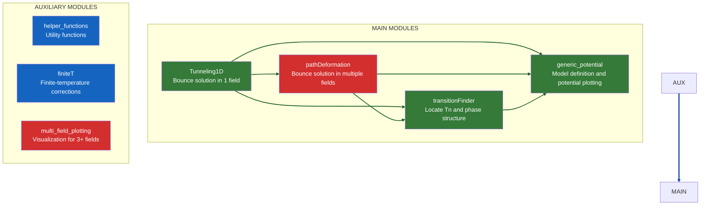

## Flowchart of the modules

### 📦 Main Modules
| Module                                                  | Description                                                          | Methods/Functionality                                                                                                                                                                                                     |
| :------------------------------------------------------ | :------------------------------------------------------------------- | :------------------------------------------------------------------------------------------------------------------------------------------------------------------------------------------------------------------------ |
| **Tunneling1D**        | Computes the bounce (instanton) solution for a single scalar field.  | Uses the **overshooting/undershooting** method to solve the Euclidean equation of motion and find the tunneling profile.                                                                                                  |
| **pathDeformation**      | Computes instantons for multiple scalar fields.                      | First finds a 1D solution constrained to an initial path in field space. Then **iteratively deforms** this path until transverse forces vanish, yielding the correct multi-dimensional solution.                          |
| **transitionFinder**   | Computes the phase structure of the potential at finite temperature. | Locates potential minima as a function of temperature, determines **critical temperatures** (degenerate vacua), and computes the **nucleation temperature** for phase transitions.                                        |
| **generic\_potential** | Abstract class that defines the physical model of interest.          | The user provides a subclass implementing the specific effective potential $V(\phi, T)$. Also provides methods to **plot the potential** and visualize its phase structure (**I still don’t understand this very well**). |

### 🔧 Auxiliary Modules
| Module                                                    | Description                                                         | Purpose                                                                                                                      |
| :-------------------------------------------------------- | :------------------------------------------------------------------ | :--------------------------------------------------------------------------------------------------------------------------- |
| **helper\_functions**                                     | A set of numerical utility functions.                               | Provides helper operations (e.g., numerical integration, interpolation, numerical differentiation) used by the main modules. |
| **finiteT**                                               | Computes finite-temperature corrections to the effective potential. | Implements the temperature-dependent partition-function terms (bosonic and fermionic loops). Used by `generic_potential`.    |
| **multi\_field\_plotting** | Visualization class for potentials with 3+ fields.                  | Tools for producing plots and visualizations of the high-dimensional effective potential.                                    |
