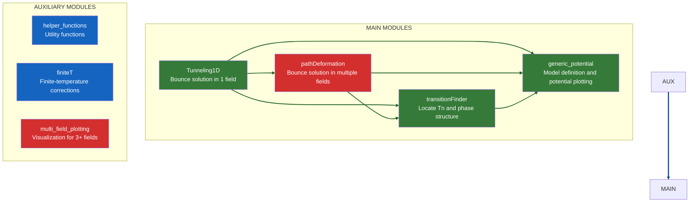

# Architecture & Module Flow
This page summarizes how modules relate and call each other during typical workflows.

> See also: per-module pages under **Docs → [Modules](modules)**.

---
## Flowchart of the modules

---

## 📦 Main Modules
| Module                 | Description                                   | Methods & Functionality                                                                            | Links                                                                                     |
| :--------------------- | :-------------------------------------------- | :---------------------------------------------------------------------------------------------------- | :---------------------------------------------------------------------------------------- |
| **Tunneling1D**        | Computes bounce (instanton) solution for a single scalar field. | Uses the **overshoot/undershoot** method to solve the Euclidean equation of motion and find the tunneling profile               | [Module page](modules/tunneling1D/tunneling1D.md)                                                     |
| **pathDeformation**    | Computes instantons for multiple scalar fields.  | First finds a 1D solution constrained to an initial path in field space. Then iteratively deforms this path until transverse forces vanish, yielding the correct multi-dimensional solution.                    | Module page - None |
| **transitionFinder** | Computes the phase structure of the potential at finite temperature. |Locates potential minima as a function of temperature, determines critical temperatures (degenerate vacua), and computes the nucleation temperature for phase transitions | [Module page](modules/transitionFinder/transitionFinder.md)                                               |
| **generic\_potential** | Abstract class that defines the physical model of interest.       | The user provides a subclass implementing the specific effective potential $V(\phi, T)$. Also provides methods to **plot the potential** and visualize its phase structure.   | [Module page](modules/generic_potential/generic_potential.md)                                               |

---
## 🔧 Auxiliary Modules
| Module                     | Description                                                                         | Purpose                                               | Links                                   |
| :------------------------- | :---------------------------------------------------------------------------------- | :--------------------------------------------------------------- |:----------------------------------------|
| **helper\_functions**      | Numerical utilities (e.g., numerical integration, interpolation, numerical differentiation). | Called by **all** core modules.                                  | [Module page](modules/helper_functions) |
| **finiteT**                | Finite-temperature effective-potential corrections (boson/fermion thermal pieces).  | Feeds **generic\_potential** and **transition\_finder**.         | [Module page](modules/finiteT)          |
| **multi\_field\_plotting** | Visualization helpers for 3+ field landscapes and paths.                            | Used mainly with **pathDeformation** and **generic\_potential**. | Module page - None                      |
                               
---
