# End-to-end showcase: from a corrected Higgs measure to a GW spectrum

This example is a **complete pipeline** that takes a concrete finite-temperature effective potential,
builds the full **thermal history** (phases + transitions), finds the **nucleation temperature**,
solves the **bounce** at $T_n$, and finally computes the **gravitational-wave (GW) spectrum**
generated by the first-order phase transition.

The goal is not just to “run a code”, but to **see every physical step** in a sequence of
clean figures (A…O), each one validating a specific piece of the story.

The full script to this example can be found and run at: 

```bash
python docs/examples/Paper_Glauber/example_paper_GWs.py
````

---

## Motivation: why this potential produces a first-order transition

The potential used here is the one discussed in the paper *[“Cosmological phase transitions from the functional measure”](https://arxiv.org/pdf/2502.09593)*.
The basic idea is that a **modified functional measure** changes the structure of the effective potential.
This is not a random model-building trick: it is a correction to how the functional integral is defined and regulated,
and it modifies the effective potential by an additional term with a characteristic branch point.

Concretely, the total effective potential is written schematically as
$V(\phi,T)=V_0(\phi)+\Delta V_T(\phi,T)+\Delta V_{\rm daisy}(\phi,T)$,
where

- $V_0(\phi)$ contains the tree-level Higgs potential plus one-loop (Coleman–Weinberg–like) corrections
  and the **functional-measure** contribution;
- $\Delta V_T$ is the finite-temperature contribution computed from thermal integrals;
- $\Delta V_{\rm daisy}$ is an (optional) resummation term that captures leading plasma effects.

The measure deformation introduces the combination
$t(\phi)=C\,\phi^2/\Lambda^2$,
with a special point at
$\phi_\star=\Lambda/\sqrt{C}$,
where the logarithm in the measure term becomes singular (and the paper discusses how to interpret the domain).

The consequence is that the potential can develop a **barrier** between $\phi=0$ and $\phi\sim v$,
making the electroweak-like transition **first order**.

---

## What this script actually does (the pipeline)

This example glues together three layers of the project:

1. **Generic finite-$T$ potential interface (`generic_potential`)**
   - wraps a user-supplied $V(\phi,T)$ into the canonical $(X,T)$ interface expected by `transitionFinder`;
   - builds numerical derivatives:
     $$
     \nabla_X V,\qquad \nabla_X^2 V,\qquad \frac{\partial V}{\partial T},\qquad
     \frac{\partial}{\partial T}\left(\nabla_X V\right).
     $$

2. **Thermal history (`transitionFinder`)**
   - traces temperature-dependent minima (phases),
   - finds critical temperatures $T_c$,
   - searches for nucleation temperatures $T_n$ using a nucleation criterion.

3. **Bounce + gravitational waves (`SingleFieldInstanton` + `gravitational_Waves`)**
   - solves the bounce at $T=T_n$,
   - extracts $S_3(T_n)$ and related diagnostics,
   - computes $(\alpha,\beta/H_\*,R_\*H_\*)$ and the GW spectrum $h^2\Omega_{\rm GW}(f)$.

---

## Conventions and key formulas used in the example

### Nucleation condition

By default, nucleation is taken to occur when
$$
\frac{S_3(T)}{T}\approx 140,
$$
implemented through a criterion function of the form
$$
\text{nuclCriterion}(S,T)=\frac{S}{T}-140.
$$

### Thermal scales

- $T_c$: the **critical** temperature where the two phases are degenerate:
  $$
  \Delta V(T_c)=V_{\rm high}(T_c)-V_{\rm low}(T_c)=0.
  $$
- $T_n$: the **nucleation** temperature where tunneling becomes efficient.
- Spinodals: temperatures where the minimum loses stability, detected by the smallest Hessian eigenvalue
  crossing zero:
  $$
  m^2(T)=\min{\rm eig}\left[\nabla^2 V(\phi_{\min}(T),T)\right]\approx 0.
  $$

### GW variables

The GW module is fed by the transition summary and returns (at $T_*\approx T_n$):
- $\alpha(T_*)$: transition strength (latent heat relative to radiation density),
- $\beta/H_*$: inverse duration of the transition in Hubble units,
- $R_*H_*$: characteristic bubble scale in Hubble units,
- peak frequencies for the different GW sources, and the full spectrum
  $$
  h^2\Omega_{\rm GW}(f)=h^2\Omega_{\rm sw}(f)+h^2\Omega_{\rm turb}(f)+h^2\Omega_{\rm coll}(f).
  $$

---

## Figures / Examples (A…O)

Below, each block corresponds to one “Example” function in the script.
Each section explains (i) what is plotted, (ii) what physics it checks,
and (iii) what you should learn from it.

For each example, I leave a clean placeholder where you can insert the generated image later.

---

### Example A — Zero-temperature comparison across multiple $C$

**Code:** `example_A_fig1_multiC(...)`  
**Outputs:** `figA_<tag>.png`

This figure plots the **zero-temperature shifted potential**
$$
V(\phi,0)-V(0,0)
$$
for several values of the measure parameter $C$, at fixed $\Lambda$.

**Purpose:**
- show how turning on $C$ deforms the potential relative to the $C=0$ (SM-like) case;
- highlight when a barrier structure becomes plausible already at $T=0$;
- make visible the scale $\phi=v$ as a reference.

**What to look for physically:**
- the relative depth of $\phi=0$ and $\phi=v$,
- whether the deformation pushes the broken minimum up/down,
- how strongly the shape changes as $C$ varies.

**Insert figure here:**
- `figA_<tag>.png`

> 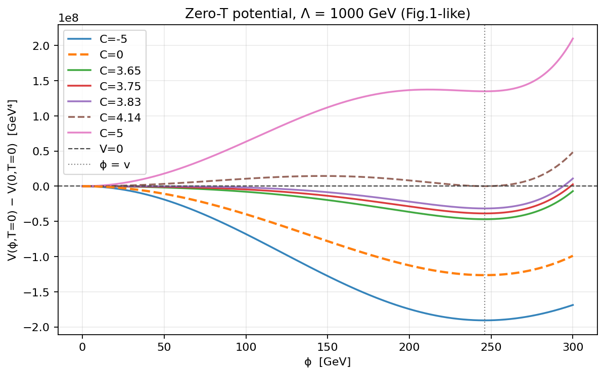

---

### Example B — Paper potential and the branch structure ($\ln|1-t|$)

**Code:** `example_B_paper_potential_with_inset(...)`  
**Outputs:** `figB_<tag>.png`

This figure shows the potential with **real-part continuation**
(using $\ln|1-t|$),
so you can display both sides of the logarithmic singularity.

The branch point is at
$$
\phi_\star=\frac{\Lambda}{\sqrt{C}}.
$$

**Purpose:**
- make the measure-induced structure explicit;
- show the domain where the potential is physically meaningful without continuation;
- use the inset to zoom into the electroweak-relevant region.

**What to look for physically:**
- where the branch point sits compared to $v$,
- whether the deformation can influence the barrier region relevant for the transition.


> 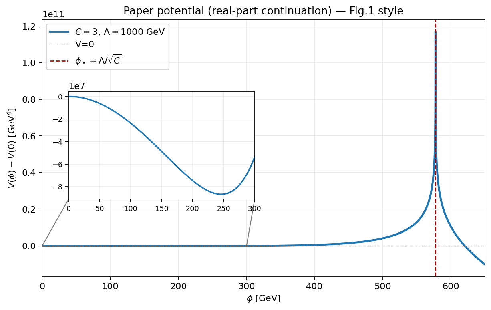

---

### Example C — Key thermal scales: $T_n$, $T_c$, and spinodals

**Code:** `example_C_transition_summary(...)`  
**Outputs:** `figC_<tag>.png`

This is the first “real” finite-$T$ physics step.

It builds phases with `transitionFinder`, identifies the main first-order transition,
and extracts:

- $T_n$ (nucleation),
- $T_c$ (degeneracy),
- spinodals (loss of stability) of both phases via $m^2(T)\approx 0$.

**Purpose:**
- certify that the thermal history is consistent,
- show supercooling: typically $T_n<T_c$,
- bracket nucleation between instability limits whenever possible.

**What to look for physically:**
- is $T_n$ finite and inside a sensible interval,
- are there clear spinodals,
- does the ordering $T_{\rm sp}^{\rm high} \gtrsim T_c \gtrsim T_n \gtrsim T_{\rm sp}^{\rm low}$ make sense for this model.


> 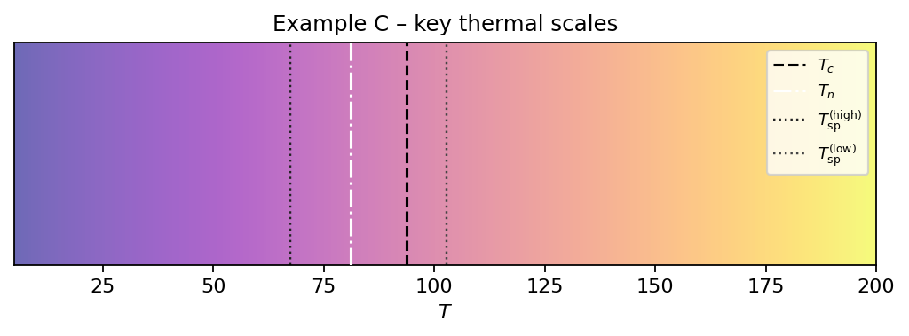

---

### Example D — $\phi_{\min}(T)$ and curvature $m^2(T)$ across the overlap region

**Code:** `example_D_phi_min_and_mass2_vs_T(...)`  
**Outputs:** `figD_<tag>.png`, `figD_full_<tag>.png`

This example makes the two phases “visible” as functions of temperature:

- the minima locations $\phi_{\min}(T)$ for both phases,
- the smallest Hessian eigenvalue along each phase:
  $$
  m^2(T)=\min{\rm eig}\left[\nabla^2 V(\phi_{\min}(T),T)\right].
  $$

**Purpose:**
- show the coexistence window where both minima exist,
- visualize stability loss (spinodal behavior),
- verify that the transitionFinder output is not a numerical artifact.

**What to look for physically:**
- smooth tracking of minima,
- $m^2(T)>0$ in stable ranges,
- near-zero crossing at spinodals.


> 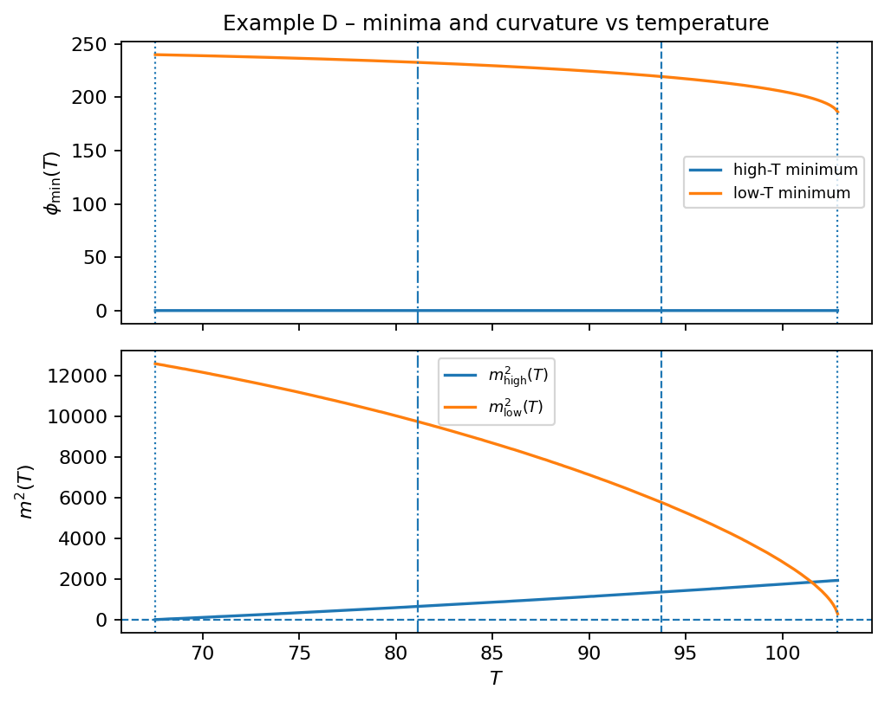

> 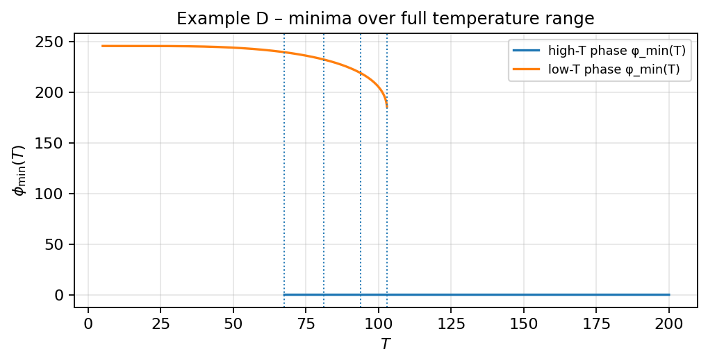

---

### Example E — Free-energy difference $\Delta V(T)$ between phases

**Code:** `example_E_deltaV_vs_T(...)`  
**Outputs:** `figE_<tag>.png`

This plots
$$
\Delta V(T)=V_{\rm high}(T)-V_{\rm low}(T)
$$
evaluated at the two minima.

**Purpose:**
- directly confirm $T_c$ through $\Delta V(T_c)\approx 0$,
- show metastability at nucleation: $\Delta V(T_n)>0$ (high-$T$ phase still above the low-$T$ phase when tunneling happens).

**What to look for physically:**
- crossing near $T_c$,
- positive $\Delta V$ at $T_n$,
- monotonic trends consistent with supercooling.


> 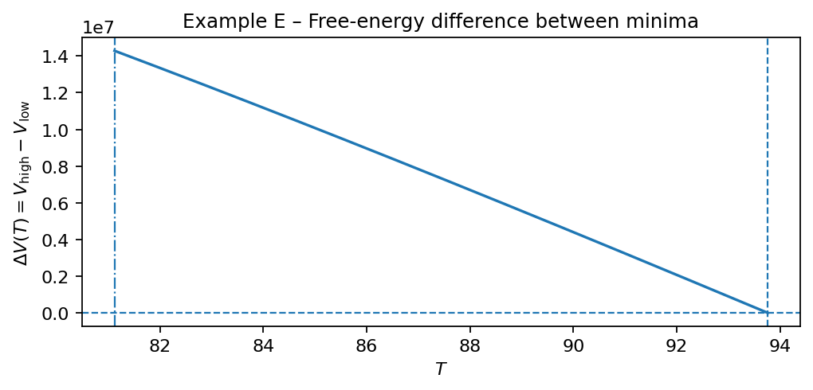

---

### Example F — Schematic phase history along cooling

**Code:** `example_F_phase_history_map(...)`  
**Outputs:** `figF_<tag>.png`

This is a compact “cartoon” of the thermal history:

- temperature axis shown as **cooling** (high $T$ → low $T$),
- colored segments indicating which Phase is realized,
- vertical lines at transition temperatures.

**Purpose:**
- present the transition sequence in one glance,
- sanity-check: starting phase at high $T$, ending phase at low $T$.


> 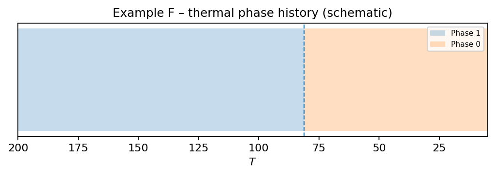

---

### Example G — Direct temperature sweep: $V(\phi,T)-V_{\rm ref}(T)$

**Code:** `example_G_T_scan(...)`  
**Outputs:** `figG_<tag>.png`

This plots the *full potential curves* at selected temperatures:
below $T_n$, near spinodals, at $T_n$, at $T_c$, etc.

**Purpose:**
- visually confirm the barrier evolution with $T$,
- see directly how the two minima compete,
- connect the abstract “phase curves” to an explicit potential landscape.

**What to look for physically:**
- appearance/disappearance of the barrier,
- relative depths swapping near $T_c$,
- the metastable minimum persisting down to $T_n$.


> 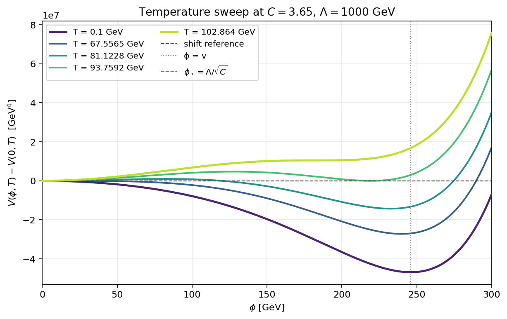

---

### Example H — Potential geometry at $T_n$ and the inverted-potential picture

**Code:** `example_H_potential_geometry(...)`  
**Outputs:** `figH1_<tag>.png`, `figH2_<tag>.png`

At this point the script switches to the bounce problem at $T=T_n$.

This example plots:

1. $V(\phi,T_n)$ with markers: $\phi_{\rm meta}$, $\phi_{\rm true}$, $\phi_{\rm bar}$, $\phi_{\rm top}$;
2. $-V(\phi,T_n)$ highlighting the shooting starting point $\phi_0$.

**Purpose:**
- make the bounce geometry tangible:
  tunneling is motion in the **inverted potential** $-V$.
- display the key points that define the barrier and scales.


> 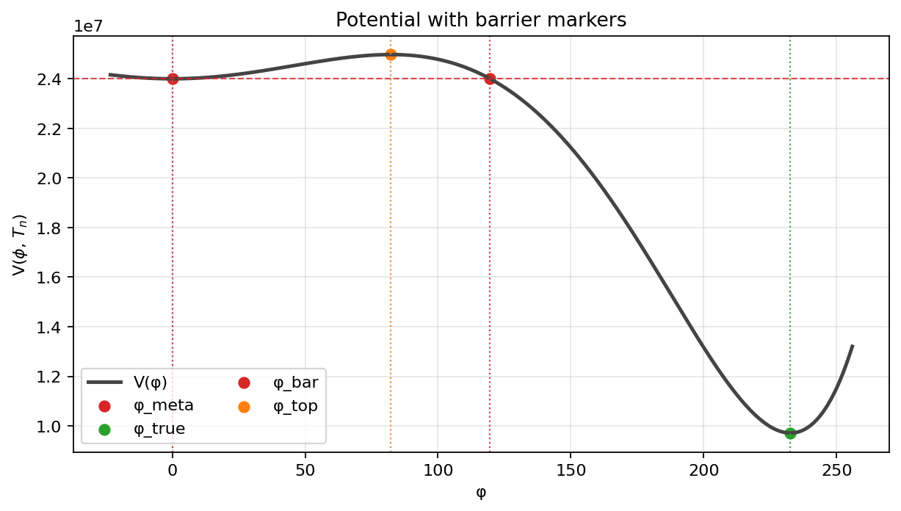

> 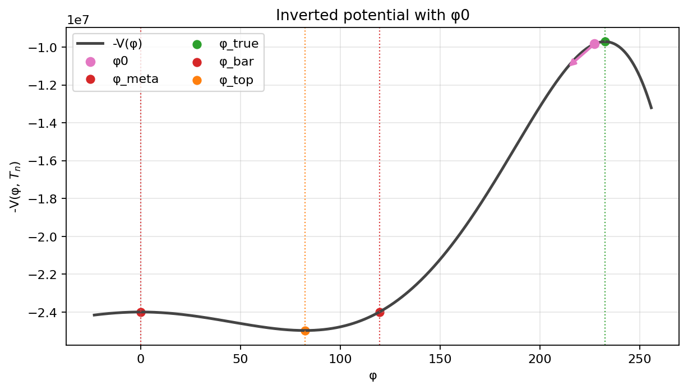

---

### Example I — Near-origin behavior and the exact small-$r$ solution

**Code:** `example_I_local_quadratic_at_phi0(...)`  
**Outputs:** `figI_<tag>.png`

This focuses on the **regularity condition** at the bubble center.
The bounce must satisfy $\phi'(0)=0$ and remain smooth.

The code uses the model’s local expansion machinery (`exactSolution`) to show the
small-$r$ behavior around $\phi_0$.

**Purpose:**
- verify the near-origin behavior is consistent with the ODE structure,
- check that the interior fill is not producing unphysical artifacts.


> 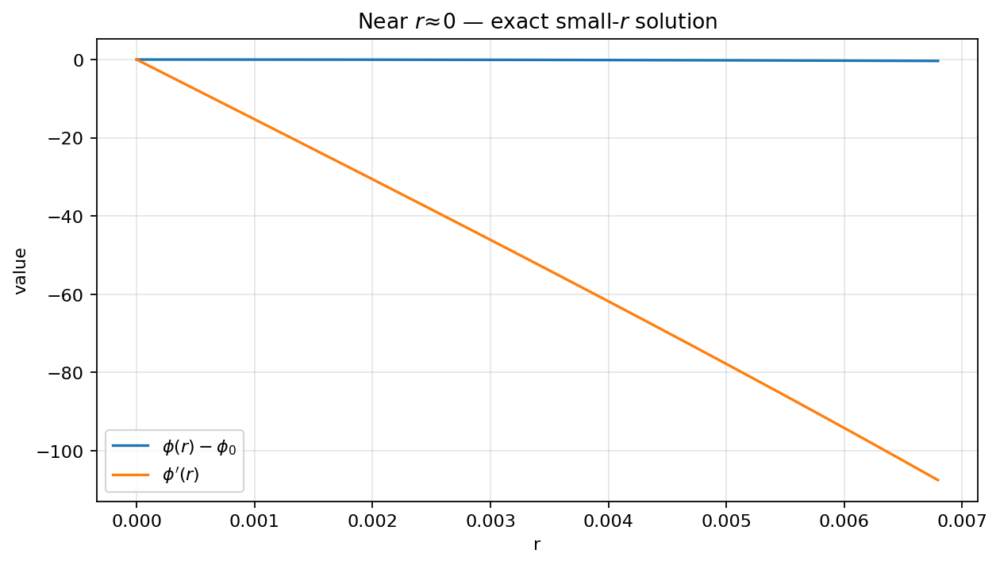

---

### Example J — Inverted-potential path from $\phi_0$ to the false vacuum

**Code:** `example_J_inverted_path(...)`  
**Outputs:** `figJ_<tag>.png`

This plots $-V(\phi,T_n)$ and highlights the segment corresponding to the “trajectory”
from the starting point $\phi_0$ toward the false vacuum.

**Purpose:**
- reinforce the mechanical analogy:
  the bounce is like a particle moving in $-V$ with friction,
  starting near the true side and asymptoting to the false vacuum.


> 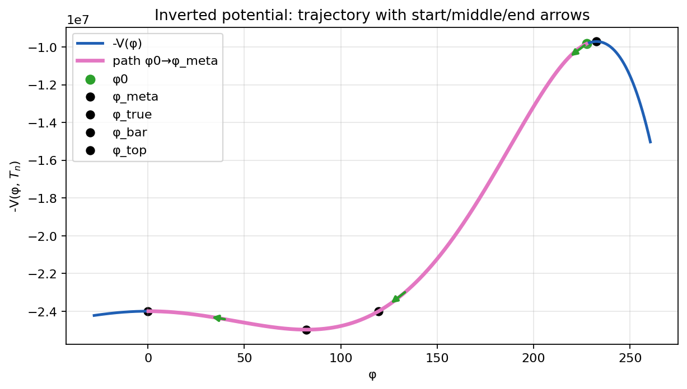

---

### Example K — The bounce profile $\phi(r)$ with the interior region highlighted

**Code:** `example_K_phi_of_r(...)`  
**Outputs:** `figK_<tag>.png`

This plots the actual bounce solution $\phi(r)$ and highlights:

- the initial shooting point $(r_0,\phi_0)$,
- the interior region $r\in[0,r_0]$ shaded for clarity.

**Purpose:**
- show the bubble interior/exterior structure directly,
- visually confirm the profile goes from true-like inside to false-like outside.


> 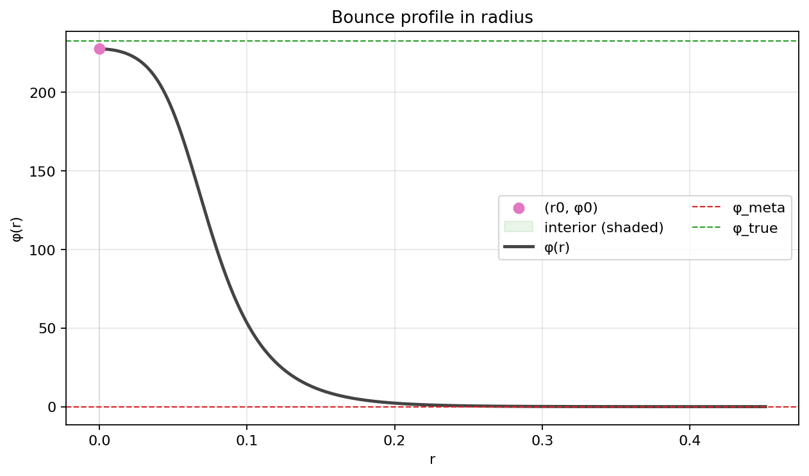

---

### Example L — Spherical maps of the bubble at $t=0$ (2D and 3D)

**Code:** `example_L_spherical_maps(...)`  
**Outputs:** `figL1_<tag>.png`, `figL2_<tag>.png`

This is the “make it real” plot:

- a 2D spatial slice $\phi(x,y)$ at $t=0$ using $\phi(\rho)$ with $\rho=\sqrt{x^2+y^2}$,
- a 3D surface view of $\phi(x,y)$.

**Purpose:**
- show the bubble as a spatial object,
- connect the O(3) bounce profile to an actual nucleated bubble at an initial time slice.


> 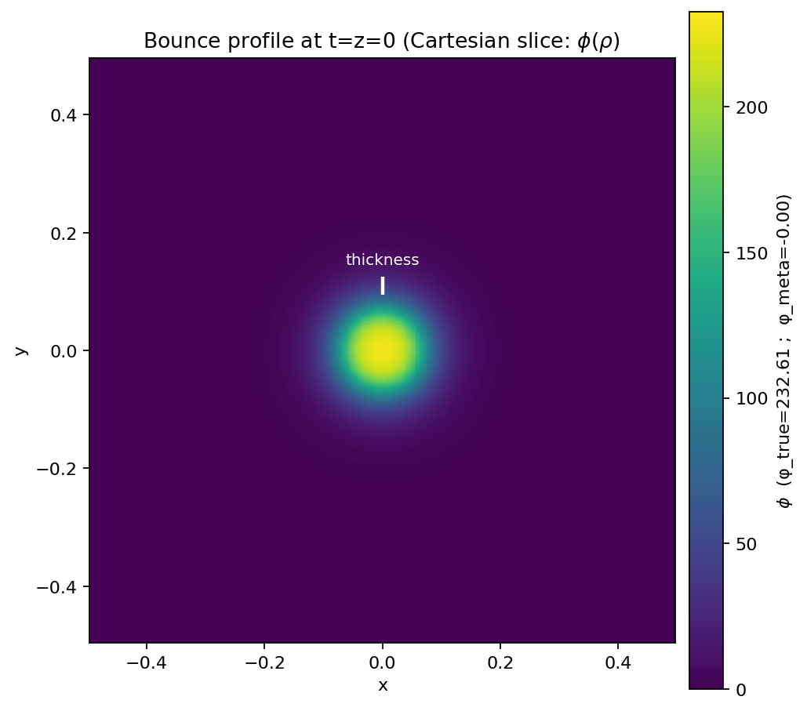

> 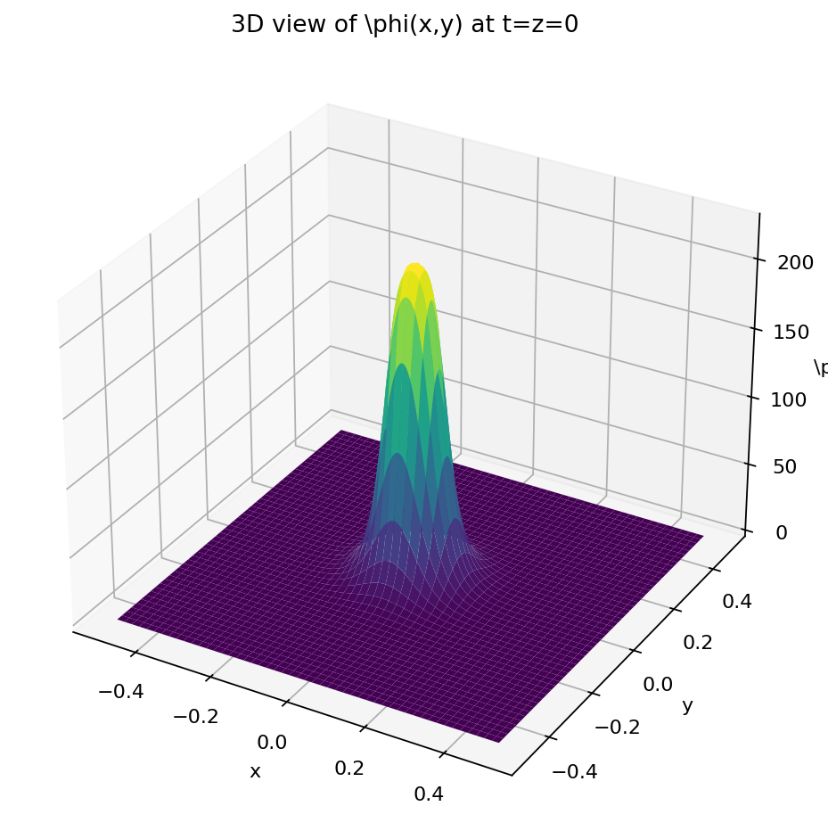

---

### Example M — ODE term decomposition along the profile

**Code:** `example_M_ode_terms(...)`  
**Outputs:** `figM_<tag>.png`

The bounce equation (in the one-field O(3) case) can be written schematically as
$$
\phi''(r)+\frac{\alpha}{r}\phi'(r)=\frac{dV}{d\phi}.
$$

This example plots, as functions of $r$:

- $\phi''(r)$ (acceleration),
- $(\alpha/r)\phi'(r)$ (friction),
- $V'(\phi(r))$ (force),

and overlays $V(\phi(r))$ on a secondary axis.

**Purpose:**
- show explicitly where friction dominates,
- show where the force term drives the field motion,
- make the ODE mechanics transparent.


> 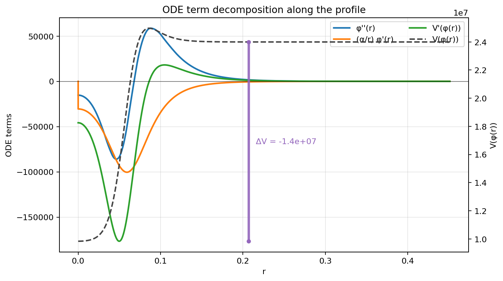

---
### Example N — Action diagnostics and $\beta$ proxies

**Code:** `example_N_action_and_beta(...)`  
**Outputs:** `figN_<tag>.png`

This example prints the full action and its decomposition:

$$
S_{\rm total}=S_{\rm kin}+S_{\rm pot}+S_{\rm interior},
$$
and displays:

- action density components versus $r$,
- cumulative action $S(r)$ building up to $S_{\rm total}$.

It also prints $\beta_{\rm eff}$ proxies from different geometric diagnostics.

**Purpose:**
- verify numerically that the action bookkeeping is consistent,
- see where the action accumulates (wall vs interior),
- extract rough time scale proxies before going to the full GW step.


> 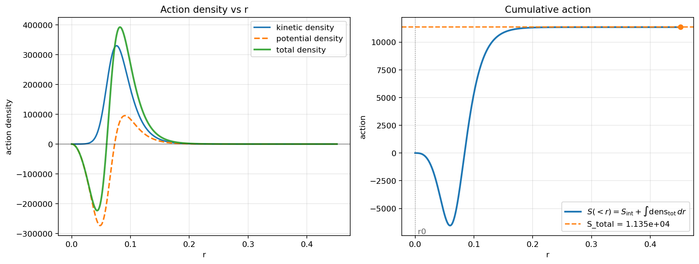


---

### Example O — Gravitational-wave spectrum at $T_\*\approx T_n$

**Code:** `example_O_gravitational_wave_spectrum(...)`  
**Outputs:** `figO1_<tag>.png`, `figO2_<tag>.png`

This is the final payoff.

Using the transition summary, the code builds a `GravitationalWaveCalculator`,
extracts the key parameters at $T_\*\approx T_n$:

- $T_*$,
- $\alpha(T_*)$,
- $\beta/H_*$,
- $R_*H_*$,
- peak frequencies (sound waves, turbulence, collisions),

and computes
$$
h^2\Omega_{\rm GW}(f)
$$
over a wide frequency range, plotting:

1. components + total,
2. total only, with peak-frequency markers and detector sensitivity curves.

**Purpose:**
- connect the microphysics (effective potential + bounce) to an observable,
- see whether the signal sits near the LISA/DECIGO/BBO sensitivity windows,
- build intuition for how $(\alpha,\beta/H_*)$ shape the spectrum.

**Insert figures here:**
- `figO1_<tag>.png`
- `figO2_<tag>.png`

> 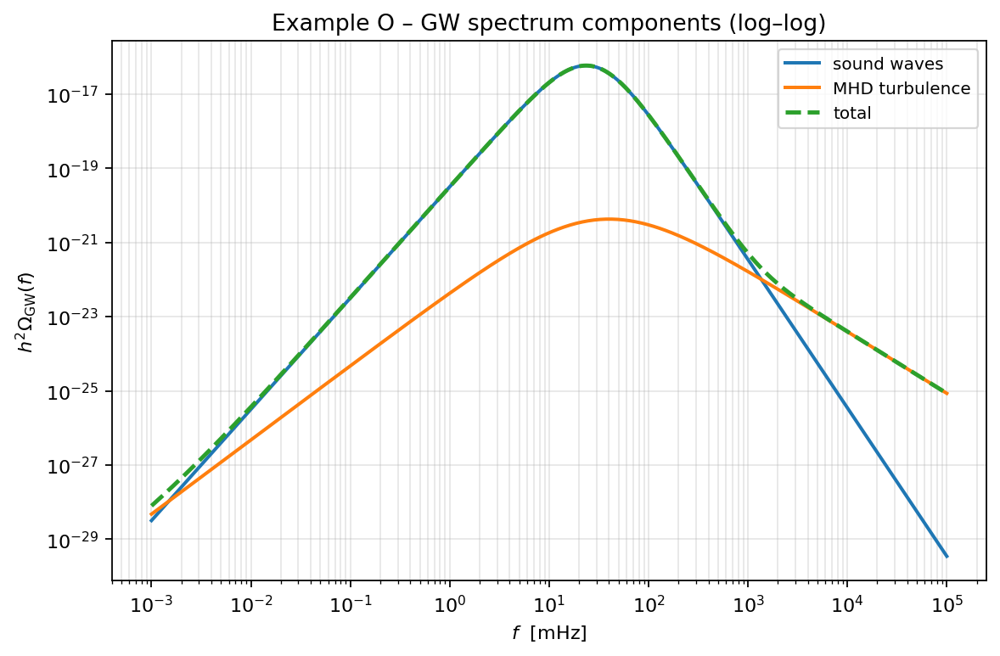


> 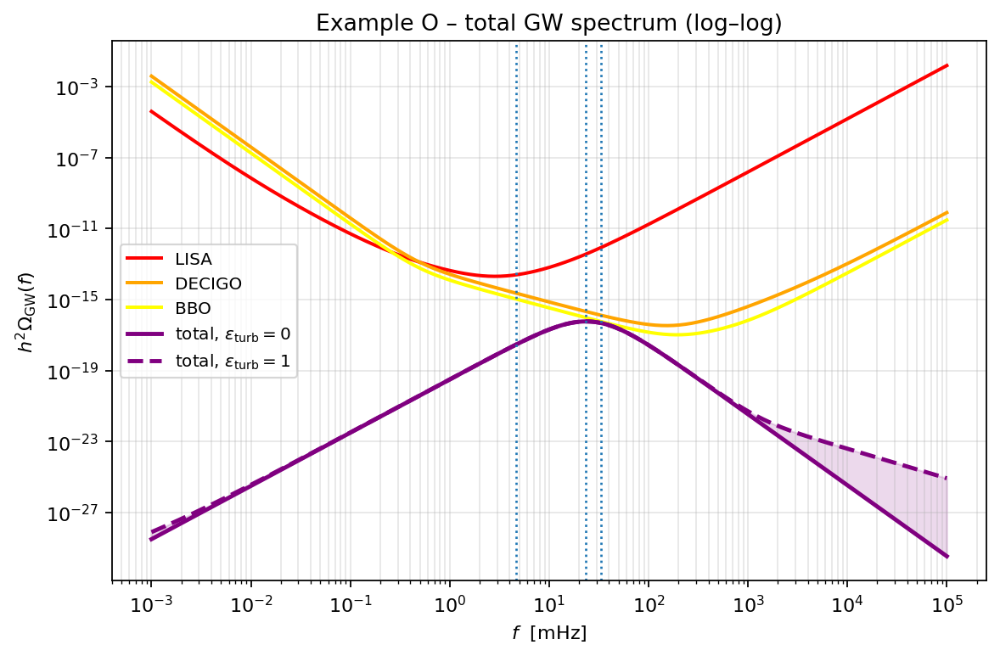

---

## What to do next (how I use this file)

1. Run the script for a given $(C,\Lambda)$ and save figures in `results_C_<C>/`.
2. Insert each `figX_<tag>.png` into the placeholders above.
3. Optionally append a short “Results table” section by pasting the JSON diagnostics summary
   (the script already saves `diagnostics_summary_C_<C>.json`).

---

## Appendix: quick map between figures and filenames

- A → `figA_<tag>.png`
- B → `figB_<tag>.png`
- C → `figC_<tag>.png`
- D → `figD_<tag>.png`, `figD_full_<tag>.png`
- E → `figE_<tag>.png`
- F → `figF_<tag>.png`
- G → `figG_<tag>.png`
- H → `figH1_<tag>.png`, `figH2_<tag>.png`
- I → `figI_<tag>.png`
- J → `figJ_<tag>.png`
- K → `figK_<tag>.png`
- L → `figL1_<tag>.png`, `figL2_<tag>.png`
- M → `figM_<tag>.png`
- N → `figN_<tag>.png`
- O → `figO1_<tag>.png`, `figO2_<tag>.png`


Figure with some different values of C's:

> 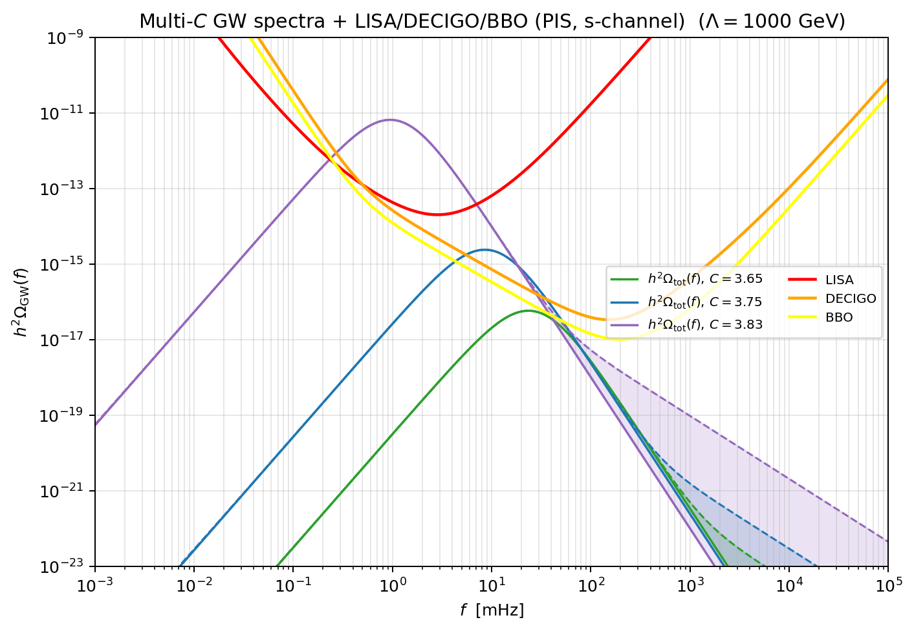


---

