from src.CosmoTransitions import SingleFieldInstanton

# Tunneling 1D - All that you need to know

This page aims to teach you only what's necessary for someone to use and call the functions that
find the bounce solution in the single-field (1D) case.

If you're not interested in seeing how each function works separately, with clear examples fore every sub-fuctions,
this is the place. However, if you have questions about a specifc functions or want to inspect one in detail,
I recommend checking the folder [modules/tunneling1D](/docs/modules/tunneling1D).

---


## Single Field Instaton

### Introduction and minimal params
In this module we solve the differential equation 


$$\frac{d^2 \phi}{dr^2}+\frac{\alpha}{r}\frac{d\phi}{dr} = \frac{dV}{d\phi} $$

This comes from writing the Laplacian in spherical coordinates and assuming spherical symmetry. 
More importantly, we are already in Euclidean signature: after the Wick rotation in the time 
coordinate  $t\rightarrow -i\tau$, the field equation becomes:

 
$$\nabla^2 \phi = V'(\phi) \quad (\text{with }\nabla \text{ in 4D}); \qquad \rho\equiv \sqrt{\tau^2+x^2+y^2+z^2}$$

**Semiclassical picture.** This is a semiclassical approximation valid for tunneling.
It governs the part where the field transition through classically forbidden paths. After tunneling,
we switch back to real time and evolve classically. At (t=0) what we "see" in space is the radial bounce
profile $\phi_b(\rho)$ we just solved for, and them the Minkowski evolution follows:


$$\ddot{\phi} -\nabla^2 \phi \equiv\Box \phi = -V'(\phi) \qquad \dot{\phi}=0; \quad \phi(x,t=0)=\phi_{bounce}(r)  $$


This point is quite crucial; we can imagine a timeline from $\tau \rightarrow \infty$ until $\tau=0$ 
that has the semiclassical description made here. 

Remembering that $\tau \gg$ 1 are high temperatures (we are closer to the beginning of the universe) 
and $\tau$ = 0 would be more towards the "future".
At $\tau=0$ we return to real time and return to the classical description with the equation above

**About $\alpha$.** The “friction” coefficient is $\alpha=d-1$, where (d) 
Thermal effects compactify Euclidean time with period $\beta=1/T$. At high temperature the time circle is small, 
the solution is effectively 3D, and $\alpha=2$ *O(3)*. In the zero-temperature limit the solution is *O(4)* and $\alpha=3$. 
In practice, transitions are often high-(T), so we default to $\alpha=2$.

With that minimal intro, here’s what you must provide for the solver (three parameters):

* $\phi_{\text{true}}$: field value at the true (stable) minimum
* $\phi_{\text{meta}}$: field value at the false/metastable minimum
* $V(\phi)$: the scalar potential

If you also have analytic $V'(\phi)$ or $V''(\phi)$, you can pass them too. Likewise, set $\alpha$
if you want something different from the default.

```text
from CosmoTransitions.tunneling1D import SingleFieldInstanton

phi_abs = 1.0
phi_meta = 0.0
alpha = 2 # O(3) 
def V ... # Define your potential here

inst = SingleFieldInstanton(
        phi_absMin= phi_abs,
        phi_metaMin=phi_meta,
        V=V,
        alpha=alpha,
        phi_eps=1e-3)
```

**How to run this example**

```bash
python -m docs.examples.example_tunneling1D
```

In all examples the potentials chosen was:

$$\text{THIN}: \frac{1}{4}\phi ^4 - 0.49\phi ^3 + 0.235 \phi ^2 $$

$$\text{THICK}:  \frac{1}{4}\phi ^4 - \frac{2}{5}\phi^3 + \frac{1}{10}\phi^2 $$


---

### About the boundary conditions

What we want from a bounce is simple to state: the solution starts at rest at the center and, as $r\to\infty$, 
it asymptotically approaches the false vacuum and stops on it.

Keep in mind the **inverted-potential picture**. After the Wick rotation $t\to -i\tau$, the Euclidan equation reads
$\phi''+frac{\alpha}{r}\phi'=V'(\phi)$. 

This is equivalent to a particle moving in the **inverted potential** (-V) with a time dependent friction
$\alpha/r$: the particle is realeased near the "top" corresponding to the true vacuum (a maximum of -V) and must roll,
losing energy to friction, to the other "top" at the false vacuum, arriving there with zero velocity. 
There is a unique "just-right" starting point $\phi_0$ for which this happens.

Therefore, the boundary contions are:

* $\phi'(0)=0$
* $\lim_{r \to \infty} \phi'(r) = 0$
* $\lim_{r \to \infty} \phi(r) = \phi_{meta}$

Notice none of these impose something on $\phi_0$ ($\equiv \phi(0)$). 
The initial field value in Euclidean "time" can be anywhere between the true and false vacua, as long
as  it is the one that makes the particle land and stop at $\phi_{meta}$ as $r\to \infty$.

**And how do we ever reach the true vacuum?** After tunneling, we go back to real time.
At (t=0) the initial data are $\dot\phi(x,0)=0,\quad \phi(x,0)=\phi_{\text{bounce}}(r).$
The bubble expands and the field relaxes toward $\phi_{true}$ (that's the phenomelogy we usually expects).
It's always good to keep in mind that the classical model governs the dynamics after the transition, 
and it will determine what will happen to the field after the transition.


**Why $\phi'(0)=0$**
* Radial symmetry and Regularity at the origin forces $\phi' _0=0$ and more precisely, a smooth Taylor
expansion $\phi(r) = \phi_0 +\mathcal{O}(r^2)$.
* The friction term $\alpha/r \phi'$ would be singular at r=0 unless $\phi'$ vanishes there
* It is important to note that radial symmetry alone guarantees that the derivative will be 0 at r=0

**Real time echo of this:** At t=0 we set $\dot{\phi} = 0$. After that, $\dot{\phi}$ generally
becomes nonzero as the bubble grows. The configuration remains **spherically symmetric** (no angular dependence),
but spatial gradients (\partial_r \phi) are zero only at the center (r=0), not everywhere. 

That's the whole boundary condition story resume. With this in place, we can move on to the key
diagnostics the code computes


--- 

### Other imporants params in $V(\phi)$ | Lot 2 of the code

There are two especially useful landmarks $V(\phi)$. 

**1) The "bar" point $\phi_{bar}$**

In the inverted potential (-V) picture, we can think that, for $\phi_0$ reach the false vacuum level,
energy must be at least equal to $V(\phi_{meta})$. 

Therefore, the field value $\phi_{bar}$ is defined on the true-vaccum side of the barrier by:

$$V(\phi_{bar})= V(\phi_{meta}) \quad (\text{with} \phi_{bar} \text{located beyond the barrier peak})$$

This gives a clean search window for the correct initial value $\phi_0$:

$$V(\phi_{bar}) \geq V(\phi_0) \geq V(\phi_{True}) $$

Intuitively: $\phi_{bar}$ marks the lowest energy starting point (on the true side) that still has the same
Euclidean "energy" as the false vacuum; anything bellow it cannot reach $\phi_{meta}$ once friction is included.

> Small clarification on commom mental image: sometimes people describe $\phi_{bar}$ as a "turning point" if realeased
> from $\phi_{meta}$  in the inverted potential. Strictly speaking, if you start exactly at $\phi_{meta}$ with 
> zero velocity you just sit there and just go for the other side by thermal fluctuations or quantum tunneling.

**2) The barrier top $\phi_{top}$ and the curvature scale**
$\phi_{top}$ is simply the maximum of $V(\phi)$ (the peak of the barrier). Near this point we 
can approximate: 

$$ V(\phi) \approx V_{top}-\frac{1}{2} k^2 (\phi-\phi_{top})^2$$
 
This motivates a **curvature length** scale

$$r_{scale} \equiv \frac{1}{\sqrt{|V''(\phi_{top})|}} $$

It is a very handy measure of how "step" the barrier is and shows up in several numerical limits
and diagnostics. In thin-wall situations the barrier is steep $\Rightarrow |V''|$ large $\Rightarrow$
$r_{scale}$ small. In thick-wall cases the top is shallow $\Rightarrow |V''|$ small $\Rightarrow$
$r_{scale}$ large; which matches each name.

> Practical note (used in the code): When the curvature at ther top is extremly small, dectyly using
> $V''(\phi_{top})$ can be noisy. In that case we fall back to more robust proxies, a cubic fit across the wall region.


---

### Visualizing potential and its inversion

Here is a plot for thin wall and thick wall with all the interesting points.

*Thin-wall — Potential with marks*
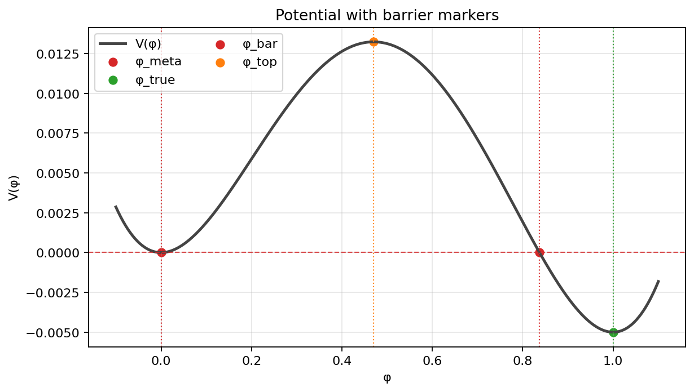

*Thick-wall — Potential with marks*
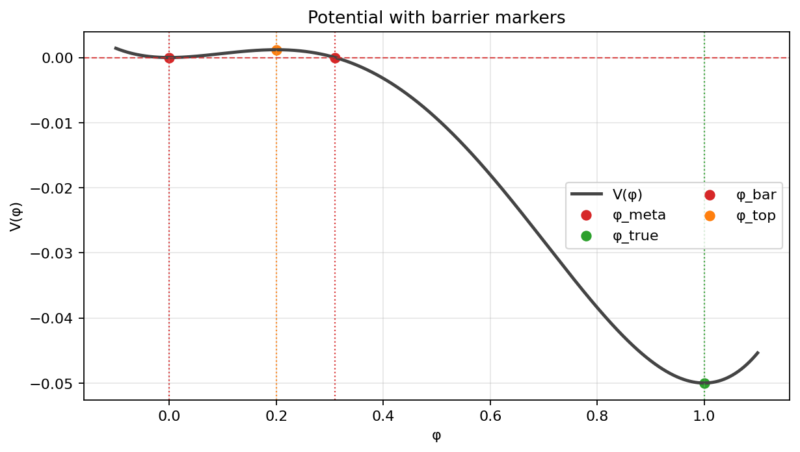

And now the inverted plots (-V) with the founded $\phi_0$ solution:

*Thin-wall — $-V(\phi)$*
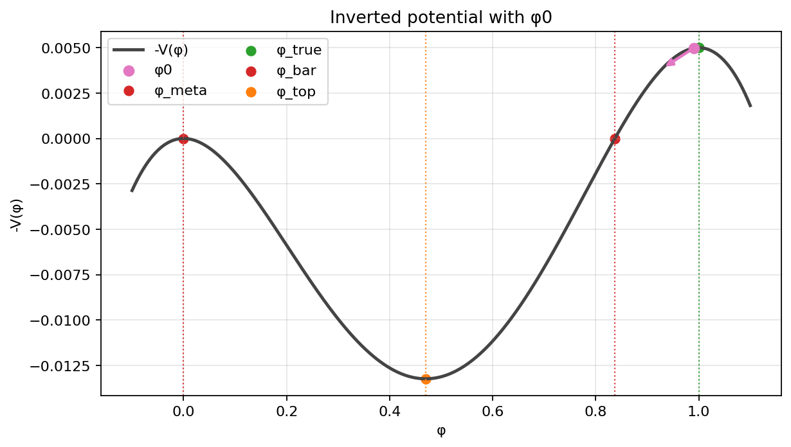

*Thick-wall — $-V(\phi)$*
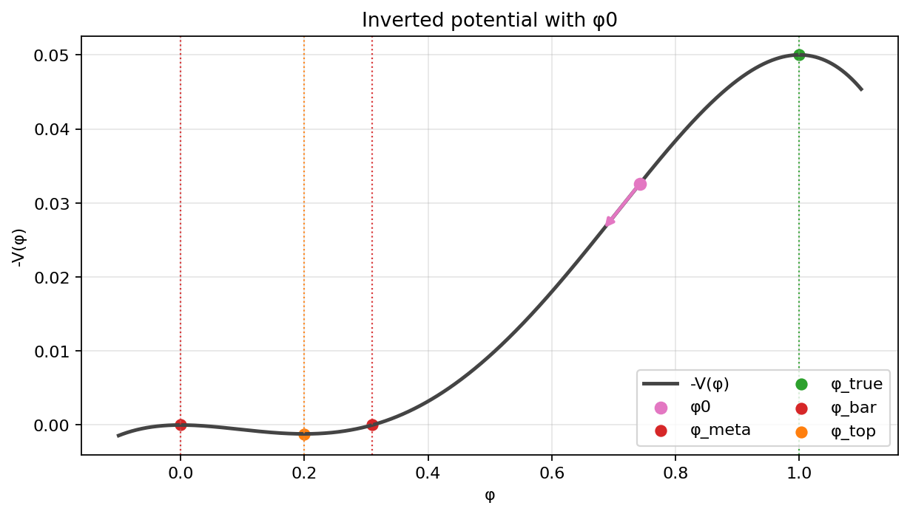

---

###  Near solutions and initial conditions| Lot 3

For any field value $\phi(r)$ taken near some arbitraty $\phi_0$, we can rewrite the ODE in
a locally linearized form and solve it exactly. Around $\phi_0$

$$V'(\phi)\approx V'(\phi_0)+V''(\phi_0)(\phi-\phi_0)$$

The solution reads  

$$\phi(r)-\phi_0 = \frac{V'(\phi_0)}{V''(\phi_0)}\Bigg[\Gamma(\nu+1)\Big(\tfrac{t}{2}\Big)^{-\nu} I_\nu(t)-1\Bigg]$$

where $I_\nu$ is the modified Bessel functions.

The key point: This expressing is valid whenever the field is sitting near a point with $\phi' \approx 0$.
It doesn't matter if $r$ is tiny or moderately large - if the derivative stays small, the approximation keeps tracking.
In practice we use it around the chosen $\phi_0$; if you need it elsewhere, re-exapand around a new $\phi_0$.

Because the equation has a formal singularaty at $r=0$, we start the numerical integration a little away from the origin,
at $r=r_{min}>0$. To do that cleanly we introduce a **lower bound** $\Delta\phi_{cutoff}$ and choose $r_{min}$
such that:

$$|\phi(r_{min})-\phi_{true}| \gtrsim \Delta \phi_{cutoff} $$

evaluating $phi(r_{min})$ with the exact small-r formula above.

We also need an inatial guess for $\phi_0$. Internally this is handled, but it's worth sating explicitly:

$$\phi_0 = \phi_{true} + \Delta \phi, qquad \text{with} \phi_0 \in [\phi_{true}, \phi_{bar}$$

The algorthm procceds as follows (conceptually):

1. Pick a trial $\phi_0$ in [$\phi_{true}, \phi_{bar}$]
2. Use the exact small-r solution to evaluate $\phi(r)$ at an initial $r_{min}$
3. If $|\phi(r_{min})-\phi_{true}| < \Delta \phi_{cutoff}$ increase $r_{min}$ (keeping the same $\phi_0$) and check again.
   Otherwise, start the full integration from that $r_{min}$.
4. If the boundary condition at infinity is not met (overshoot/undershoot), update $\phi_0$ and repeat

Heuristic that i follow: choose $\Delta \phi_{cutoff}$ as small as makes the code stable, so we don't sart too
far from $\phi_{true}$. This matters even more in the thin-wall regime, where the correct $phi_0$ typically sits very close
to $\phi_{true}$

Note that if we choose a very high cutoff we may find a wrong solution that would still converge!

Bellow are one example of a bad use of the $\Delta \phi_{cutoff}$ in a thin wall case:

*Error case Thin-wall — $\Delta \phi_{cutoff} = 0.15$*
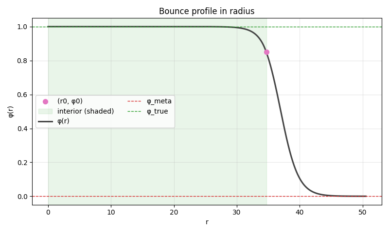

**So how do I know I've found the right one cutoff?** I had the same question, but the key is to realize that if 
your cutoff was too high, then your $\phi$ is below what it should be, and its derivative pulls it towards the correct value 
(i.e., $\phi'_0 \neq 0$). A good practice is to check your graph, as in the one above, 
to see if $\phi_0$ (pink dot) is increasing towards some value going towards r=0; this shouldn't happen, as we expect $\phi'_0=0$.

In the case above: $\phi'_0 = -1.05e-01 $

The correct thing is that going to r=0 there is a plateau at \phi_0 (not so much grow)

In the end  are the correct solutions with $\Delta \phi_{cutoff}=0.01$.

Bellow are the plots for $\phi$ and $\phi'$ near $r=0$

*Thin-wall - $\phi$ near r=0*
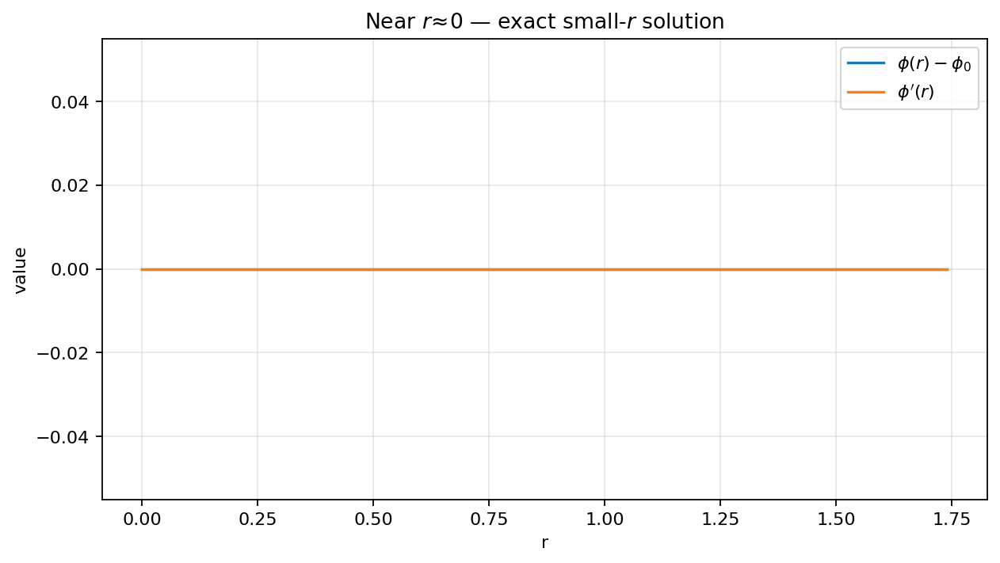

*Thick-wall — $\phi$ near r=0*
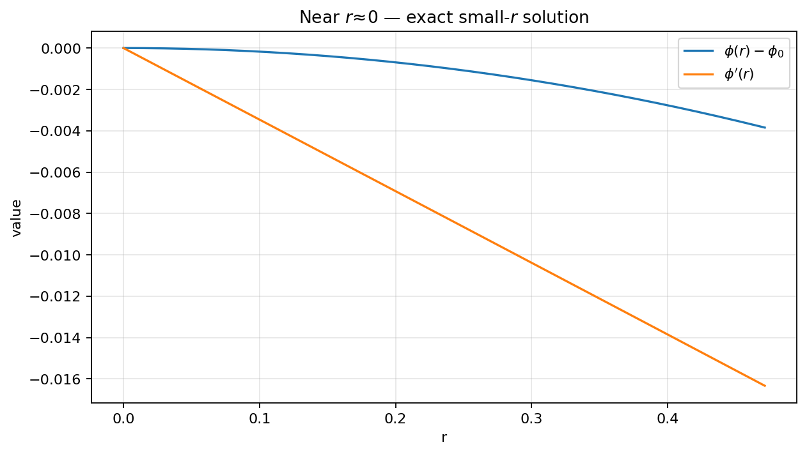

We can clearly see that both prevent the singularity of the friction term at the origin.

Thin wall with $\phi'$ = 0 and thick with $\phi' \propto r$, as we expected.

---

### ODE/Integrate & Saveprofile

Inside the ODE the state is package as $(\phi,y)$ with

$$\phi'=y;\quad  \phi''=V'(\phi)- \alpha/r \dot{\phi}$$

(Here primes mean derivatives with respect to the radial coordinate r. I stick to primes to avoid
confusion with time-dots used later in real time evolution).

Given the initial conditions and this ODE, we integrate with RKCK and look for a solution that
satisfies

$$|\phi(\infty)-\phi_{metamin}|< \epsilon_{\phi}; \qquad |\phi'(\infty)| < \epsilon_{d\phi} $$

What `integrate` actually does is evolve from the chosen initial condition until one of the
**following stopping** criteria triggers:

1. **Converged--** Both tolerances above are met. We return the arrays $r, \phi(r)$, and $\phi'(r)$
2. **Undershoot--** The field strts turning back before reaching the false vacuum. In practice this show
up as $\phi'(r)$ changing sign to positive whle $\phi(r)>\phi_{meta}$. 
Physically: friction wins, not enough energy to climb all the way. We stop at the first turning point
where $\phi'(r)=0$ and return $r,\phi,\phi'$ there.
3. **Overshoot--** The trajectory crosses the false vacuum, i.e., $\phi(r)-\phi_{meta}<0$
within a step. Too much energy: it blows past the target. We stop at (or bracket to) the point
where $\phi=\phi_{meta}$

On undershoot/overshoot, the code adjusts the initial field value $\phi_0$ and repeats (classic shooting),
until the exact solution is found.

Once the correct initial condition is locked in, we run integrate-and-save to build the full
bounce profile: we evaluate and store $\phi(r)$ on a user-controlled radius grid R. If the adaptive RKCK steps
are coarser than the requested spacing, we fill in the missing samples by cubic interpolation between the integrator outputs
(and, when available, we use the stored $\phi'(r)$ to do Hermit-quality interpolation). This produces a clean
($R$, $\phi(R),\phi'(R)$) profile ready for diagnostics and plots.

### Find profile

This is the most important part of the module—the place where a few internally chosen parameters are worth knowing 
(and sometimes tweaking).

**Minimum radius.** The seach starts near the true vacuum at


$$r_{\min}=10^{-4} r_{\text{scale}}$$

**Tolerances.** `phi_tol` defaults to $10^{-4}$. 
From it  build the relative end point tolerances $\varepsilon_\phi$ and $\varepsilon_{\phi'}$
that the solution must satisfy at large r, as $\phi$ reachs the false vacuum.

**Cutoff.** Used

$$\texttt{cutoff}=10^{-2}|\phi_{\text{meta}}-\phi_{\text{true}}|$$

as the lower bound for the initial displacement needed to leave the immediate vicinity of 
$(\phi_{\text{true}})$.


**How the initial condition is guessed**

Because $\phi_0 \equiv \phi(0)$ is not known a priori, the code parametrizes it 
with a single shooting variable (x):


$$\phi_0(x)=\phi_{\text{true}}+e^{-x}\bigl(\phi_{\text{meta}}-\phi_{\text{true}}\bigr)$$

* Large (x)  $\Rightarrow \phi_0$ close to the **true** vacuum.
* Small (x)  $\Rightarrow \phi_0$ close to the **false** (meta) vacuum.

The code **starts** from the conservative side: pick (x) such that 
$\phi_0=\phi_{\text{bar}}$ (remember $\phi_0\ge \phi_{\text{bar}}$). Then:

1. Try to find an admissible starting radius for this $(\phi_0)$. Otherwise, if can’t find any 
, **increase (x)** (move $\phi_0$ a bit toward $\phi_{\text{true}}$) and try again.
2. Integrate until we either **converge** or detect **undershoot/overshoot** (see below).

---

**What undershoot / overshoot mean here (and how x gets update)**

* **Undershoot**: friction wins and the field turns around before reaching $\phi_{\text{meta}}$
  ($\phi'(r)$ flips to *positive* while $\phi>\phi_{\text{meta}}$).
  → We started too close to $\phi_{\text{bar}}$ (not enough energy).
  → **Set $x_{\min}=x$** and **increase (x)**: $x\leftarrow \tfrac{1}{2}(x_{\min}+x_{\max})$.

* **Overshoot**: the trajectory crosses $\phi_{\text{meta}}$.
  → We started too close to $\phi_{\text{true}}$ (too much energy).
  → **Set $x_{\max}=x$** and **decrease (x)**: $x\leftarrow \tfrac{1}{2}(x_{\min}+x_{\max})$.

This bisection on (x) repeats until both end-point tolerances are satisfied.

---

**After the correct $(\phi_0)$ is found**

Builds a radius grid

$$R={r_0,\dots,r_f}\quad\text{with}\quad \texttt{n_points}$$

starting at the **found** $r_0$ from the initial-condition logic and going out to $r_f$. 
Note that $r_0$ can be **well above** zero (especially in thin wall): the field may 
sit almost flat before it “decides” to roll.

For the **interior** $r$ < r_0$, The code fills the bubble by the exact small-(r) expansion 
around $\phi_0$ (we effectively have $\phi'\approx 0$ there), which gives a smooth and 
physically correct core.

**Good practice.** Always sanity-check that $\phi'_0\approx 0$; if it’s not, 
you’re likely starting a bit too far out or with an inconsistent $\phi_0$.

Bellow are all the plots for thin and thick wall with the correct solution for this simple
case.

```text
# To get the profile
inst = SingleFieldInstanton(
        phi_absMin= phi_abs,
        phi_metaMin=phi_meta,
        V=V,
        alpha=alpha,
        phi_eps=1e-3)

profile = inst.findProfile(
        xguess=None, phitol=phitol,
        thinCutoff=thinCutoff, npoints=npoints,
        max_interior_pts=max_interior_pts,
        _MAX_ITERS= _MAX_ITERS
    )
R= profile.R
phi = profile.Phi
dphi = profile.dPhi
```

*Thin-wall - Path of $\phi(r)$ on $V(\phi)$*
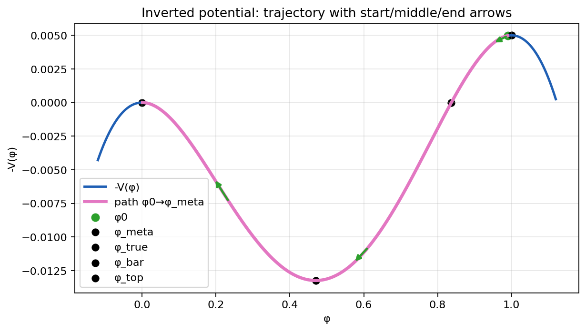

*Thin-wall - Path of $\phi(r)$ on $V(\phi)$*
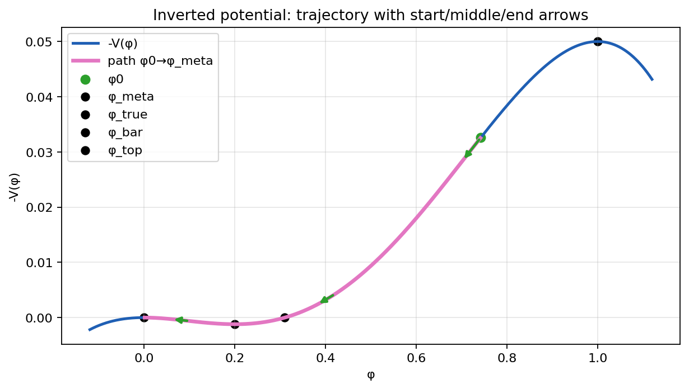

---

*Thin-wall - Bounce Solution ($\phi_b(r)$) $\phi(r)$x r*
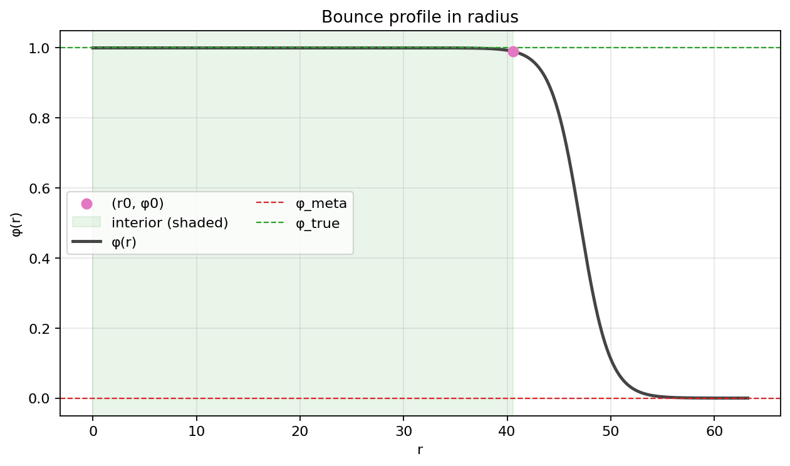

*Thick-wall - Bounce Solution ($\phi_b(r)$) $\phi(r)$x r*
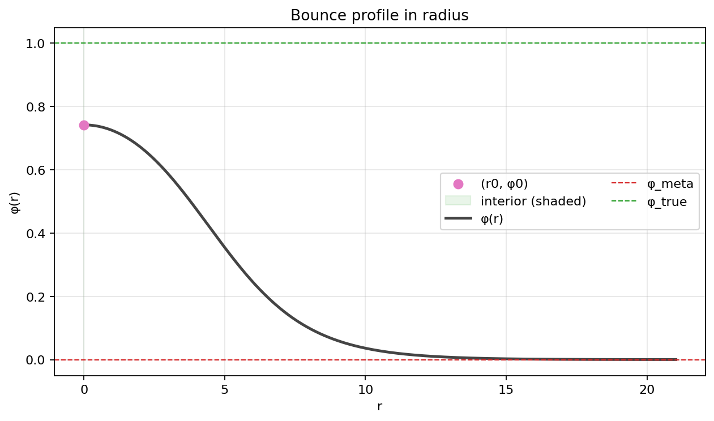

---
Some plots to represent what we would see in 3D space, 
at the moment after the bubble nucleation (t=0)

*Thin-wall - Cartesian slice*
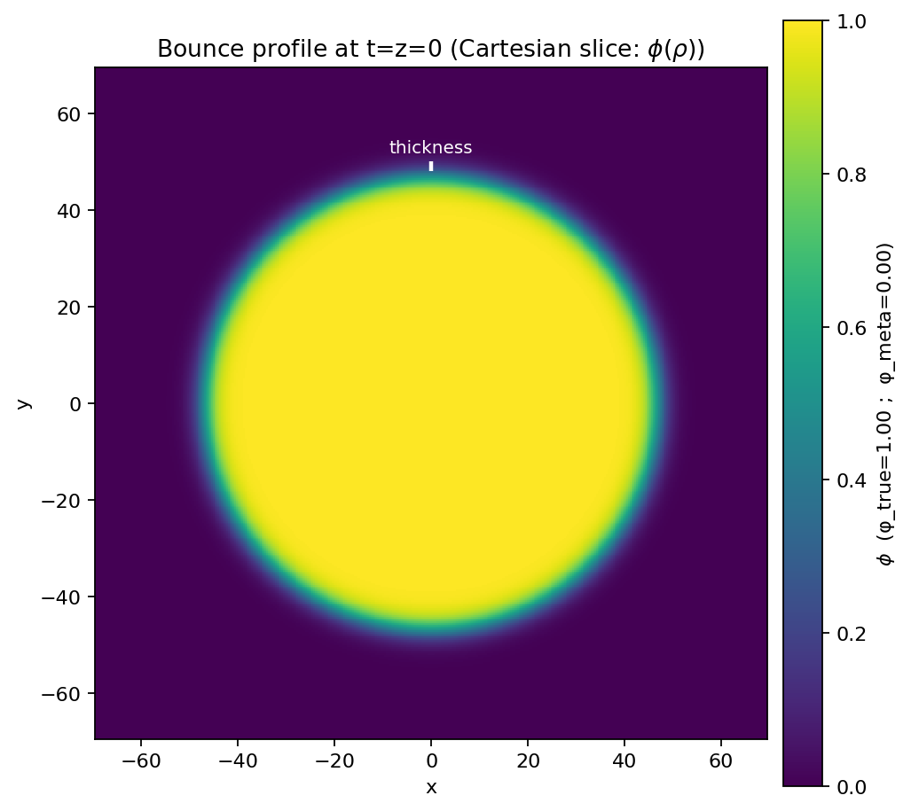

*Thick-wall - Cartesian slice*
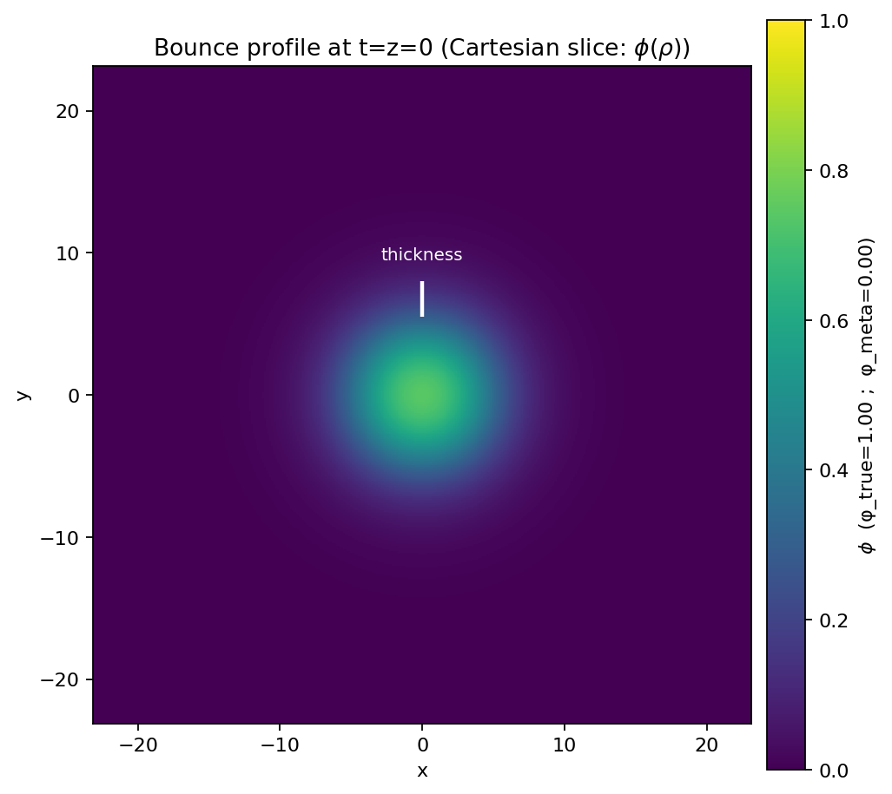

*Thin-wall - Surface 3D*
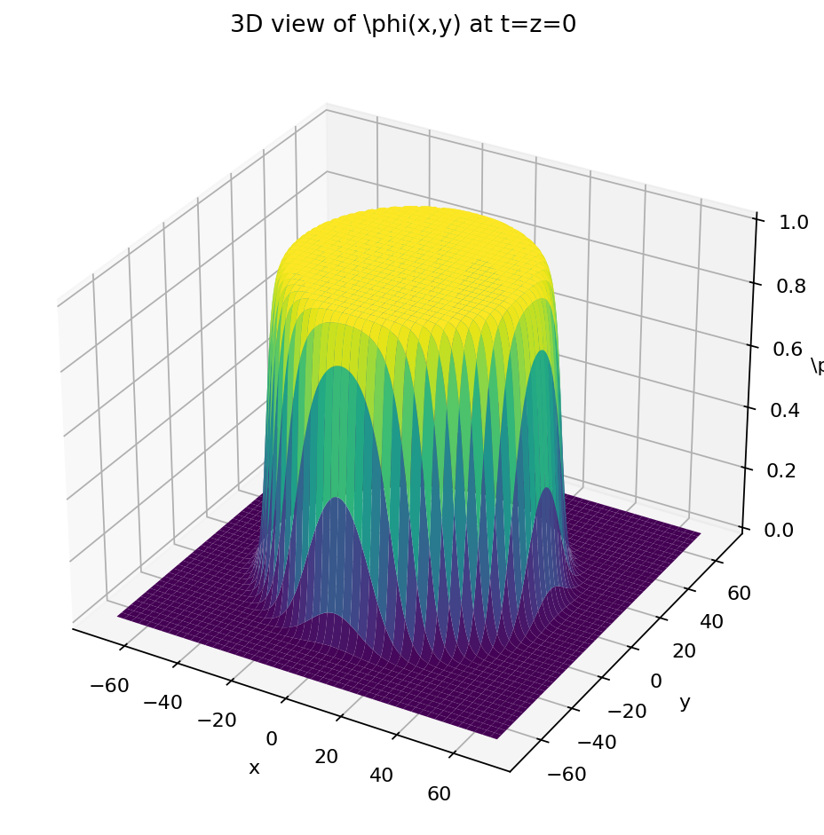

*Thick-wall - Surface 3D*
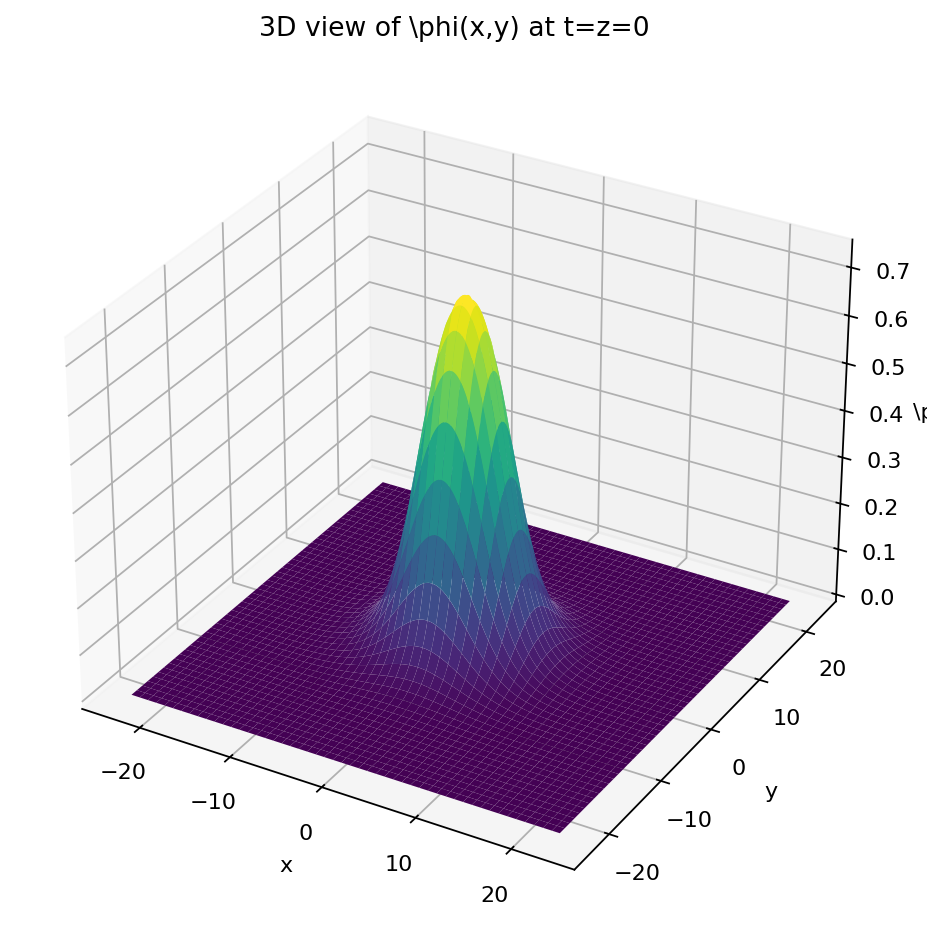

---


### Action, $\beta$ and terms contributions

Inside the class SingleFieldInstaton there is also a function to evaluate the action of the
founded solution. 


The action (with the false-vacuum constant removed) is

$$S = \int_{r_0}^{\infty}\Big[\tfrac12(\partial_r\phi)^2+\big(V(\phi)-V(\phi_{\rm meta})\big)\Big]  r^\alpha dr\Omega_\alpha +$$

$$+\underbrace{ \int_{0}^{r_0} \big(V(\phi(r_0)) - V(\phi_{\rm meta})\big),d^dr }_{\text{“interior bulk”}}$$

because thin-wall integrations start at $(r=r_0>0)$. Regularity implies$ (\phi'(r)\sim\mathcal{O}(r))$,
so the **gradient** contribution from $([0,r_0])$ is negligible,
but the **potential** offset must be accounted for via the (d)-ball volume:

$${\rm Vol}_d(r_0)=\frac{\pi^{d/2}}{\Gamma(d/2+1)}r_0^d$$

The function `inst.actionBreakdown(profile)` returns

A named tuple with:

* `S_total`: valued with `findAction(profile)`.
* `S_kin`, `S_pot`: line integrals of the kinetic and potential pieces **separately**.
* `S_interior`: the interior bulk correction.
* Copies of `r`, `phi`, `dphi`.
* `density`: a dict with arrays

  * `density["kin"]` = $tfrac12\Phi'^2 r^\alpha \Omega_\alpha$,
  * `density["pot"]` = $(V(\Phi)-V_{\rm meta}) r^\alpha \Omega_\alpha$
  * `density["tot"] = density["kin"] + density["pot"]`.

From this we can see how the action density varies with r.


---

The code also includes a function to calculate an approximate inverse 
time scale $(\beta)$. This function uses 1/rscale or thickness.

To understand this further or see everything the code can do, 
see the complete code in [docs/examples/tunneling1D](/docs/examples/example_tunneling1D.py) 
or the full .md explanation of each function in [docs/modules/tunneling1D/single_field](/docs/modules/tunneling1D/single_field.md)

Bellow are the plots made and the full diagnostics;


*Thin-wall -  ODE Terms contributions*
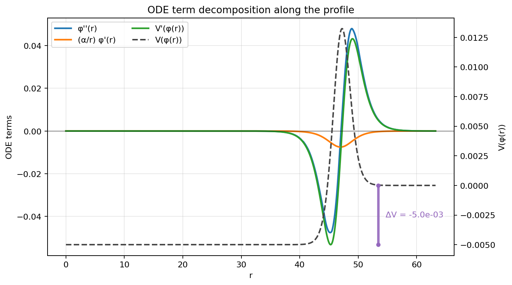

*Thick-wall -  ODE Terms contributions*
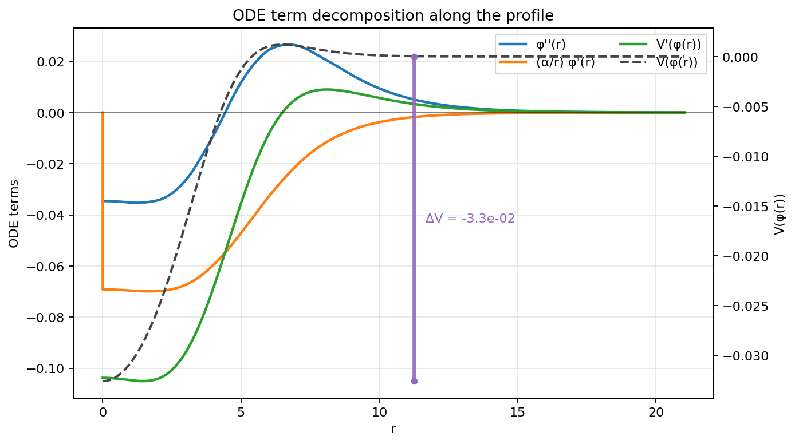

*Thin-wall -  Action*
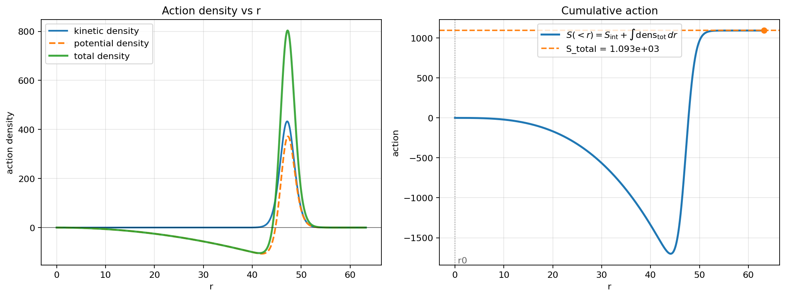

*Thick-wall - Action*
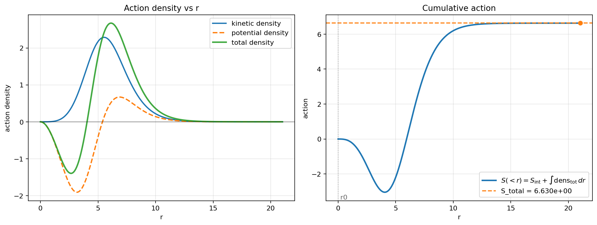


```text
Wall diagnostics:

{
  "label": "thin-wall",
  "phi_metaMin": 0.0,
  "phi_absMin": 1.0,
  "phi_bar": 0.8371714313771578,
  "phi_top": 0.4699999983395586,
  "V(phi_meta)": 0.0,
  "V(phi_true)": -0.0050000000000000044,
  "V(phi_top)": 0.013237432499999993,
  "DeltaV_true_minus_meta": -0.0050000000000000044,
  "r0": 40.55284169790182,
  "phi0": 0.9900000000000001,
  "dphi0": -0.007033518046022252,
  "rscale_cubic": 1.6677093050224265,
  "rscale_curv": 2.003609750059915,
  "wall_r_hi": 50.18104547208761,
  "wall_thickness": 6.229542940963725,
  "S_total": 1093.4288131878518,
  "S_kin": 1638.3947831914747,
  "S_pot": -544.9659700036232,
  "S_interior": 0.0,
  "beta_rscale": 0.5996248848575876,
  "beta_curvature": 0.49909918859817576,
  "beta_wall": 0.16052542048057503
}

{
  "label": "thick-wall",
  "phi_metaMin": 0.0,
  "phi_absMin": 1.0,
  "phi_bar": 0.31010205014581543,
  "phi_top": 0.20000000196657425,
  "V(phi_meta)": 0.0,
  "V(phi_true)": -0.05000000000000002,
  "V(phi_top)": 0.0011999999999999992,
  "DeltaV_true_minus_meta": -0.05000000000000002,
  "r0": 0.0002357022627131459,
  "phi0": 0.7421401843117063,
  "dphi0": -8.151238531343361e-06,
  "rscale_cubic": 2.357022627131459,
  "rscale_curv": 2.499999981574293,
  "wall_r_hi": 7.990901987734343,
  "wall_thickness": 7.990901987734343,
  "S_total": 6.6298736618724545,
  "S_kin": 9.943318384815374,
  "S_pot": -3.3134447229429216,
  "S_interior": 0.0,
  "beta_rscale": 0.42426406454019444,
  "beta_curvature": 0.4000000002104124,
  "beta_wall": 0.1251423182933482
}
```

### Notes

It's **important** to emphasize that within this example, you can apply your **own potential** and test it to obtain all these graphs. 
Note that so far, there are no temperature corrections or anything like that; we're doing everything very simply. 
The rest will be covered in the next modules.

Go to: [docs/examples/example_tunneling1D.py](/docs/examples/example_tunneling1D.py)

1. At the beginning of the code, define your potential.

```python
def V_mine(phi: float) ->float:
    return 0.25 * phi ** 4 - 0.49 * phi ** 3 + 0.235 * phi ** 2
```
2. Go to the end of the code and uncomment the line with

```python
run_all(case="mine", xguess=None, phitol=1e-5,thinCutoff=0.01,
             phi_abs= 1.0, phi_meta =0.0, save_dir=None)
```

Note that you need to know a priori what $\phi_{true}$ and 
$\phi_{meta}$ are, and you may need to adjust some parameters depending 
on the error encountered raised throughout the code.

---

