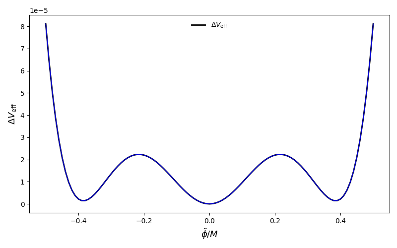
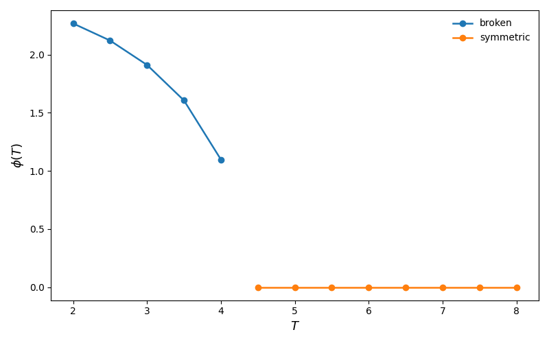
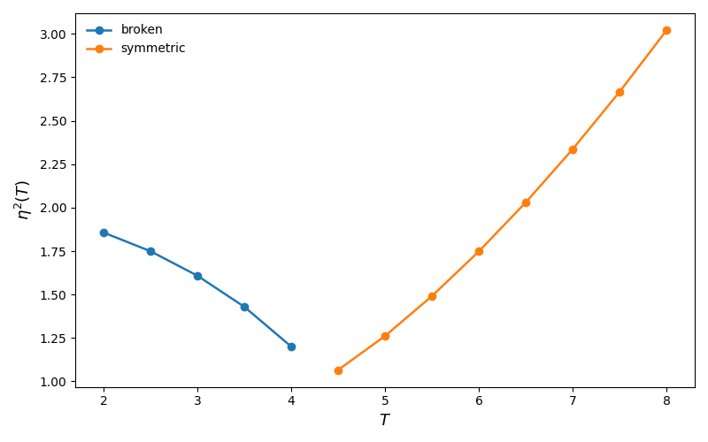
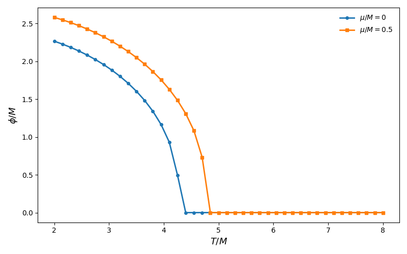

# OPT Effective Potential Module

## Overview

This module implements the **Optimized Perturbation Theory (OPT)** effective potential used in the Mathematica notebook that motivated this work. Its purpose is to provide a clean, testable, and reusable Python interface for evaluating the thermal effective potential of the model, solving the associated **gap equation**, following **stationary branches**, and reproducing the main numerical workflows of the notebook.

In practical terms, the module allows us to:

1. evaluate the **off-shell** effective potential  
   $
   V_{\mathrm{eff}}(\phi,\eta^2;T,\mu),
   $

2. solve the OPT **gap equation** for the variational mass parameter  
   $
   \eta^2 = \eta^2(\phi,T,\mu),
   $

3. build the **on-shell** potential  
   $
   V_{\mathrm{eff}}(\phi;T,\mu)
   =
   V_{\mathrm{eff}}(\phi,\eta^2(\phi,T,\mu);T,\mu),
   $

4. scan $V(\phi)$ for fixed temperature $T$ and chemical potential $\mu$,

5. identify approximate minima,

6. follow the broken and symmetric branches as the temperature changes,

7. reproduce the section-3 notebook scan and related plots.

---

## Why this module exists

The original Mathematica notebook contains the full physical logic, but its workflow is not immediately modular. The goal of this Python implementation is to separate the problem into well-defined layers:

- **physics formulas**,
- **thermal backend**,
- **root solving**,
- **branch tracing**,
- **observables**,
- **plotting helpers**.

This makes the code easier to test, extend, and connect later to the rest of the `CosmoTransitions` workflow, especially for phase transition finding and gravitational-wave observables.

---

# 1. Physical picture

## 1.1 Two related potentials: off-shell vs on-shell

A central conceptual point of the OPT construction is that the module works with **two different objects**.

### Off-shell potential
The most basic object is

$
V_{\mathrm{eff}}(\phi,\eta^2;T,\mu),
$

which depends both on the background field $\phi$ and on the variational mass parameter $\eta^2$.

This is called **off-shell** because $\eta^2$ is still being treated as an independent variable.

### On-shell potential
The physical potential used in scans is instead obtained only after solving the gap equation,

$$
F_\eta(\phi,\eta^2;T,\mu)=0.
$$

That defines the physical branch

$$
\eta^2 = \eta^2(\phi,T,\mu),
$$

and then the physical potential becomes

$$
V_{\mathrm{eff}}(\phi;T,\mu)
=
V_{\mathrm{eff}}(\phi,\eta^2(\phi,T,\mu);T,\mu).
$$

This is the **on-shell** potential.

### Analogy
A useful analogy is the following:

- the **off-shell** potential is like a landscape drawn in two coordinates, $(\phi,\eta^2)$,
- the **gap equation** selects a special curve through that landscape,
- the **on-shell** potential is the restriction of the landscape to that curve.

So the module is not just “plotting a potential”: it is first solving a constrained optimization problem and then evaluating the potential along the physically allowed path.

---

## 1.2 The role of the gap equation

In the notebook logic, the variational parameter $\eta^2$ is not arbitrary. It is fixed by the OPT physical prescription through a nonlinear equation that we write as a residual

$$
F_\eta(\phi,\eta^2;T,\mu)=0.
$$

This equation must be solved repeatedly:

- for every point in a $\phi$-scan,
- for every temperature in a branch trace,
- for every evaluation of the on-shell potential.

This is why the root-solving layer is one of the most important numerical parts of the module.

---

## 1.3 The stationary condition in $\phi$

Besides the gap equation, the notebook also uses the stationary condition in $\phi$, written in this module as

$$
F_\phi(\phi,\eta^2;T,\mu)=0.
$$

The implemented object is the **factored residual** used in the notebook, after extracting the trivial overall $\phi$ factor from $dV/d\phi$. The relation is

$$
\frac{dV}{d\phi} = \frac{\phi}{24} F_\phi.
$$

This means:

- $\phi=0$ is always a stationary possibility and defines the **symmetric branch**,
- the equation $F_\phi=0$ defines the **nontrivial broken branch**.

This distinction is numerically and physically important.

---

## 1.4 Thermal functions and the high-temperature expansion

The notebook introduces thermal functions $H_1$, $H_3$, and $H_5$, which are built from a more general high-temperature object. In the Python module these are implemented in two ways:

1. **Notebook high-temperature formulas**, valid for general $\mu$ within the real-valued domain used in the notebook,
2. **CosmoTransitions bosonic backend** for $\mu=0$, using `Jb` when available.

This hybrid structure is deliberate:

- for $\mu\neq0$, the notebook formula is the active implementation,
- for $\mu=0$, the code can use either the notebook approximation or the `CosmoTransitions` backend.

---

# 2. Numerical philosophy of the module

## 2.1 Why continuation matters

The notebook repeatedly reuses previous solutions as seeds for new points. This is called **continuation**.

The idea is simple: if you already know the solution at one point, then a nearby point probably has a nearby solution. Reusing the previous answer as the next seed makes the solve much more stable.

This is used in:

- $\phi$-scans,
- temperature scans,
- branch tracing.

Without continuation, the code would still work in some regimes, but it would be less robust and much slower.

---

## 2.2 Why physical domains must be enforced

The thermal formulas involve quantities like

$$
\sqrt{\Omega^2}, \qquad \log\!\left(\frac{M}{\sqrt{\Omega^2}}\right),
\qquad
r = \frac{\mu}{\sqrt{\Omega^2}},
$$

with

$$
\Omega^2 = m^2 + \eta^2.
$$

Therefore, the numerical solver must respect several domain constraints:

- $\Omega^2 > 0$,
- $M > 0$,
- in the notebook real-valued high-T regime, $|r|<1$.

These constraints are not optional numerical decorations. They are part of the physical definition of the formulas being used.

---

## 2.3 Why some on-shell scans can fail

An important subtlety is that the on-shell potential $V(\phi;T,\mu)$ is only defined at values of $\phi$ for which the gap equation admits a **physical real solution**.

So a failure in `solve_eta2_given_phi(...)` does **not automatically mean** a bug in the solver. In some regions, there simply is no real physical root for the chosen $(\phi,T,\mu)$.

This is especially important when comparing:

- **direct $\phi$-scans** of the on-shell potential,
- **branch tracing** based on stationary equations.

These are related but not identical numerical tasks.

---

# 3. Module structure

The module is organized into ten layers:

1. **Model parameters and numerical options**  
2. **Low-level utilities**  
3. **Thermal backend**  
4. **Core physics equations**  
5. **Root-solving helpers**  
6. **Branch solvers**  
7. **On-shell potential layer**  
8. **Scans and continuation**  
9. **Observables**  
10. **Plotting and notebook reproduction helpers**

Each layer is described below.

---

# 4. Model parameters and numerical options

## `OPTModelParams`

This dataclass stores the physical parameters of the model:

- `m2`: bare mass parameter $m^2$,
- `lam`: quartic coupling $\lambda$,
- `M`: renormalization scale.

### Typical usage
```text
params = OPTModelParams(m2=-1.0, lam=1.0, M=1.0)
````

---

## `SolverOptions`

This dataclass stores the numerical controls for root solving and scans:

* `root_tol`: root-finding tolerance,
* `max_iter`: maximum number of iterations,
* `continuation`: whether to reuse previous solutions as seeds.

### Typical usage

```text
solver = SolverOptions(root_tol=1e-12, max_iter=300, continuation=True)
```

---

## `ThermalOptions`

This dataclass controls the thermal backend:

* `mode_mu0`: strategy for $\mu=0$,
* `mode_muneq0`: strategy for $\mu\neq0$,
* `ct_mu0_approx`: approximation mode passed to `Jb`,
* `ct_mu0_n`: truncation parameter for `Jb`,
* `mu_zero_tol`: tolerance used to decide whether $\mu$ should be treated as zero.

### Typical usage

```text
thermal = ThermalOptions(
    mode_mu0="notebook_highT",
    mode_muneq0="notebook_highT",
)
```

or

```text
thermal = ThermalOptions(
    mode_mu0="auto",
    mode_muneq0="notebook_highT",
    ct_mu0_approx="exact",
    ct_mu0_n=20,
)
```

---

# 5. Low-level utilities

These functions are the smallest building blocks of the module.

## `effective_mass_sq(eta2, params)`

Returns

$$
\Omega^2 = m^2 + \eta^2.
$$

This combination appears everywhere in the thermal functions and logarithms.

---

## `validate_effective_mass_sq(eta2, params)`

Checks whether the physical domain is valid:

* $\Omega^2 > 0$,
* $M > 0$,
* finite inputs.

This function is a guardrail. It prevents unphysical evaluations before they propagate deeper into the code.

---

## `thermal_variables(m2_eff, T, mu)`

Builds the dimensionless variables used in the notebook formulas:

$$
y = \frac{\sqrt{m^2_{\mathrm{eff}}}}{T},
\qquad
r = \frac{\mu}{\sqrt{m^2_{\mathrm{eff}}}}.
$$

These are the natural arguments of the notebook high-temperature functions.

---

# 6. Thermal backend

This layer implements the thermal objects used in the effective potential.

## `h_e_odd(l, y, r)`

This is the master notebook formula for the odd-(H) family. It is the base object from which the module constructs:

* (H_1),
* (H_3),
* (H_5).

It is implemented in the real-valued regime of the notebook, which requires

$$
|r| < 1.
$$

---

## `H1_notebook_highT(m2_eff, T, mu)`

Notebook high-temperature approximation for (H_1).

---

## `H3_notebook_highT(m2_eff, T, mu)`

Notebook high-temperature approximation for (H_3).

---

## `H5_notebook_highT(m2_eff, T, mu)`

Notebook high-temperature approximation for (H_5).

---

## `H3_ct_mu0(m2_eff, T, approx="exact", n=8)`

Optional $\mu=0$ backend using the bosonic `CosmoTransitions` thermal integral `Jb`.

The implemented mapping is

$$
H_5 = -\frac{J_b(x)}{8},
\qquad
H_3 = \frac{J_b'(x)}{2x},
\qquad
x = \frac{\sqrt{m^2_{\mathrm{eff}}}}{T}.
$$

This mapping was chosen to be consistent with the derivative identity and the small-(x) normalization.

---

## `H5_ct_mu0(m2_eff, T, approx="exact", n=8)`

Optional $\mu=0$ backend for H_5, again using `Jb`.

---

## `H3(m2_eff, T, mu, thermal)`

Public dispatcher for H_3.

### Logic

* if $\mu\neq0$: use the notebook high-(T) formula,
* if $\mu=0$: choose notebook or `CosmoTransitions` according to `thermal`.

---

## `H5(m2_eff, T, mu, thermal)`

Public dispatcher for H_5, analogous to `H3`.

---

# 7. Core physics equations

This is the physical heart of the module.

## `opt_veff_off_shell(phi, eta2, T, mu, params, thermal)`

Computes the off-shell effective potential

$$
V_{\mathrm{eff}}(\phi,\eta^2;T,\mu).
$$

This is the direct translation of the physical notebook expression, organized into several pieces:

* thermal terms,
* logarithmic terms,
* tree-level $\phi^2$ and $\phi^4$ pieces,
* OPT-dependent pieces.

### Important remark

This function does **not** solve the gap equation. It only evaluates the off-shell object.

---

## `eta_gap_residual(phi, eta2, T, mu, params, thermal)`

Computes the gap equation residual

$$
F_\eta(\phi,\eta^2;T,\mu).
$$

The physical solution is obtained by solving

$$
F_\eta = 0.
$$

This function is used repeatedly by all on-shell evaluations.

---

## `phi_stationary_residual(phi, eta2, T, mu, params, thermal)`

Computes the factored stationary residual in $\phi$,

$$
F_\phi(\phi,\eta^2;T,\mu),
$$

which satisfies

$$
\frac{dV}{d\phi} = \frac{\phi}{24}F_\phi.
$$

### Why factored?

Because $\phi=0$ is a trivial stationary possibility. Factoring it out allows us to isolate the **nontrivial broken branch equation**.

---

# 8. Root-solving helpers

This layer is responsible for solving the nonlinear equations robustly.

## `_eta2_physical_lower_bound(mu, params, thermal, safety=1e-12)`

Returns the strict lower bound for (\eta^2), combining:

* $\eta^2 \ge 0$,
* $\Omega^2 > 0$,
* for notebook high-(T) with $\mu\neq0$, the real-valued requirement $|r|<1$.

This defines the numerical region where the solver is allowed to search.

---

## `solve_eta2_given_phi(phi, T, mu, eta2_seed, params, thermal, solver)`

Solves the gap equation for fixed $(\phi,T,\mu)$.

### Numerical strategy

The solver uses three layers:

1. **local bracketing** around the seed,
2. **Brent solve** if a bracket is found,
3. **fallback scan and secant attempts** if local bracketing fails.

### Why this design?

Because the gap equation can be delicate:

* roots may sit very close to the physical lower bound,
* the residual can be stiff,
* continuation helps, but cannot solve everything by itself.

### Important interpretation

If this function fails, it may mean either:

* the seed was poor,
* or there is **no physical real root** for that $\phi$.

This distinction matters physically.

---

## `solve_stationary_system(T, mu, eta2_seed, phi2_seed, params, thermal, solver)`

Solves the coupled system

$$
F_\eta = 0,
\qquad
F_\phi = 0,
$$

for the broken branch.

The solve is performed in transformed variables

$$
\eta^2 = \eta^2_{\min} + e^u,
\qquad
\phi^2 = e^v,
$$

so the solver automatically remains in the physical region.

### Why solve in $\phi^2$?

Because the broken branch is naturally characterized by a nonzero $\phi^2$, and this removes sign ambiguity during the solve.

---

# 9. Branch solvers

These are higher-level wrappers that implement the notebook section-2 logic.

## `solve_symmetric_branch(T, mu, eta2_seed, params, thermal, solver)`

Solves the symmetric branch, defined by

$$
\phi = 0.
$$

So this reduces to solving only the gap equation.

---

## `solve_broken_branch(T, mu, eta2_seed, phi2_seed, params, thermal, solver)`

Solves the broken branch using the coupled stationary system.

### Strategy

This wrapper tries several nearby seeds and accepts the best sufficiently accurate broken-branch solution.

This mirrors the practical notebook logic: one often needs a bit of seed flexibility to keep the branch alive numerically.

---

# 10. On-shell potential layer

This layer translates the off-shell potential into physical on-shell quantities.

## `veff_on_shell(phi, T, mu, eta2_seed, params, thermal, solver)`

For fixed $\phi$, it:

1. solves the gap equation for $\eta^2(\phi,T,\mu)$,
2. evaluates the off-shell potential at that solution,
3. returns both the on-shell potential and the corresponding $\eta^2$.

So its output is

$$
\left(
V_{\mathrm{eff}}(\phi;T,\mu),
\eta^2(\phi,T,\mu)
\right).
$$

---

## `veff_difference_from_origin(phi, T, mu, eta2_seed_phi, eta2_seed_zero, params, thermal, solver)`

Computes the quantity used in section 3 of the notebook:

$$
\Delta V(\phi)
$$
==============

## $V_{\mathrm{eff}}(\phi;T,\mu)$

$
V_{\mathrm{eff}}(0;T,\mu).
$

This is especially useful because the absolute normalization of the potential is often less informative than the **difference relative to the origin**.

---

# 11. Scans and continuation

This layer builds full curves rather than isolated evaluations.

## `scan_potential(phi_grid, T, mu, eta2_seed, params, thermal, solver, subtract_origin=True)`

Scans the on-shell potential over a user-supplied $\phi$-grid.

### Outputs

The returned dictionary includes:

* `"phi"`: the field grid,
* `"values"`: either $V(\phi)$ or $\Delta V(\phi)$,
* `"eta2"`: the solved gap values,
* optionally `"eta2_zero"` if subtraction from the origin is requested.

### Important note

The order of `phi_grid` matters when `continuation=True`. The code will reuse the previous $\eta^2$ solution as the seed for the next point.

This is not just an optimization trick: it is part of the intended workflow.

---

## `trace_branches_over_T(mu, T_grid, eta2_seed, phi2_seed, params, thermal, solver)`

Follows the stationary solutions as the temperature changes.

### Purpose

This is the natural tool for notebook section 2 logic.

It tracks:

* the broken branch while $\phi^2>0$,
* then switches to the symmetric branch when the broken branch disappears numerically.

### Output

The returned dictionary contains:

* `"T"`,
* `"eta2"`,
* `"phi2"`,
* `"phi"`,
* `"is_broken"`,
* `"branch"`.

### Important conceptual note

This routine follows stationary branches, not arbitrary on-shell $\phi$-scans. This difference is essential.

---

# 12. Observables

These are convenient physics-facing wrappers built from the lower layers.

## `phi_min(T, mu, phi_grid, eta2_seed, params, thermal, solver)`

Returns the approximate minimum of the on-shell potential on a discrete $\phi$-grid.

### Important limitation

This is a **grid minimum**, not a continuous minimization.

It is appropriate when:

* the on-shell potential exists on the chosen grid,
* a discrete scan is sufficient.

It should **not** be confused with branch tracing.

---

## `eta2_solution(phi, T, mu, eta2_seed, params, thermal, solver)`

Simple wrapper returning only the on-shell solution $\eta^2(\phi,T,\mu)$.

Useful when one wants the gap solution but not the potential value itself.

---

## `Tc_opt(mu, T_grid, eta2_seed, phi2_seed, params, thermal, solver)`

Estimates the OPT critical temperature by tracing branches over the supplied temperature grid.

### Current definition

At present, the code defines T_c as the first temperature where the branch-tracing logic switches from broken to symmetric.

So this is a **grid-level estimate**, not yet a refined interpolated or degeneracy-based critical temperature.

---

## `Tc_pt(mu, params)`

Returns the perturbative benchmark critical temperature,

$$
T_c^2 = 18(\mu^2 - m^2).
$$

This is a useful reference curve and sanity check, even though it is not the full OPT result.

---

# 13. Plotting and notebook reproduction helpers

These functions make it easier to validate the module visually.

## `reproduce_section3_scan(...)`

This is the main end-to-end convenience helper.

By default, it reproduces the notebook section-3 scan using:

* the same default (T),
* the same default $\mu$,
* the same default $\phi$-range and step,
* the same default subtraction convention.

It also remains generic, so the user can change:

* `phi_max`,
* `dphi`,
* `T`,
* `mu`,
* numerical options.

---

## `plot_potential_scan(scan_data, show=True)`

Plots the output of `scan_potential(...)` or `reproduce_section3_scan(...)`.

It automatically detects whether the plotted quantity is:

* $V_{\mathrm{eff}}$,
* or $\Delta V_{\mathrm{eff}}$.

---

## `plot_branches(trace_data, show=True)`

Plots the temperature branch data produced by `trace_branches_over_T(...)`.

It creates two figures:

1. $\phi(T)$,
2. $\eta^2(T)$.

This is the natural visualization tool for notebook section 2.

---

# 14. Recommended workflows

## Workflow A — Reproduce section 3

Use this when you want the notebook-style $\Delta V(\phi)$ scan.

```python
from CosmoTransitions import (
    OPTModelParams, ThermalOptions, SolverOptions,
    reproduce_section3_scan, plot_potential_scan
)

params = OPTModelParams(m2=-1.0, lam=1.0, M=1.0)
thermal = ThermalOptions(mode_mu0="notebook_highT", mode_muneq0="notebook_highT")
solver = SolverOptions(root_tol=1e-12, max_iter=300, continuation=True)

scan = reproduce_section3_scan(
    params=params,
    thermal=thermal,
    solver=solver,
)

plot_potential_scan(scan)
```

---

## Workflow B — Evaluate the on-shell potential at a single point

```python
from CosmoTransitions import (
    OPTModelParams, ThermalOptions, SolverOptions, veff_on_shell
)

params = OPTModelParams()
thermal = ThermalOptions(mode_mu0="notebook_highT", mode_muneq0="notebook_highT")
solver = SolverOptions()

veff, eta2 = veff_on_shell(
    phi=0.30,
    T=4.760359332047422,
    mu=0.5,
    eta2_seed=2.1214029070500127,
    params=params,
    thermal=thermal,
    solver=solver,
)
```

---

## Workflow C — Trace branches in temperature

Use this when you want the notebook section-2 logic.

```python
from CosmoTransitions import (
    OPTModelParams, ThermalOptions, SolverOptions,
    trace_branches_over_T, plot_branches
)
import numpy as np

params = OPTModelParams()
thermal = ThermalOptions(mode_mu0="auto", mode_muneq0="notebook_highT")
solver = SolverOptions(root_tol=1e-12, max_iter=300, continuation=True)

T_grid = np.linspace(2.0, 8.0, 81)

trace = trace_branches_over_T(
    mu=0.0,
    T_grid=T_grid,
    eta2_seed=2.0,
    phi2_seed=4.0,
    params=params,
    thermal=thermal,
    solver=solver,
)

plot_branches(trace)
```

---

## Workflow D — Find an approximate minimum by direct scan

```python
from CosmoTransitions import (
    OPTModelParams, ThermalOptions, SolverOptions, phi_min
)
import numpy as np

params = OPTModelParams()
thermal = ThermalOptions(mode_mu0="notebook_highT", mode_muneq0="notebook_highT")
solver = SolverOptions()

phi_grid = np.linspace(-0.5, 0.5, 101)

phi_star, V_star = phi_min(
    T=4.760359332047422,
    mu=0.5,
    phi_grid=phi_grid,
    eta2_seed=2.1214029070500127,
    params=params,
    thermal=thermal,
    solver=solver,
)
```

---

# 15. Interpretation notes and best practices

## 15.1 When to use `scan_potential(...)`

Use direct $\phi$-scans when you want:

* the shape of the on-shell potential,
* a section-3 type notebook reproduction,
* a local potential comparison at fixed (T,\mu).

---

## 15.2 When to use `trace_branches_over_T(...)`

Use branch tracing when you want:

* $\phi(T)$ on a stationary branch,
* broken/symmetric phase following,
* the notebook section-2 type information.

This is usually the more appropriate tool for thermal histories.

---

## 15.3 Why `phi_min(...)` is not the same as branch tracing

A direct on-shell $\phi$-scan assumes the gap equation can be solved at every (\phi) in the grid.

A branch trace instead follows solutions of the coupled stationary system.

These tasks answer different questions:

* `phi_min(...)`: “what is the minimum on this scanned on-shell curve?”
* `trace_branches_over_T(...)`: “what stationary phase branch survives as temperature changes?”

---

## 15.4 About failures in `solve_eta2_given_phi(...)`

A failure may indicate:

* a poor seed,
* an insufficient scan range,
* or genuinely no physical real root.

This is why the module separates:

* direct $\phi$-scans,
* branch solving,
* branch tracing.

The user should choose the layer that matches the physical question.

---

# 16. Validation and tests

The module was developed together with a dedicated test file that checks:

* low-level utilities,
* thermal identities,
* consistency of the off-shell formulas,
* root-solving accuracy,
* branch solving,
* on-shell evaluations,
* scans and continuation,
* observable helpers,
* plotting and notebook reproduction.

Below are suggested placeholders for the most relevant validation outputs.

---

## 16.1 Suggested validation figures

### Section-3 reproduction





### Branch tracing: $\phi(T)$




### Branch tracing: $\eta^2(T)$




### Comparison of $\mu/M=0$ and $\mu/M=0.5$

*


---

## 16.2 Suggested validation printouts

### Example: thermal identity check

```text
=== Thermal backend tests ===
H1_notebook_highT = 6.238764517764
H3_notebook_highT = 0.690904877278
H5_notebook_highT = 0.268157247933
dH5/dm2 (FD)       = -3.746302296159e-03
-H3/(8 T^2)        = -3.746302313813e-03
dH3/dm2 (FD)       = -5.908580585912e-02
-H1/(4 T^2)        = -5.908580590729e-02
Unified dispatch for mu != 0: passed.
H3 notebook vs CT rel. diff. = 3.238e-16
H5 notebook vs CT rel. diff. = 4.991e-15
CT mu=0 backend comparison: passed.
All thermal backend tests passed.

```

### Example: section-3 scan summary

```text
=== Plotting and notebook reproduction helper tests ===
section 3 scan keys      = ['phi', 'values', 'eta2', 'eta2_zero', 'quantity', 'subtract_origin', 'T', 'mu', 'phi_max', 'dphi', 'eta2_seed']
section 3 quantity       = deltaV
section 3 number of pts  = 101
section 3 T              = 4.760359332047
section 3 mu             = 0.500000000000
section 3 DeltaV(phi=0) = 1.421085471520e-14
generic scan number of pts = 41
generic scan quantity      = veff
generic scan min(V)        = -284.989500306239
generic scan max(V)        = -284.934940602553
All plotting and notebook reproduction helper tests passed.

```

### Example: branch solver summary

```text
=== Branch solver tests ===
solve_symmetric_branch = 1.252275098977
solve_eta2_given_phi   = 1.252275098977
F_eta(sym root)        = 2.792654996142e-12
solve_broken_branch eta2 = 1.856831051347
solve_broken_branch phi2 = 5.140986308084
F_eta(broken root)       = 0.000000000000e+00
F_phi(broken root)       = -7.105427357601e-15
solve_stationary_system eta2 = 1.856831051347
solve_stationary_system phi2 = 5.140986308084
All branch solver tests passed.
```

---

# 17. Current limitations

This module is already a complete and reusable implementation of the notebook logic, but some important limitations should be kept in mind.

## 17.1 `Tc_opt` is still a simple estimate

The current implementation defines $T_c$ by branch switching on a supplied temperature grid. A future refinement could define (T_c) more precisely through potential degeneracy or interpolation.

## 17.2 The $\mu\neq0$ backend is notebook high-(T)

For nonzero chemical potential, the active implementation is the notebook high-temperature approximation. This is the intended behavior for now.

## 17.3 `phi_min(...)` is discrete

It returns the minimum on a supplied grid, not a refined continuous minimizer.

## 17.4 On-shell scans are not guaranteed to exist for all $\phi$

This is a physical issue, not just a numerical one. In some regimes, the gap equation may have no physical real solution for a given $\phi$.

---

# 18. Connection to future work

This module is designed to be the effective-potential engine that later feeds the rest of the first-order phase transition workflow.

In particular, it can be coupled to:

* phase transition finding,
* thermal history reconstruction,
* bounce calculations,
* nucleation temperature extraction,
* gravitational-wave signal computation.

So the present module should be viewed as the **potential layer** on top of which the full phase transition and gravitational-wave analysis can be organized.

---

# 19. Summary

The `OPT.py` module provides a complete Python implementation of the OPT effective potential workflow developed in the Mathematica notebook. Its design is intentionally layered:

* first define the physical formulas,
* then implement robust thermal backends,
* then solve the gap equation,
* then build the on-shell potential,
* then scan, trace, and extract observables.

The most important conceptual lesson is that the code distinguishes clearly between:

* the **off-shell** object $V(\phi,\eta^2)$,
* the **gap equation** that defines the physical $\eta^2$,
* the **on-shell** potential $V(\phi)$,
* and the **stationary branches** followed across temperature.

That separation is what makes the module both physically transparent and numerically reusable.

---

# 20. API quick reference

## Dataclasses

* `OPTModelParams`
* `SolverOptions`
* `ThermalOptions`

## Low-level utilities

* `effective_mass_sq`
* `validate_effective_mass_sq`
* `thermal_variables`

## Thermal backend

* `h_e_odd`
* `H1_notebook_highT`
* `H3_notebook_highT`
* `H5_notebook_highT`
* `H3_ct_mu0`
* `H5_ct_mu0`
* `H3`
* `H5`

## Core physics equations

* `opt_veff_off_shell`
* `eta_gap_residual`
* `phi_stationary_residual`

## Root-solving helpers

* `_eta2_physical_lower_bound`
* `solve_eta2_given_phi`
* `solve_stationary_system`

## Branch solvers

* `solve_symmetric_branch`
* `solve_broken_branch`

## On-shell potential layer

* `veff_on_shell`
* `veff_difference_from_origin`

## Scans and continuation

* `scan_potential`
* `trace_branches_over_T`

## Observables

* `phi_min`
* `eta2_solution`
* `Tc_opt`
* `Tc_pt`

## Plotting and notebook reproduction

* `reproduce_section3_scan`
* `plot_potential_scan`
* `plot_branches`

