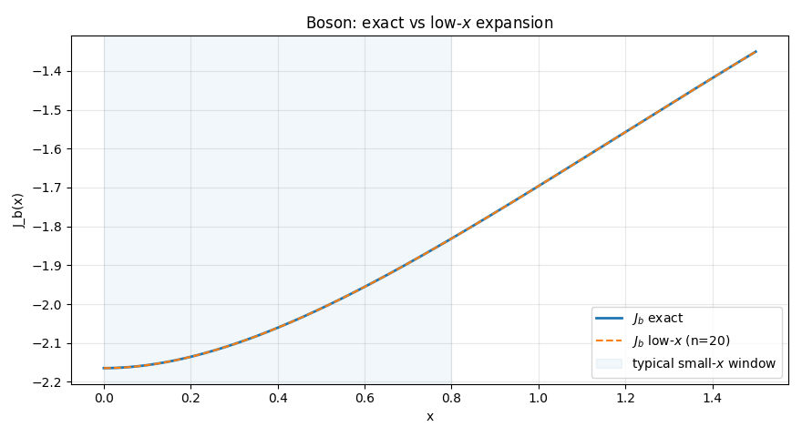
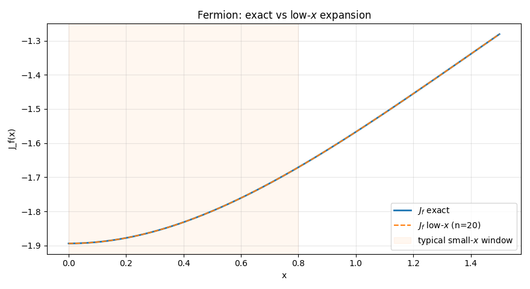
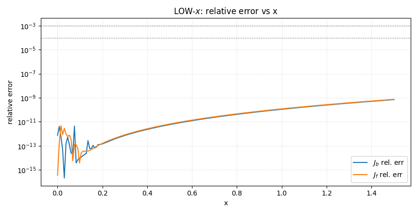
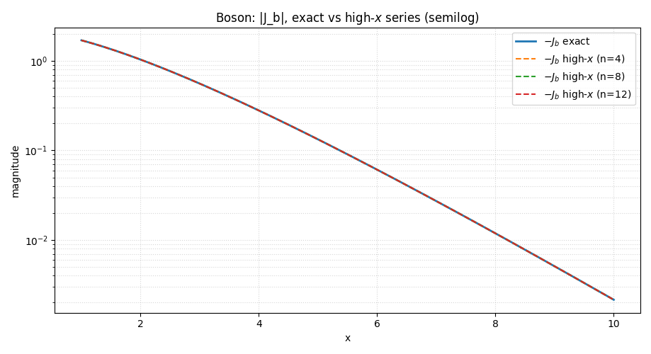
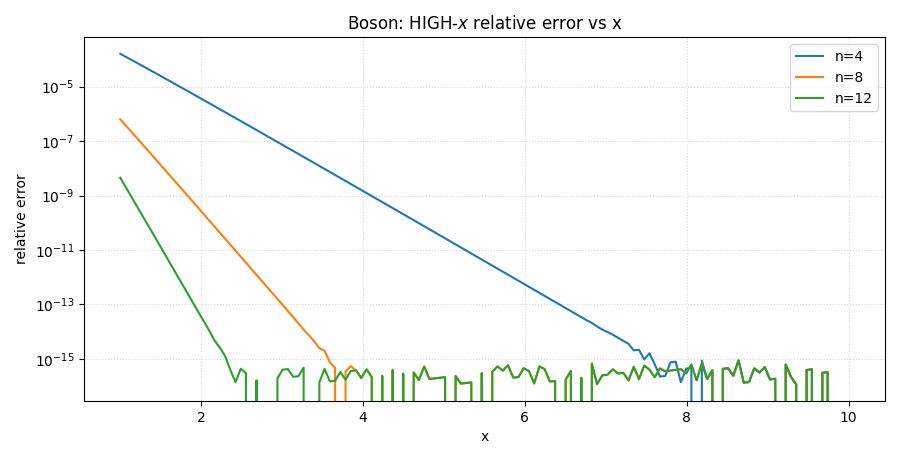
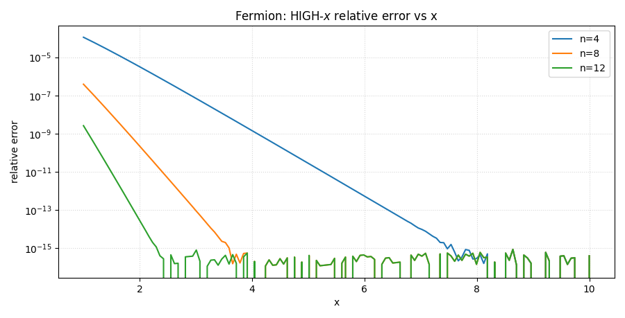

# Approx Thermal Integrals (Jb, Jf)

---

## Low-x (High-T) Approximate Thermal Integrals

This page documents the **small (x)** (high temperature) asymptotic expansions for the 1 loop thermal integrals:

$$J_b(x)=\int_0^\infty dy y^2\ln\bigl(1-e^{-\sqrt{y^2+x^2}}\bigr)\qquad
J_f(x)=\int_0^\infty dy -y^2\ln\bigl(1+e^{-\sqrt{y^2+x^2}}\bigr)$$

with (x = m/T). The functions below implement the **low (x)** series used ubiquitously in finite temperature QFT.

**Purpose (for both):** provide fast, vectorized approximations valid for ($|x|\ll 1$). They return types (scalar-in → scalar-out; array-in → array-out), using modern numerics and clear error handling.

---

### Signatures

```python
Jb_low(x: float | array_like, n: int = 20) -> float | np.ndarray
Jf_low(x: float | array_like, n: int = 20) -> float | np.ndarray
```

---

### Formulas

For small (|x|), the bosonic and fermionic integrals admit the asymptotic series

$$\boxed{
\begin{aligned}
J_b(x) &=
-\frac{\pi^4}{45}
+\frac{\pi^2}{12} x^2
-\frac{\pi}{6} x^3
-\frac{1}{32} x^4\Big(\ln x^2 - C_b\Big)
+\sum_{i=1}^{n} g^{(b)}*i x^{2i+4} \\
J_f(x) &=
-\frac{7\pi^4}{360}
+\frac{\pi^2}{24}x^2
+\frac{1}{32}x^4\Big(\ln x^2 - C_f\Big)
+\sum_{i=1}^{n} g^{(f)}_i x^{2i+4}
\end{aligned}}$$

where

$$C_b = \tfrac{3}{2}-2\gamma_E + 2\ln(4\pi)\qquad
C_f = \tfrac{3}{2}-2\gamma_E + 2\ln(\pi)
$$

and ($\gamma_E$) is the Euler Mascheroni constant. The tail coefficients ($g^{(b)}_i, g^{(f)}_i$) are precomputed from combinations of the Riemann zeta and Gamma functions (as in the literature), and we truncate the tail at order (n) (default (n=20), capped at 50).

**Implementation notes**

* The ($x^4\ln x^2$) piece has a **removable singularity** at (x=0). We evaluate it as *exactly zero* at ($x=0$) to avoid ($0\times(-\infty)$) numerics.
* The tail ($\sum_{i=1}^{n}g_i x^{2i+4}$) is accumulated as ($x^4 \sum_i g_i (x^2)^i$) for stability and performance.

---

### Parameters, Returns & Errors

**Parameters (both)**

* `x` (`float | array_like`): argument (x=m/T). Intended for the **small (x)** regime.
* `n` (`int`, default `20`): number of tail terms to add. Clipped to the available (50) precomputed terms.

**Returns (both)**

* `float | np.ndarray`: ($J_{b,f}(x)$) with the chosen truncation; preserves scalar/array shape.

**Raises (both)**

* `ValueError` if `n < 0`.
* `TypeError` if `x` is complex. (Low (x) expansions are defined for **real** (x). For complex/imaginary mass, use the **exact** or **spline** implementations.)

---

### When to use

* Use `Jb_low` / `Jf_low` for **fast high-T evaluations** with ($|x|\ll 1$) when you don’t need the full integral and want smooth dependence near the origin.
* Prefer the **exact** or **spline** versions outside the small (x) window or when high accuracy is required globally.

**Caveats (asymptotic series):**

* Adding more terms (`n`) usually improves accuracy for **sufficiently small** (x), but for fixed (x) the series is asymptotic—there is an optimal truncation beyond which errors **grow**.
* Not suitable for complex (x) (no physical meaning for mixed real+imag parts here; use exact/spline branches instead).

---

### Usage hints

```python
# Small-x grid (e.g., up to x ~ 0.5)
x = np.linspace(0.0, 0.5, 200)

# Fast approximations
Jb_approx = Jb_low(x, n=20)
Jf_approx = Jf_low(x, n=20)

# Cross-check near the origin (optional)
Jb0 = Jb_low(0.0)   # ≈ -π^4/45
Jf0 = Jf_low(0.0)   # ≈ -7π^4/360
```

For full validation plots and quantitative error checks against the **exact** integrals, see the test suite for this sub-module.

---

### Low-x (High-T) - Test

Comparison: exact vs. low-x series

**Setup:** ($x \in [0,,1.5]$). We intentionally go beyond the strictly small-(x) window to show where the series starts to degrade. Truncation length (n=20) (can be tuned).

**Note:** If you change the grid one can see that for $x \geq 3$, $J_f$ diverges quickly. The same thing happens for $x \geq 5.5$ in $J_b$. 

#### Plots

* **Boson:** exact vs. low-x approximation
  

* **Fermion:** exact vs. low-x approximation
  

* **Relative error** (both species on one panel; log scale)
  

#### Expected behavior

* Near ($x\approx 0$), the low (x) series is excellent for both ($J_b$) and ($J_f$).
* Accuracy gradually decreases as (x) grows; with (n\approx 20), the series is typically reliable up to ($x\sim 0.6{-}0.8$).

#### Console output

```text
=== Test 1: LOW-x (high-T) comparison: exact vs low-x series ===
Boson  (low-x)  n=20: max abs err=9.492e-10, max rel err=7.029e-10
Fermion(low-x)  n=20: max abs err=9.492e-10, max rel err=7.411e-10
  threshold 1e-03: max x with rel err < thr →  J_b: 1.500,  J_f: 1.500
  threshold 1e-04: max x with rel err < thr →  J_b: 1.500,  J_f: 1.500
Expectation: The low-x series is excellent near x≈0 and degrades gradually;
             truncation at n≈20 is typically sufficient up to x~0.6–0.8.
```

* see [tests/finiteT/Approx_Thermal_Integrals](/tests/finiteT/Approx_Thermal_Integrals.py) for more

---

## High-x (Low-T) Approximate Thermal Integrals

This page documents the **large (x)** (low temperature) asymptotic expansions of the 1 loop thermal integrals,

$$J_b(x)=\int_0^\infty dy y^2\ln \bigl(1-e^{-\sqrt{y^2+x^2}}\bigr)\qquad
J_f(x)=\int_0^\infty dy -y^2\ln \bigl(1+e^{-\sqrt{y^2+x^2}}\bigr)$$

with (x=m/T). For ($x\gg 1$), both integrals admit rapidly convergent series in terms of the modified Bessel functions ($K_\nu$).

**Purpose (for all functions in this block):** provide fast, vectorized, and numerically stable **high (x)** approximations (and up to 3 derivatives) using sums of ($K_\nu$).

---

### Signatures

```python
# Term (single-k) building blocks
x2K2(k: int, x: float | array_like)  -> float | np.ndarray
dx2K2(k: int, x: float | array_like) -> float | np.ndarray
d2x2K2(k: int, x: float | array_like)-> float | np.ndarray
d3x2K2(k: int, x: float | array_like)-> float | np.ndarray

# High-x sums (public)
Jb_high(x: float | array_like, deriv: int = 0, n: int = 8) -> float | np.ndarray
Jf_high(x: float | array_like, deriv: int = 0, n: int = 8) -> float | np.ndarray
```

---

### Formulation

The expansions are built from the “single (k)” terms

$$T_k(x)\equiv -\frac{x^2}{k^2}K_2\big(k|x|\big)$$

whose derivatives w.r.t. (x) (accounting for the even/odd symmetry through (|x|)) are:

* **0th:** $(T_k(x)= -\dfrac{x^2}{k^2}K_2\big(k|x|\big))$.
* **1st:** $(\dfrac{dT_k}{dx} = \dfrac{x|x|}{k}K_1\big(k|x|\big))$ (odd, vanishes at (x=0)).
* **2nd:** $(\dfrac{d^2T_k}{dx^2} = |x|\left(\dfrac{K_1(k|x|)}{k}-|x|K_0(k|x|)\right))$ (even).
* **3rd:** $(\dfrac{d^3T_k}{dx^3} = x\left(|x|k K_1(k|x|)-3K_0(k|x|)\right))$ (odd).

Then:

$$\boxed{J_b^{\text{high}}(x) \approx \sum_{k=1}^{n} \frac{d^{\text{deriv}}}{dx^{\text{deriv}}}T_k(x)}$$

$$\boxed{J_f^{\text{high}}(x) \approx \sum_{k=1}^{n} (-1)^{k-1}\frac{d^{\text{deriv}}}{dx^{\text{deriv}}}T_k(x)} $$

The alternating sign for ($J_f$) reflects Fermi–Dirac statistics. Each term decays ($\sim e^{-k|x|}$), so only a few terms are needed for ($x\gtrsim\mathcal{O}(1)$).

#### Small-(x) limits for single-(k) terms

Used to avoid numerical issues and ensure smoothness at (x=0):

$$\lim_{x\to 0} T_k(x) = -\frac{2}{k^4}\qquad
\lim_{x\to 0} \frac{dT_k}{dx} = 0\qquad
\lim_{x\to 0} \frac{d^2T_k}{dx^2} = \frac{1}{k^2}\qquad
\lim_{x\to 0} \frac{d^3T_k}{dx^3} = 0$$

---

### Parameters, Returns & Errors

**Parameters (all):**

* `x` (`float | array_like`, real): argument (x=m/T). These high-(x) series target **real** (x).
* `deriv` (`int`, default `0` for `J*_high`): order of derivative to return (`0`, `1`, `2`, `3`).
* `n` (`int`, default `8` for `J*_high`): number of exponential terms in the truncated sum; must be ≥ 1.

**Returns (all):**

* `float | np.ndarray`: the requested approximation, preserving scalar/array shape.

**Raises (all):**

* `TypeError` if `x` is complex (no physical meaning for mixed real+imag here; use **exact/spline** branches for complex analyses).
* `ValueError` if `deriv ∉ {0,1,2,3}` or if `n < 1`.
* `ValueError` if a term helper is called with `k ≤ 0` (internal guard).

---

### When to use

* Use `Jb_high` / `Jf_high` (and derivatives) when (x) is **moderately to very large** (e.g. ($x \gtrsim 2$)), where the series converges **exponentially fast**.
* For small or intermediate (x), prefer:

  * `Jb_low` / `Jf_low` (low (x) series, high T),
  * `Jb_exact` / `Jf_exact` (direct quadrature),
  * or `Jb_spline` / `Jf_spline` (global interpolation).
* Complex (x) has no direct physical interpretation here and is **not** supported by the high (x) series.

---

### Usage hints

```python
# Example: values (no derivatives), n=8 terms
x = np.linspace(2.0, 8.0, 60)
Jb = Jb_high(x, deriv=0, n=8)
Jf = Jf_high(x, deriv=0, n=8)

# First derivatives
dJb = Jb_high(x, deriv=1, n=8)
dJf = Jf_high(x, deriv=1, n=8)

# Scalar input → scalar output
val_b = Jb_high(5.0)        # float
val_f = Jf_high(5.0, 2, 10) # d²/dx² with 10 terms
```

**Convergence tip:** increase `n` until your observable stops changing at the precision you need. Because terms scale as ($e^{-k|x|}$), a modest `n` (6–12) is usually enough for ($x \gtrsim 2$).

---

### Numerical/Implementation Notes

* We evaluate Bessel functions with SciPy (`scipy.special.kv`), always using (k|x|) in the argument to maintain the correct even/odd symmetry of derivatives.
* At `x == 0`, we insert the **analytic limits** listed above to avoid underflow/overflow and ensure smoothness.
* Functions are fully **vectorized** (array-in → array-out) while preserving scalar behavior (scalar-in → scalar-out), consistent with the legacy API.

---

### High-x (Low-T) - Test

comparison: exact vs. high x series

**Setup:** ($x \in [2,,10]$). We compare the exact integrals against the high (x) sums with **($n\in{4,8,12}$)** terms to illustrate exponential convergence.

#### Plots

* **Boson:** ($|J_b|$) semilog — exact vs. high-(x) (n=4,8,12)
  

* **Fermion:** ($|J_f|$) semilog — exact vs. high-(x) (n=4,8,12)
  

* **Boson:** relative error vs. (x) (n=4,8,12)
  

* **Fermion:** relative error vs. (x) (n=4,8,12)
  

#### Expected behavior

* Both ($|J_b|$) and ($|J_f|$) decay roughly ($\sim e^{-x}$); the high-(x) sums track the exact curves closely on semilog axes.
* Relative error drops rapidly with increasing (n) and (x); (n\approx 8{-}12) is usually very accurate for ($x\gtrsim 2$).

#### Console output

```text
=== Test 2: HIGH-x (low-T) comparison: exact vs high-x series ===

High-x error summary (boson):
  n= 4: max rel err=1.619e-04, median rel err=3.945e-12
  n= 8: max rel err=6.351e-07, median rel err=3.778e-16
  n=12: max rel err=4.527e-09, median rel err=2.949e-16

High-x error summary (fermion):
  n= 4: max rel err=1.113e-04, median rel err=3.929e-12
  n= 8: max rel err=3.878e-07, median rel err=3.485e-16
  n=12: max rel err=2.618e-09, median rel err=2.686e-16

Expectation: High-x sums converge exponentially fast with n and x;
             even n≈8–12 is typically very accurate for x≳2.

---------- END OF TESTS: Approx Thermal Integrals ----------
```

* see [tests/finiteT/Approx_Thermal_Integrals](/tests/finiteT/Approx_Thermal_Integrals.py) for more

---