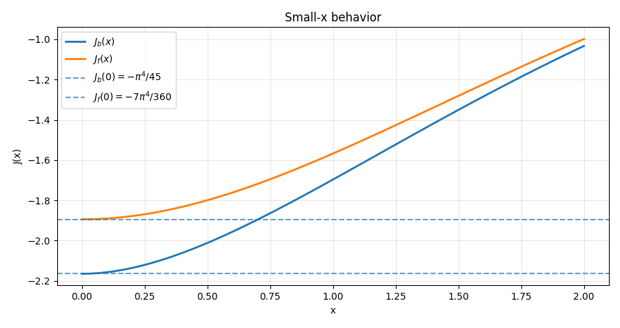
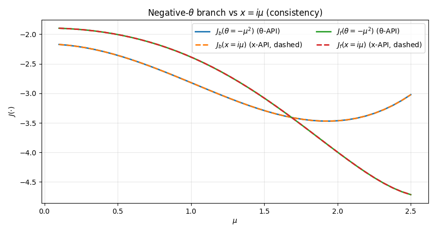
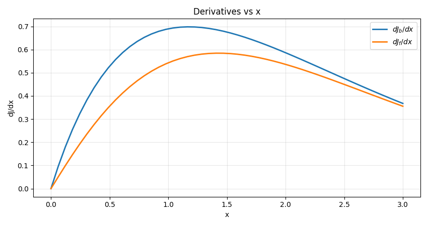
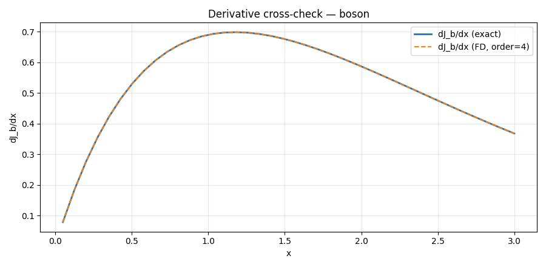
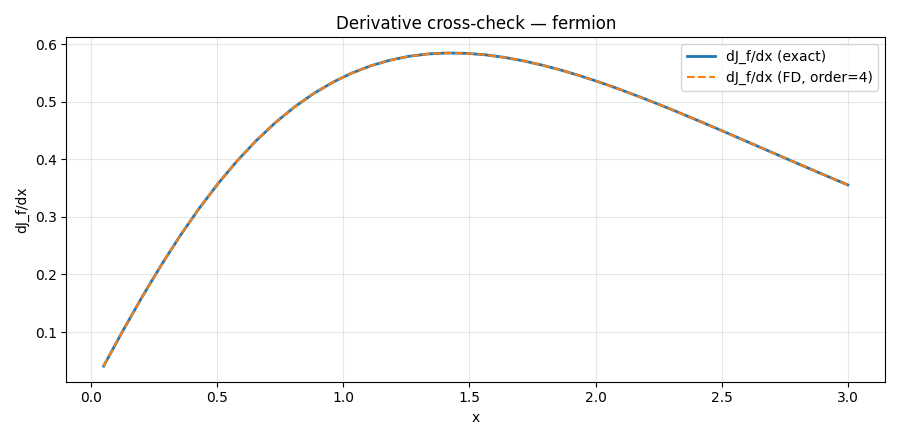
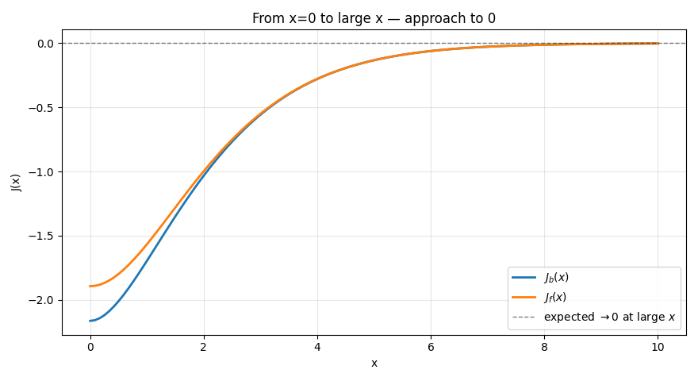
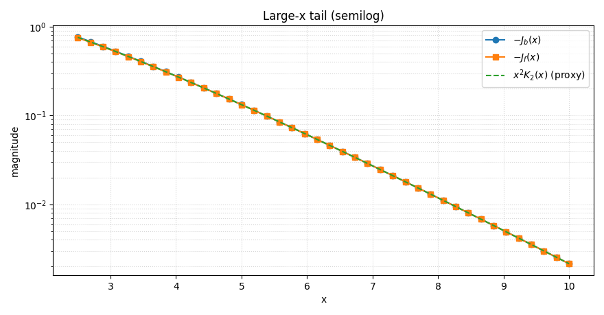
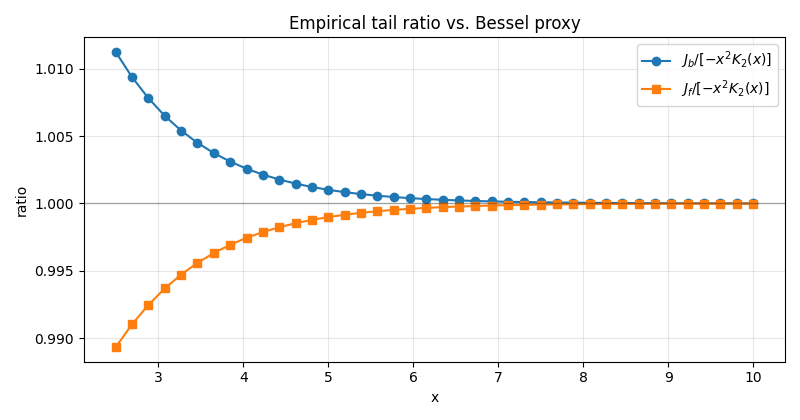
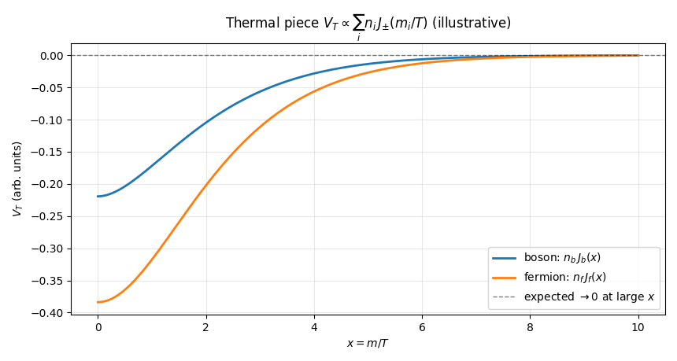

# Exact Thermal Integrals (Jb, Jf)

---

## `_asarray`

### Signature

```python
_asarray(x: ArrayLike) -> np.ndarray
```

### Purpose

Convert input to a NumPy array **without copying** when possible (thin wrapper around `np.asarray`). Normalizes heterogeneous inputs (lists, tuples, scalars) into an `ndarray` for downstream vectorized code.

### Parameters, returns and Raises

**Parameters**

* `x` (`array_like`): Any object that can be interpreted as an array (e.g., list, tuple, scalar, or `ndarray`).

**Returns**

* `np.ndarray`: A NumPy view of `x` if `x` is already an `ndarray`; otherwise a newly allocated array.

**Raises / Assumptions**

* Propagates exceptions from `np.asarray` if `x` cannot be interpreted as an array.

**Notes**

* Internal helper only, used by other functions

---

## `_is_scalar`

### Signature

```python
_is_scalar(x: ArrayLike) -> bool
```

### Purpose

Check whether `x` is a **scalar** (Python/NumPy numeric scalar or a **0-D `ndarray`**). Useful to preserve the contract “scalar-in → scalar-out” from legacy.

### Parameters, returns and Raises

**Parameters**

* `x` (`array_like`): Object to inspect.

**Returns**

* `bool`: `True` if `x` is scalar (including 0-D arrays), otherwise `False`.

**Raises / Assumptions**

* Never raises by design; if `np.ndim(x)` errors for exotic objects, the function safely returns `False`.

**Notes**

* Internal helper only, used by other functions

---

## `_apply_elementwise`

### Signature

```python
_apply_elementwise(f: Callable[[Number], Number],x: ArrayLike,*,dtype: np.dtype = np.float64,) -> Union[Number, np.ndarray]
```

### Purpose

Apply a **scalar** function `f` to `x` (scalar or array) **element wise**, preserving **scalar-in → scalar-out** like legacy version.
Mirrors the legacy behavior: **any element** that causes an exception during evaluation is mapped to **`NaN`** (instead of raising). Supports real or complex outputs via `dtype`.

### Parameters, returns and Raises

**Parameters**

* `f` (`callable`): Function of a single numeric argument returning a numeric value.
* `x` (`array_like`): Input value(s); scalar or array-like of any shape.
* `dtype` (`np.dtype`, optional): Output dtype when `x` is array-like (use `np.complex128` for complex results). Default `np.float64`.

**Returns**

* `number | np.ndarray`:

  * If `x` is scalar: the scalar result `f(x)` (or `NaN`/`NaN+0j` on failure).
  * If `x` is array-like: an array with the **same shape** as `x`, containing element-wise results (or `NaN` where evaluation fails).

**Raises / Assumptions**

* Designed not to raise for per-element failures (they become `NaN`).
* May propagate errors only if `dtype` is invalid or memory allocation fails.

**Notes**

* Preserves **shape** for array inputs and **scalar semantics** for scalar inputs.
* For complex outputs, pass `dtype=np.complex128` to avoid down-casting.
* Internal helper; used by other functions

---

## `_Jf_exact_scalar`

### Signature

```python
_Jf_exact_scalar(x: Number) -> Number
```

### Purpose

Evaluate the **exact one-loop fermionic thermal integral** ($J_f(x)$) for a **scalar** input (x) (real or complex),

$$J_f(x) = \int_{0}^{\infty}  dy \big(-y^2\big)\ln\Big(1 + e^{-\sqrt{y^2+x^2}}\Big)$$


where ($x \equiv m/T$) and ($E=\sqrt{y^2+x^2}$) is the dimensionless energy.
This scalar kernel is used internally by the vectorized public wrapper `Jf_exact`.

### Where the formula comes from (QFT background)

At one loop in finite-temperature field theory, the thermal correction for fermionic modes is proportional to
($\int d^3p \ln\big(1+e^{-E_p/T}\big)$). After factoring constants and using spherical coordinates ($p/T \to y$), the angular integration yields ($4\pi$), and the radial part becomes exactly the integral above with the weight ($y^2$).

### Real-argument path (direct integral)

For **real** (x), the integrand is real and we integrate directly:

$$
J_f(x)=\int_0^\infty -y^2\ln\big(1+e^{-E}\big)dy \qquad E=\sqrt{y^2+x^2}.$$

We use the numerically stable identity ($\ln(1+e^{-E})=\mathrm{log1p}(e^{-E})$).

### Pore Complex-argument path (domain split)

If (x) carries an imaginary part only, then for ($0\le y \le |x|$) the principal branch energy becomes **purely imaginary**:

(E= i,z) with ($z=\sqrt{|x|^2-y^2}$). In this regime,

$$1+e^{-E} = 1+e^{-i z} = 2e^{-i z/2}\cos(z/2)\quad\Rightarrow\quad \big|1+e^{-E}\big| = 2|\cos(z/2)|.$$

Therefore, we split the integral at ($a_x=|x|$) and evaluate

$$\boxed{
\begin{aligned}
J_f(x)=\int_0^{a_x}-y^2\ln\Big(2\big|\cos\big(\tfrac{\sqrt{a_x^2-y^2}}{2}\big)\big|\Big)dy \quad +\int_{a_x}^{\infty}-y^2,\ln\Big(1+e^{-\sqrt{y^2+x^2}}\Big)dy
\end{aligned}}$$

so that both pieces are **real valued** integrands, suitable for high accuracy quadrature.

### Parameters, returns and Raises

**Parameters**

* `x` (`Number`): Scalar input, real or complex.

**Returns**

* `Number`: The value of (J_f(x)). For real `x`, the result is real. For complex `x`, the value is computed via real integrands on both pieces and is real as well (principal-branch prescription).

**Raises / Assumptions**

* Assumes the principal square root branch. Numerical quadrature tolerances are set to `epsabs=1e-10`, `epsrel=1e-8`, `limit=200`.

**Notes**

* This is an **internal scalar** kernel. Use the public `Jf_exact` for array inputs (vectorized and with dtype control).
* The use of `log1p` improves robustness near ($E\approx 0$).

---

## `_Jb_exact_scalar`

### Signature

```python
_Jb_exact_scalar(x: Number) -> Number
```

### Purpose

Evaluate the **exact one-loop bosonic thermal integral** ($J_b(x)$) for a **scalar** input (x) (real or complex),

$$J_b(x) = \int_{0}^{\infty} dy y^2\ln\Big(1 - e^{-\sqrt{y^2+x^2}}\Big)$$

where ($x=m/T$) and ($E=\sqrt{y^2+x^2}$).

This scalar kernel is used internally by the vectorized public wrapper `Jb_exact`.

### Where the formula comes from (QFT background)

For bosonic modes, the finite (T) one-loop contribution is proportional to ($\int d^3p ,\ln(1-e^{-E_p/T})$).
After the angular integral and rescaling ($p/T\to y$), we obtain the radial integral above with weight ($y^2$).

### Real-argument path (direct integral)

For **real** (x),

$$J_b(x)=\int_0^\infty y^2\ln\big(1-e^{-E}\big)dy\qquad E=\sqrt{y^2+x^2}$$

We employ the stable identity ($\ln(1-e^{-E})=\mathrm{log1p}(-e^{-E})$).

### Pure Complex-argument path (domain split)

If (x) has an imaginary component, then for ($0\le y \le |x|$), (E=iz) with ($z=\sqrt{|x|^2-y^2}$) and

$$1-e^{-E} = 1-e^{-i z} = 2e^{-i z/2}i\sin(z/2)\quad\Rightarrow\quad  \big|1-e^{-E}\big| = 2|\sin(z/2)|$$

Thus, we split at ($a_x=|x|$) and evaluate

$$\boxed{
\begin{aligned}
J_b(x)
&=\int_0^{a_x}y^2\ln\Big(2\big|\sin\big(\tfrac{\sqrt{a_x^2-y^2}}{2}\big)\big|\Big)dy\ \quad +\int_{a_x}^{\infty}y^2\ln\Big(1-e^{-\sqrt{y^2+x^2}}\Big)dy
\end{aligned}}$$

which again yields **real** integrands in both intervals.

### Parameters, returns and Raises

**Parameters**

* `x` (`Number`): Scalar (real or complex).

**Returns**

* `Number`: The value of ($J_b(x)$). For real `x` the result is real; with complex `x`, the split formulas ensure a real valued integral (principal branch choice).

**Raises / Assumptions**

* Principal square-root branch. Quadrature settings: `epsabs=1e-10`, `epsrel=1e-8`, `limit=200`.

**Notes**

* Internal scalar kernel; the vectorized public API is `Jb_exact`.
* `log1p(-exp(-E))` mitigates loss of significance near ($E\approx 0$) for bosons.


---

## `_Jf_exact2_scalar`

### Signature

```python
_Jf_exact2_scalar(theta: Number) -> float
```

### Purpose

Evaluate the **exact one-loop fermionic thermal integral** (J_f) as a function of the **real scalar**
($\theta \equiv x^2 = (m/T)^2$) equivalent to the functions above:

$$J_f(\theta) = \int_{0}^{\infty} dy \big(-y^2\big)\ln\Big(1 + e^{-\sqrt{y^2+\theta}}\Big) $$

This is the scalar kernel used internally by the vectorized public wrapper `Jf_exact2(theta)`.

### Why a θ-based API (and why keep it alongside the x based one)?

* **Physics-first variable.** In finite-T QFT the natural scalar entering the thermal integrals is ($\theta=m^2/T^2$) (a **real** quantity that may be **negative** in symmetry-broken/tachyonic regions).
* **Numerical stability.** With ($\theta\in\mathbb{R}$) the integrand is always chosen **real-valued**, even for ($\theta<0$) (see splitting below). Quadrature is typically faster and more robust.
* **Interpolation/caching.** Tabulating in ($\theta$) is convenient for splines (next block) and reuse across scans.
* **Compatibility.** Remains legacy code that supplies ($x=m/T$) directly. Both compute the same physics when (x) is real or purely imaginary (($\theta=x^2$) real).

> Implementation detail: this function **takes the real part** of `theta` internally (`th = float(np.real(theta))`) to enforce ($\theta\in\mathbb{R}$) as used in physics.

### Positive-θ branch $(\theta\ge 0)$

$$J_f(\theta)=\int_0^\infty -y^2\ln\big(1+e^{-\sqrt{y^2+\theta}}\big)dy$$

computed directly with the numerically stable identity ($\ln(1+e^{-E})=\mathrm{log1p}(e^{-E})$).

### Negative-θ branch $(\theta<0)$ — domain split with real integrands

Write ($\theta=-\mu^2) ((\mu>0)$). Then

$$E=\sqrt{y^2+\theta}=\sqrt{y^2-\mu^2}=
\begin{cases}
i\sqrt{\mu^2-y^2}\equiv i z & 0\le y<\mu 
\sqrt{y^2-\mu^2}\in\mathbb{R}*+  & y\ge \mu.
\end{cases}$$

For (E=i z), ($1+e^{-E}=2e^{-iz/2}\cos(z/2)$) and ($\big|1+e^{-E}\big|=2|\cos(z/2)|$).
Thus we split:

$$\boxed{
\begin{aligned}
J_f(\theta)
&=\int_{0}^{\mu}-y^2\ln\Big(2\big|\cos!\big(\tfrac{\sqrt{\mu^2-y^2}}{2}\big)\big|\Big)dy\ \quad+\int_{\mu}^{\infty}-y^2\ln\Big(1+e^{-\sqrt{y^2-\mu^2}}\Big)dy
\end{aligned}}$$

Both pieces are **real**, ensuring stable high-accuracy quadrature.

### Parameters, returns and Raises

**Parameters**

* `theta` (`Number`): Scalar; only its **real part** is used internally.

**Returns**

* `float`: ($J_f(\theta)$) as a real number.

**Raises / Assumptions**

* Principal square-root branch. Quadrature tolerances are `epsabs=1e-10`, `epsrel=1e-8`, `limit=200`.

**Notes**

* Prefer the θ API in new code (it is what the spline based approximations will use).
* For (x) real or ($x=i\mu$) (pure imaginary), `_Jf_exact_scalar(x)` and `_Jf_exact2_scalar(\theta=x^2)` coincide.

---

## `_Jb_exact2_scalar`

### Signature

```python
_Jb_exact2_scalar(theta: Number) -> float
```

### Purpose

Evaluate the **exact one-loop bosonic thermal integral** ($J_b$) as a function of the **real scalar**
($\theta \equiv x^2 = (m/T)^2$):

$$J_b(\theta) = \int_{0}^{\infty} dy y^2\ln\Big(1 - e^{-\sqrt{y^2+\theta}}\Big)$$

This is the scalar kernel used internally by the vectorized public wrapper `Jb_exact2(theta)`.

### Why a θ based API (and why keep it alongside the x-based one)?

Same rationale as fermions:

* ($\theta=m^2/T^2$) is the natural **real** control variable (possibly **negative**).
* Splitting at ($\theta<0$) yields **real** integrands everywhere ⇒ more stable and faster quadrature.
* Ideal for spline tables and caching; x API kept for **compatibility** with legacy callers providing (x).

> Implementation detail: only the **real part** of `theta` is used internally.


### Positive-θ branch $(\theta\ge 0)$

$$J_b(\theta)=\int_0^\infty y^2\ln\big(1-e^{-\sqrt{y^2+\theta}}\big)dy$$

computed via the stable ($\ln(1-e^{-E})=\mathrm{log1p}(-e^{-E})$).

### Negative-θ branch $(\theta<0)$ — domain split with real integrands

Let ($\theta=-\mu^2$) $(\mu>0)$. For ($y<\mu$), (E=i z) with ($z=\sqrt{\mu^2-y^2}$) and

$$1-e^{-E}=2e^{-iz/2}i\sin(z/2)\quad\Rightarrow\quad
\big|1-e^{-E}\big|=2|\sin(z/2)|.$$

Therefore,

$$\boxed{
\begin{aligned}
J_b(\theta)
&=\int_{0}^{\mu}y^2\ln\Big(2\big|\sin\big(\tfrac{\sqrt{\mu^2-y^2}}{2}\big)\big|\Big)dy\ \quad+\int_{\mu}^{\infty}y^2\ln\Big(1-e^{-\sqrt{y^2-\mu^2}}\Big)dy
\end{aligned}}$$

Again, both integrands are **real**.

### Parameters, returns and Raises

**Parameters**

* `theta` (`Number`): Scalar; only its **real part** is used internally.

**Returns**

* `float`: ($J_b(\theta)$) as a real number.

**Raises / Assumptions**

* Principal square-root branch. Quadrature settings as above.

**Notes**

* Prefer the θ-API for new code and for spline approximation.
* For (x) real or ($x=i\mu$), `_Jb_exact_scalar(x)` and `_Jb_exact2_scalar(\theta=x^2)` agree.

### Relationship between the x- and θ based functions

* If (x) is **real** or **purely imaginary** ($(x=i\mu\Rightarrow \theta=-\mu^2)$), both APIs are **equivalent** and yield the same physics.
* The θ-API enforces ($\theta\in\mathbb{R}$) and constructs **real integrands** in all regimes, which improves numerical behavior and matches how downstream interpolation/approximations will operate.
* The x API remains for **backward compatibility** with callers that already supply ($x=m/T$).


---

## `_dJf_exact_scalar`

### Signature

```python
_dJf_exact_scalar(x: Number) -> float
```

### Purpose

Compute the **exact derivative** ( $\dfrac{dJ_f}{dx}$ ) for a **scalar** (x) with a numerically stable integrand.
For fermions,

$$J_f(x)=\int_0^\infty -y^2\ln\Big(1+e^{-\sqrt{y^2+x^2}}\Big)dy \qquad E\equiv\sqrt{y^2+x^2}.$$

### Differentiating under the integral sign

Under standard regularity conditions (smooth, absolutely integrable integrand), we may exchange derivative and integral:

$$\frac{dJ_f}{dx} =\int_0^\infty \frac{\partial}{\partial x}\left[-y^2\ln\big(1+e^{-E}\big)\right]dy.$$

Using
$$ \frac{d}{dE}\Big[-\ln\big(1+e^{-E}\big)\Big] =\frac{e^{-E}}{1+e^{-E}} =\frac{1}{e^{E}+1}\equiv  n_F(E) \qquad \frac{dE}{dx}=\frac{x}{E}$$

we obtain the **fermionic derivative kernel**

$$\boxed{
\frac{dJ_f}{dx}  =\int_0^\infty y^2 n_F(E) \frac{x}{E} dy =\int_0^\infty y^2\frac{x}{E}\frac{1}{e^{E}+1}dy \qquad E=\sqrt{y^2+x^2}}$$

### Numerical stability choices

* We implement ( $n_F(E)=\dfrac{1}{e^{E}+1}$ ) as `special.expit(-E)` (the logistic function), which is stable for large (E).
* By **parity**, ($J_f(x)$) is **even** in (x) (i.e., ($J_f(-x)=J_f(x)$)), hence ( $\tfrac{dJ_f}{dx}\big|_{x=0}=0 $). The function returns **0** exactly at (x=0).
* Internally we form ($E=\sqrt{y^2+x_r^2}$) with ($x_r=|x|\ge 0$) to guarantee ($E\ge 0$). In physical use ($x=m/T\ge 0$).
  (For explicit sign handling: ($ \tfrac{dJ_f}{dx}(-x)=-\tfrac{dJ_f}{dx}(x) $).)

### Parameters, returns and Raises

**Parameters**

* `x` (`Number`): Scalar (real or complex). In physical applications ($x\in\mathbb{R}_{\ge 0}$).

**Returns**

* `float`: The real value of ( $\dfrac{dJ_f}{dx}$ ).

**Notes**

* Quadrature settings: `epsabs=1e-10`, `epsrel=1e-8`, `limit=200`.
* Integration domain (y\in[0,\infty)) with stable integrand ($y^2,\dfrac{x}{E},n_F(E)$).

---

## `_dJb_exact_scalar`

### Signature

```python
_dJb_exact_scalar(x: Number) -> float
```

### Purpose

Compute the **exact derivative** ($ \dfrac{dJ_b}{dx} $) for a **scalar** (x).
For bosons,

$$ J_b(x)=\int_0^\infty y^2\ln\Big(1-e^{-\sqrt{y^2+x^2}}\Big)dy \qquad E\equiv\sqrt{y^2+x^2}.$$

### Differentiating under the integral sign

$$\frac{dJ_b}{dx}
=\int_0^\infty \frac{\partial}{\partial x}\left[y^2\ln\big(1-e^{-E}\big)\right]dy$$

Using

$$\frac{d}{dE}\ln\big(1-e^{-E}\big) =\frac{e^{-E}}{1-e^{-E}}  =\frac{1}{e^{E}-1}\equiv n_B(E)\qquad \frac{dE}{dx}=\frac{x}{E} $$

we obtain the **bosonic derivative kernel**

$$\boxed{ \frac{dJ_b}{dx}
=\int_0^\infty y^2 n_B(E)\frac{x}{E}dy =\int_0^\infty y^2\frac{x}{E}\frac{1}{e^{E}-1}dy \qquad E=\sqrt{y^2+x^2} }$$

### Numerical stability choices

* We implement ( $n_B(E)=\dfrac{1}{e^{E}-1}$ ) as `1/np.expm1(E)`, which is stable as ($E\to 0^+$).
* By **parity**, ($J_b(x)$) is **even** in (x) (i.e., ($J_b(-x)=J_b(x)$)), hence ($ \tfrac{dJ_b}{dx}\big|_{x=0}=0 $). The function returns **0** at (x=0).
* Internally ($E=\sqrt{y^2+x_r^2}$) with ($x_r=|x|\ge 0$), consistent with the physical case ($x=m/T\ge 0$).
  (For sign handling: ( $\tfrac{dJ_b}{dx}(-x)=-\tfrac{dJ_b}{dx}(x) $).)

### Parameters, returns and Raises

**Parameters**

* `x` (`Number`): Scalar (real or complex). In physical applications ($x\in\mathbb{R}_{\ge 0}$).

**Returns**

* `float`: The real value of ( $\dfrac{dJ_b}{dx}$ ).

**Notes**

* Quadrature settings: `epsabs=1e-10`, `epsrel=1e-8`, `limit=200`.
* Integration domain ($y\in[0,\infty)$) with stable integrand ($y^2,\dfrac{x}{E}n_B(E)$).

---

# Jf_exact; Jf_exact2; Jb_exact; Jb_exact2; dJf_exact; dJb_exact

### Purpose

These functions are **vectorized, user-facing wrappers** around the exact scalar kernels for the one-loop thermal integrals ($J_b$), ($J_f$) and their derivatives. They:

* preserve the **legacy cosmoTransitions API** (same names/behavior),
* accept **scalars or arrays** and apply the scalar kernels **element-wise** (scalar-in → scalar-out),
* offer both **x-based** (($x=m/T$)) and **θ based** $(\theta=x^2=m^2/T^2\in\mathbb{R})$ entry points.

---

## Signatures

```python
Jf_exact(x: ArrayLike) -> Union[Number, np.ndarray]
Jf_exact2(theta: ArrayLike) -> Union[float, np.ndarray]

Jb_exact(x: ArrayLike) -> Union[float, np.ndarray]
Jb_exact2(theta: ArrayLike) -> Union[float, np.ndarray]

dJf_exact(x: ArrayLike) -> Union[float, np.ndarray]
dJb_exact(x: ArrayLike) -> Union[float, np.ndarray]
```

---

## Parameters

* **For x based functions** (`Jf_exact`, `Jb_exact`, `dJf_exact`, `dJb_exact`):

  * `x` (`float | complex | array-like`): argument(s) ($x=m/T$).
    • Real inputs are treated as `abs(x)` (legacy).
    • Complex inputs are accepted for **backward compatibility** only; see Notes.

* **For θ based functions** (`Jf_exact2`, `Jb_exact2`):

  * `theta` (`float | array-like`): ($\theta=x^2=m^2/T^2$) (its **real part** is used).
    May be **negative**; the implementation splits the domain to keep the integrand real.

---

## Returns

* Scalar if the input is scalar; `ndarray` with the **same shape** as the input otherwise.
* On array inputs, any element that fails to evaluate returns **NaN** (legacy behavior preserved).

---

## Notes (apply to all)

* **Vectorization & semantics.** All functions act **element-wise** on arrays and preserve shapes.
* **Numerical stability.** Internally use stable forms:

  * `log1p` / `log1p(-exp(-E))` for the logs,
  * `special.expit(-E)` for the Fermi factor ($1/(e^E+1)$),
  * `1/np.expm1(E)` for the Bose factor ($1/(e^E-1)$).
* **Branching / complex inputs.**

  * For **θ-API** (`*_exact2`): ($\theta\in\mathbb{R}$). If ($\theta<0$) the integral is split at ($y=\sqrt{|\theta|}$) and expressed with ($\cos$) / ($\sin$), yielding **real integrands** throughout.
  * For **x-API** (`*_exact`): complex (x) triggers the **legacy branch splitting** (over ($[0,|x|]$)) to keep the integrals numerically real/stable.
    **Physical note:** a **general complex (x)** has **no standard physical meaning** here; it is supported **only for backward compatibility**. In physics workflows, ($x=m/T$) is real (or equivalently ($\theta$) is real).
* **Recommended usage.** Prefer the **θ based** functions (`Jf_exact2`, `Jb_exact2`) in new code (better for interpolation/splines and uniformly real integrands). Use x based names for seamless drop in replacement in legacy pipelines.
* **Derivatives.** `dJf_exact`, `dJb_exact` implement the differentiated kernels:
  
$$\frac{dJ_f}{dx}=\int_0^\infty y^2\frac{x}{E}\frac{1}{e^E+1}dy\qquad  \frac{dJ_b}{dx}=\int_0^\infty y^2\frac{x}{E}\frac{1}{e^E-1}dy \quad E=\sqrt{y^2+x^2}$$
  and return **0** exactly at `x==0` (removable singularity; evenness in (x)).

---

## Exact Thermal Integrals — Examples 

This page documents progressive sanity/consistency checks for the **exact** one-loop thermal integrals and their derivatives:

$$J_b(x)=\int_0^\infty y^2\ln\bigl(1-e^{-\sqrt{y^2+x^2}}\bigr)dy\quad
J_f(x)=\int_0^\infty -y^2\ln\bigl(1+e^{-\sqrt{y^2+x^2}}\bigr)dy$$
We test the public API:
`Jb_exact`, `Jf_exact`, `Jb_exact2`, `Jf_exact2`, `dJb_exact`, `dJf_exact`.

All figures below are produced by the script
`tests/finiteT/Exact_Thermal_Integrals.py`. see [tests/finiteT/Exact_Thermal_Integrals](/tests/finiteT/Exact_Thermal_Integrals.py) for more

---

### Test 1 — Small-x physics sanity: constants at (x=0) and near-zero behavior

**What it checks**

* The known limits:
* 
  $$J_b(0)=-\frac{\pi^4}{45},\qquad
  J_f(0)=-\frac{7\pi^4}{360}.$$

* For small positive (x), both (J_b) and (J_f) **increase toward 0**, as mass/temperature ($x=m/T$) grows.

**Figure**

* *Small-x behavior:*
  

**Console output**

```python
"""
=== Test 1: Small-x sanity (x → 0) ===
J_b(0): num=-2.164646467421e+00, expected=-2.164646467422e+00, |Δ|=1.60e-12
J_f(0): num=-1.894065658994e+00, expected=-1.894065658994e+00, |Δ|=6.66e-16
Expectation: For both bosons and fermions, J(x) starts negative and increases toward 0 as x grows. 
As we can see in the image above, this expectation is met.
"""
```

---

### Test 2 — Consistency: (J(x)) vs (J($\theta=x^2$)) for ($x\ge 0$)

**What it checks**

* Numerical agreement between the **x-API** (`J*_exact`) and the **θ-API** (`J*_exact2`) when ($\theta=x^2$) with ($x\ge 0$).
* Differences should be at **quadrature noise** level.

**Figure**

* *Direct consistency, (J(x)-J($\theta$)):*
  

**Console output**

```python
"""
=== Test 2: Consistency J(x) vs J(theta=x^2) (x ≥ 0) ===
Max |J_b(x) - J_b(theta)| over grid: 0.000e+00
Max |J_f(x) - J_f(theta)| over grid: 0.000e+00
Expectation: differences ~ 0 within quadrature noise. 
This expectation its valid as we can see in the image above
"""
```

---

### Test 2b — Negative-($\theta$) branch and imaginary (x) cross-check

**What it checks**

* For ($\theta<0$), compare the **θ-API** values (J($\theta=-\mu^2$)) with the **x-API** evaluated at ($x=i\mu$) (dashed).
  This confirms that our real, piecewise integrands for negative ($\theta$) match the legacy branch split for purely imaginary (x).

**Figure**

* *($\theta<0$) (solid) vs ($x=i\mu$) (dashed):*
  

**Console output**

```python
"""
=== Test 2b: Negative-θ branch and imaginary-x consistency ===
Max |J_b(θ<0) - J_b(x=iμ)| over grid: 5.551e-13
Max |J_f(θ<0) - J_f(x=iμ)| over grid: 5.596e-12
Expectation: solid and dashed curves overlap within quadrature accuracy.
"""
```

---

### Test 3 — Derivatives: shape and sign ($(dJ/dx \ge 0)$ for ($x\ge 0$))

**What it checks**

* From the derivative formulas,

  $$\frac{dJ_f}{dx}=\int_0^\infty y^2\frac{x}{E}\frac{1}{e^E+1}dy\qquad
  \frac{dJ_b}{dx}=\int_0^\infty y^2\frac{x}{E}\frac{1}{e^E-1}dy\quad E=\sqrt{y^2+x^2}$$

  we expect **non negative** derivatives for ($x\ge 0$).
* Plots should show both ($dJ_b/dx$) and ($dJ_f/dx$) positive and **decreasing toward 0** as (x) increases.

**Figure**

* *Derivatives vs (x):*
  

**Console output**

```python
"""
=== Test 3: Derivative sign/shape (dJ/dx ≥ 0 for x ≥ 0) ===
Min dJ_b/dx on grid: 0.000e+00  (expected ≥ 0)
Min dJ_f/dx on grid: 0.000e+00  (expected ≥ 0)
Expectation: derivatives are positive (curves move up toward 0). As we can see this is satisfied
"""
```

---

### Test 4 — Cross-check (dJ/dx) via finite-difference `gradientFunction` (order=4)

**What it checks**

* Independent numerical differentiation (order-4 central differences) reproduces `dJ*_exact` closely.

**Figures**

* *Boson derivative cross-check:*
  

* *Fermion derivative cross-check:*
  

**Console output**

```python
"""
=== Test 4: Cross-check dJ/dx using gradientFunction (order=4) ===
Max |dJ_b (FD) - dJ_b (exact)|: ...
Max |dJ_f (FD) - dJ_f (exact)|: ...
Expectation: order-4 finite differences should track the exact derivative closely (small max absolute error).
"""
```

---

###  Test 5A — Global trend: (x) from 0 to large (approach to 0)

**What it checks**

* Over a wide range ($x\in[0,10]$), both ($J_b$) and ($J_f$) **approach 0** as (x) grows (heavier mass over temperature).
* The plot includes a **(y=0)** reference line.

**Figure**

* *Global trend with (y=0) guide:*
  

**Console output**

```python
"""
=== Test 5A: Global trend (x from 0 to large) with y=0 reference ===
Expectation: as x increases (heavier over T), both J_b and J_f approach 0 exponentially.
"""
```

---

### Test 5B — Large-(x) tails (semilog) and Bessel proxy ($x^2 K_2(x)$)

**What it checks**

* On a **semilog** scale, (|J|) decays roughly like ($\exp(-x)$).
* The empirical proxy ($-x^2 K_2(x)$) captures the qualitative tail behavior.

**Figures**

* *Semilog magnitudes:*
  

* *Tail ratio vs proxy:*
  

**Console output**

```python
"""
=== Test 5B: Large-x tail (semilog plots) ===
Tail check (medians):
 median[ J_b / ( -x^2 K2 ) ] = 1.000
 median[ J_f / ( -x^2 K2 ) ] = 1.000
Expectation: both |J| decay ~exp(-x); the Bessel proxy captures the trend qualitatively.
"""
```

---

### Test 6 — Physical illustration: thermal piece ($V_T\propto \sum_i n_i,J_{\pm}(m_i/T)$)

**What it checks**

* With illustrative degeneracies (n_b, n_f) and (T=1), thermal contributions built from ($J_b$) and ($J_$f) are largest near (x=0) and **vanish for ($x\gg 1$)**.

**Figure**

* *Illustrative thermal potential piece:*
  

**Console output**

```python
"""
=== Test 6: Thermal contribution V_T ∝ J(x) with x = m/T ===
Expectation: contributions are largest near x≈0 and vanish exponentially for x≫1.
---------- END OF TESTS: Exact Thermal Integrals ----------
"""
```

---

### Reproducibility notes

* Quadrature tolerances used internally: `epsabs=1e-10`, `epsrel=1e-8`, `limit=200`.
* Small differences across machines/BLAS/SciPy versions are expected at the (10^{-9})–(10^{-7}) level in these tests.

---