  # Dispatcher Helpers — `Jb` and `Jf` Short Hands

## Purpose

Thin, user friendly wrappers that **dispatch** to the implementations of the Jb & Jf modernized:

* **`exact`** (numerical quadrature),
* **`low`** (small-(x), high-T series),
* **`high`** (large-(x), low-T Bessel-(K) sum),
* **`spline`** (cubic spline in ($\theta=x^2$), allowing ($\theta<0$)).

They **preserve the legacy API** and defaults, validate inputs consistently, and keep scalar-in → scalar-out behavior (vectorized over arrays).

---

## Signatures

```python
Jb(x, approx: str = "high", deriv: int = 0, n: int = 8) -> float | np.ndarray
Jf(x, approx: str = "high", deriv: int = 0, n: int = 8)  -> float | complex | np.ndarray
```

---

## Parameters (common)

* `x` (`float | array-like`):
  For `approx in {"exact","low","high"}` this is the usual real (x=m/T).
  For `approx=="spline"`, **`x` is ($\theta = (m/T)^2$)** (can be negative; legacy behavior).
* `approx` (`"exact"|"high"|"low"|"spline"`): Which evaluator to use (default `"high"`).
* `deriv` (`int`): Derivative order — allowed per mode:
  `exact`: 0 or 1 • `low`: 0 • `high`: 0..3 • `spline`: 0..3.
* `n` (`int`): Truncation — used only in series/sum modes:
  `low`: number of tail terms (≤ 50) • `high`: number of Bessel-sum terms.

## Returns

* `Jb`: `float | ndarray`
* `Jf`: `float | complex | ndarray` (in `exact` mode, legacy complex dtype is preserved; use `.real` if you only need the physical value for real (x)).

---

## Notes

* **Spline mode uses ($\theta$), not (x)**, by design. This allows ($\theta<0$) (tachyonic curvature) and matches the legacy spline tables.
* Complex (x) **has no physical meaning** here and is not supported by these wrappers; if you truly need complex analysis, call the exact scalar routines directly.
* Validation mirrors each backend’s capability (`low` supports values only; `high` supports up to 3rd derivative; etc.).

---

## See also (all details)

* Exact integrals and derivatives: *[Exact Thermal Integrals (J_b, J_f)](Exact_Thermal_Integrals.md)*
* Spline construction & use: *[Spline Thermal Integrals (J_b, J_f)](Spline_Thermal_Integrals.md)*
* Low-(x) (high-T) series: *[Approx — Low-x Series](Approx_Thermal_Integrals.md)*
* High-(x) (low-T) series: *[Approx — High-x Series](Approx_Thermal_Integrals.md)*

---

## Tests (`Jb`, `Jf`) - All plots


### Test A — Exact ($J_b$, $J_f$) on ($[0,10]$)

**What it checks:** Baseline curves from numerical quadrature; values at (x=0) match
$(J_b(0)=-\pi^4/45)$ and $(J_f(0)=-7\pi^4/360)$.
**Expectation:** Both start negative and monotonically approach 0 as (x) grows.

**Figure**
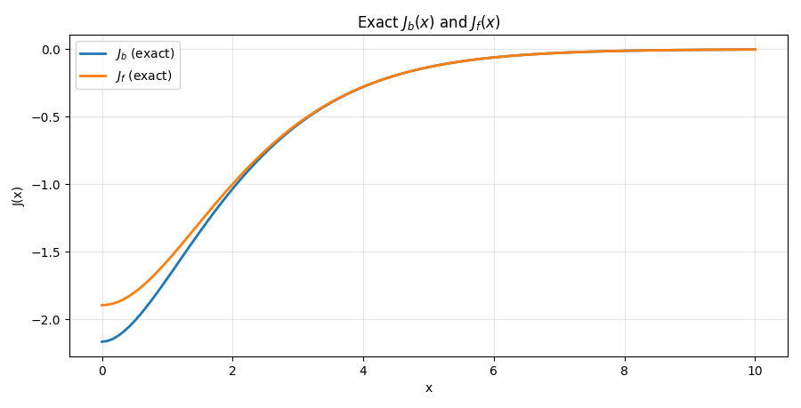

**Console output**

```text
=== Test A: exact J_b, J_f on [0,10] ===
At x=0: J_b=-2.164646467421e+00, J_f=-1.894065658994e+00.
```

---

### Test B — Spline ($J_b$, $J_f$) on ([0,10]) with ($\theta=x^2$)

**What it checks:** Spline evaluation agrees with exact on the same (x)-grid
(using ($\theta=x^2$)).
**Expectation:** Small max relative differences, consistent with spline accuracy.

**Figure**
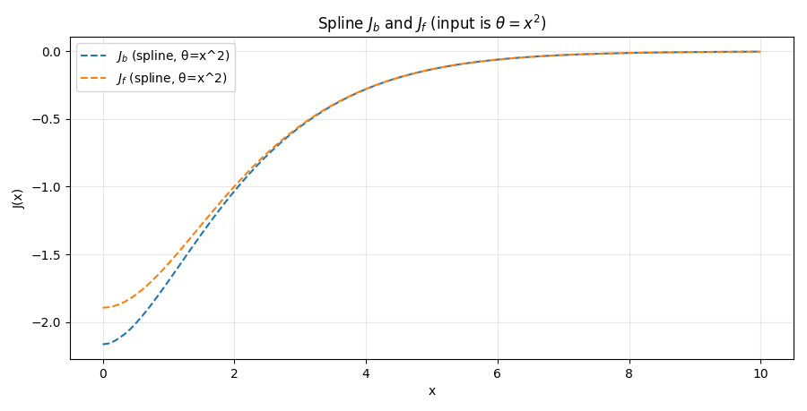

**Console output**

```text
=== Test B: spline J_b, J_f on [0,10] (θ = x^2) ===
Max relative diff spline vs exact on [0,10]:  J_b: 5.564e-04,  J_f: 2.479e-05
```

---

### Test C — Exact first derivatives $(\mathrm dJ/\mathrm dx)$ on ([0,10])

**What it checks:** Direct quadrature of (dJ/dx).
**Expectation:** (dJ/dx) is (0) at (x=0) (removable singularity handled),
positive for (x>0), and decays with (x).

**Figure**
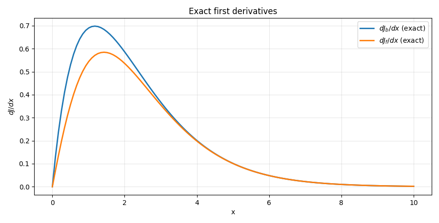

**Console output**

```text
=== Test C: exact derivatives dJ/dx on [0,10] ===
dJ_b/dx at x=0: 0.000e+00 (expected 0);  dJ_f/dx at x=0: 0.000e+00 (expected 0)
```

---

### Test D — Spline first derivative mapped to (x) via chain rule

**What it checks:** Spline derivatives (computed in $(\theta))$ correctly mapped to
(x): $(\frac{dJ}{dx} = 2x,\frac{dJ}{d\theta})$.
**Expectation:** Close agreement with exact (dJ/dx).

**Figure**
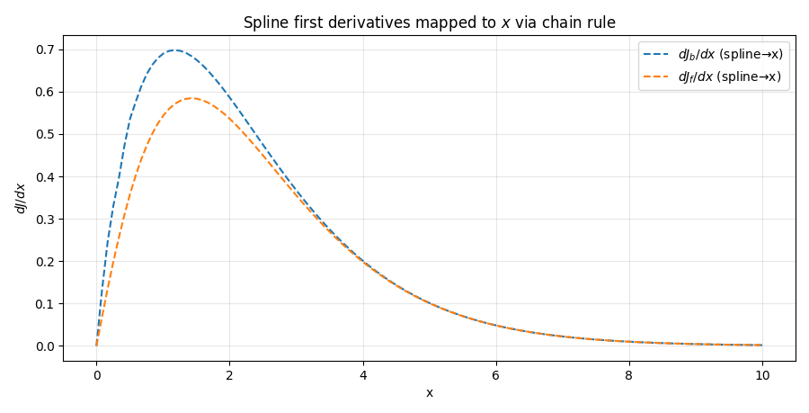

**Console output**

```text
=== Test D: spline first derivative (chain rule to dJ/dx) on [0,10] ===
Max relative diff (spline→x) vs exact dJ/dx:  J_b: 3.758e-02,  J_f: 2.851e-03
```

---

### Test E — Spline second derivative mapped to (x)

**What it checks:** Chain rule for the second derivative:

$$\frac{d^2J}{dx^2} = 2,\frac{dJ}{d\theta} + 4x^2\frac{d^2J}{d\theta^2}$$

**Expectation:** Smooth, sensible curvature; finite at (x=0).

**Figure**
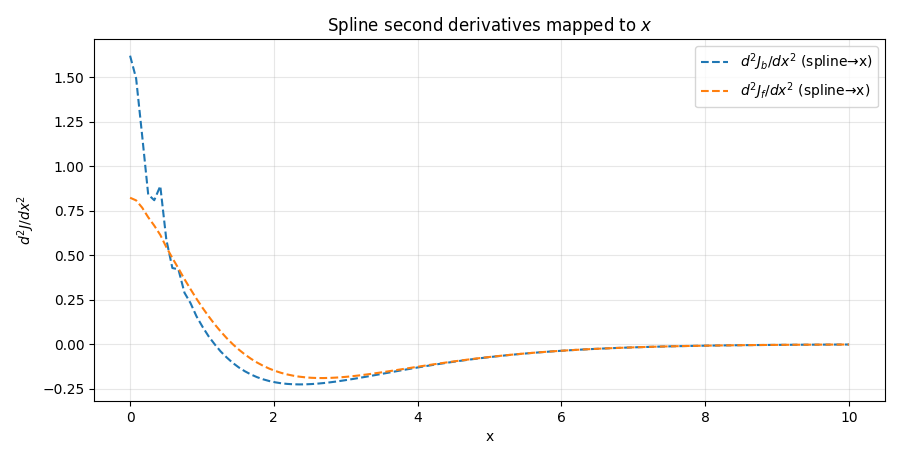

---

### Test F — Low-(x) series vs exact (with relative error)

**What it checks:** High-T (small (x)) series accuracy windows.

**Ranges:** ($J_b$) on ([0,7]), (J_f) on ([0,3.7]).

**Expectation:** Low relative error in these windows; error grows as (x) leaves
the intended regime.

**Figures**

* Boson: series vs exact — 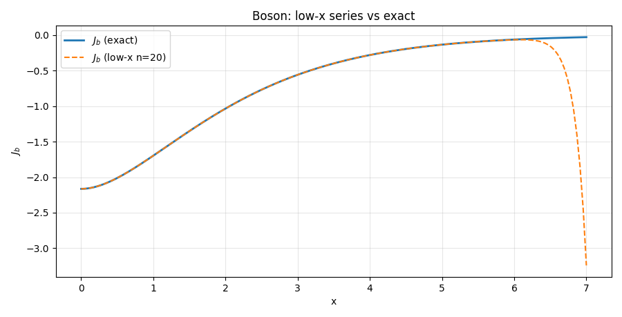
* Boson: relative error — 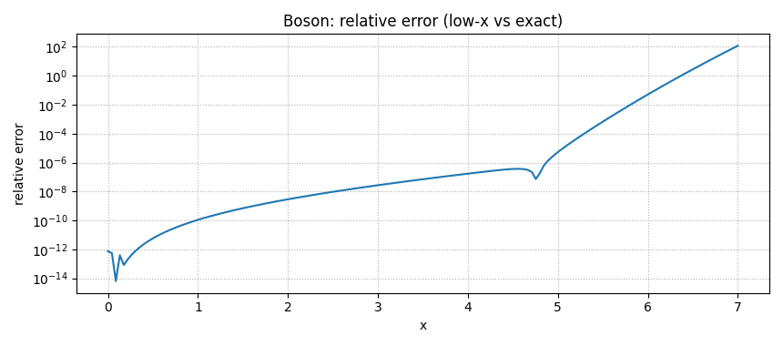
* Fermion: series vs exact — 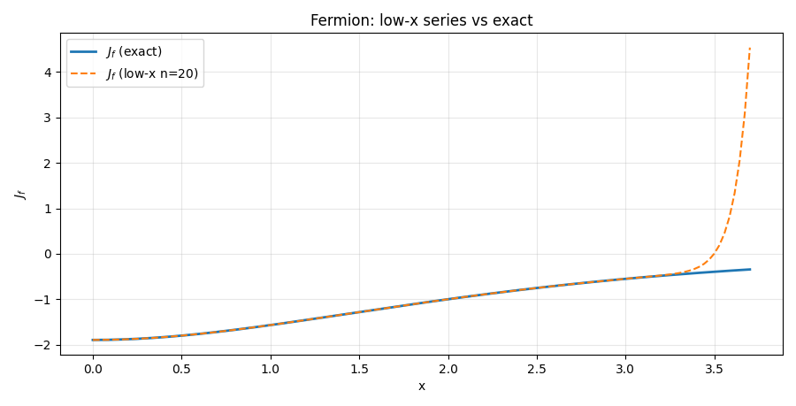
* Fermion: relative error — 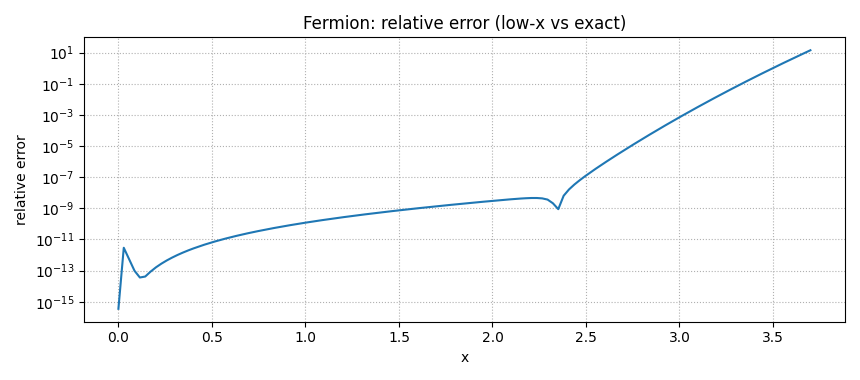

**Console output**

```text
=== Test F: low-x series vs exact (with relative error) ===
Boson low-x: max rel err = 1.183e+02
Fermion low-x: max rel err = 1.422e+01
```

---

### Test G — High-(x) series vs exact on ([1,10]) (with relative error)

**What it checks:** Low-T (large (x)) Bessel-sum accuracy.
**Expectation:** Semilog plot shows exponential tails; series tracks exact well
with modest (n) (here (n=8)).

**Figures**

* Semilog magnitude — 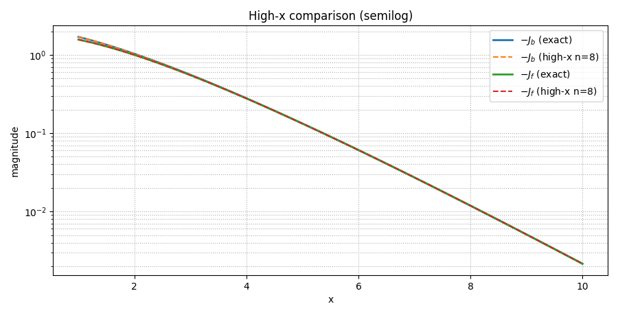
* Relative error — 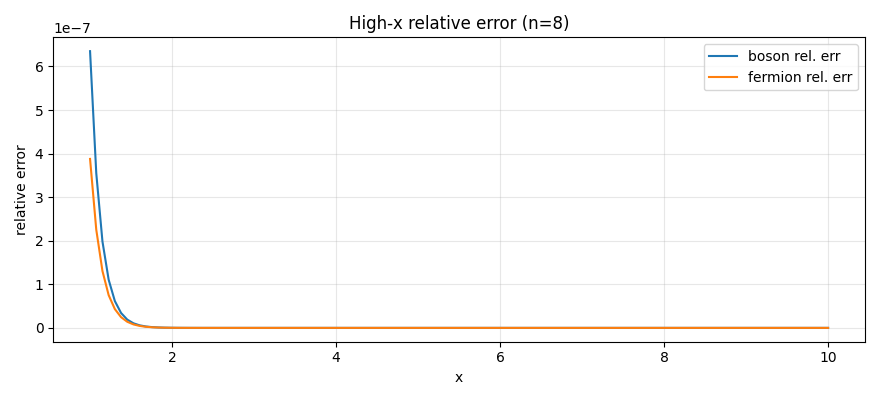

**Console output**

```text
=== Test G: high-x series vs exact (x in [1,10]) ===
High-x: max rel err  J_b: 6.351e-07,  J_f: 3.878e-07

---------- END OF TESTS: Dispatcher (Jb, Jf) ----------
```

---

### Notes

* **Spline mode input:** remember that the dispatcher expects (\theta=x^2) as input in `"spline"` mode; chain rule conversions are used for derivatives in (x).
* **Relative error definition:** ($\mathrm{rel}=\frac{|A-B|}{\max(|B|,10^{-12})}$).
* For quicker runs, reduce grid sizes or narrow (x)-ranges during development.
* see [tests/finiteT/Short_Hand](/tests/finiteT/Short_Hand_Jb&Jf.py) for more