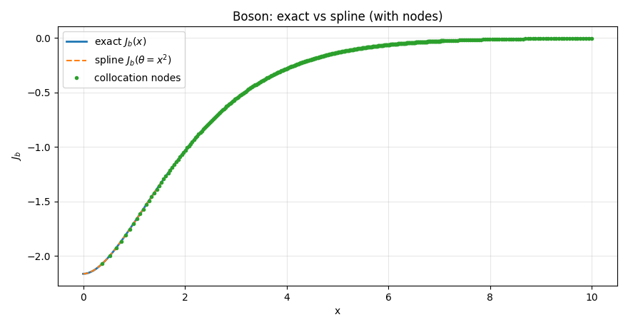
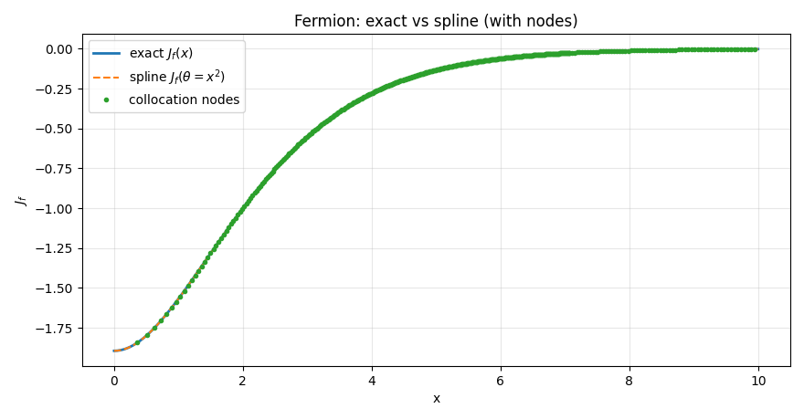
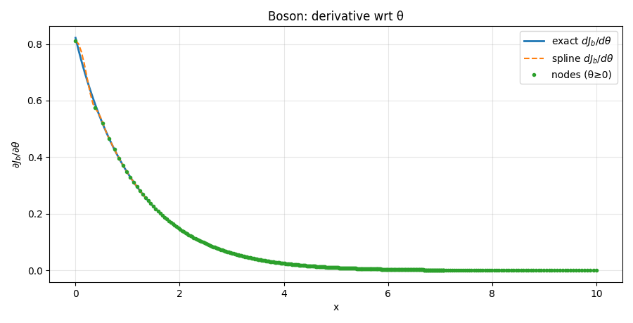
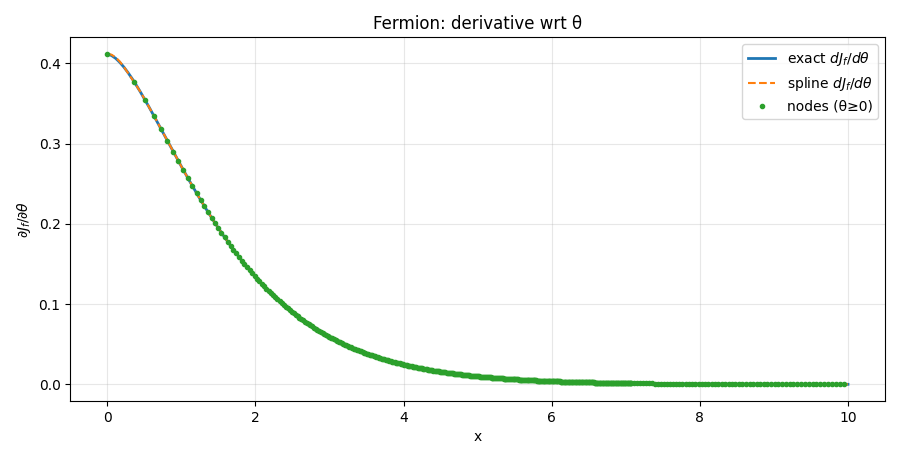
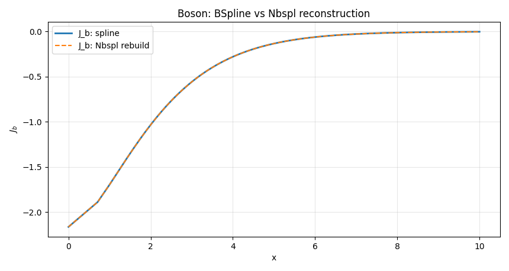
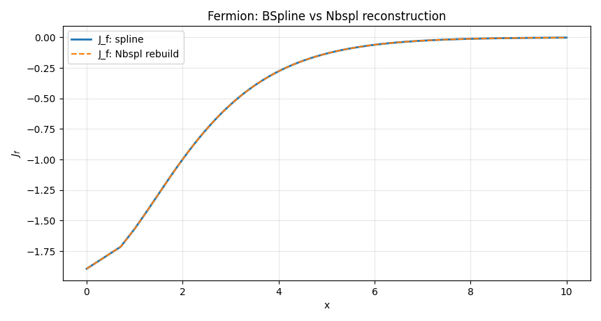

# Spline Thermal Integrals (Jb, Jf)

---

## Spline Thermal Integrals (J_f)

### Purpose

Provide a **fast, differentiable surrogate** for the exact fermionic thermal integral

$$J_f(\theta)\equiv J_f\bigl(x^2\bigr)\quad \theta=(m/T)^2\in\mathbb{R}$$

by fitting a **cubic B-spline** to samples of the exact function (J_f(\theta)) on a **non-uniform grid**.
The spline preserves the **legacy API/behavior**:

* Input is **($\theta=x^2$)** (not (x)); ($\theta$) can be **negative** (imaginary (x) branch).
* For ($\theta < \theta_{\min}$): returns the **clamped** value ($J_f(\theta_{\min})$).
* For ($\theta > \theta_{\max}$): returns **0** (and its derivatives 0), matching the physical larg -mass suppression in the legacy code.
* Supports **derivatives w.r.t. ($\theta$)** via `n` (uses `BSpline.derivative(n)`).

**Domain used:**
($\theta_{\min} = -6.82200203,\quad \theta_{\max} = 1.35\times 10^3.$)

> Notes:
> * The spline is built from `Jf_exact2(theta)` (exact quadrature) and cached to disk for reproducibility/speed.
> * Physically meaningful inputs here are **real ($\theta$)**. A complex and real (x) (thus complex ($\theta$)) has no direct meaning in this spline API—use the exact routines if you need analytic continuation details.

---

### `Jf_spline`

#### Signature

```python
Jf_spline(X: float | np.ndarray, n: int = 0) -> float | np.ndarray
```

#### Parameters

* `X` (`float | array_like`): Input **theta** values ($\theta=(m/T)^2$). Scalar-in → scalar-out.
* `n` (`int`, default `0`): Derivative **order w.r.t. (\theta)** (0 for the function value, 1 for first derivative, etc).

#### Returns

* `out` (`float | ndarray`): ($J_f(\theta)$) (or its (n)-th ($\theta$)-derivative) evaluated by the spline.
  Behavior outside the fit domain:

  * If ($\theta < \theta_{\min}$): returns the **constant** value at (\theta_{\min}).
  * If ($\theta > \theta_{\max}$): returns **0.0** (derivatives also 0.0), per legacy behavior.

#### Notes

* Backend: `scipy.interpolate.BSpline` (created via `make_interp_spline(..., k=3)`).
* The grid is **denser** near ($\theta\le 0$) and small positive ($\theta$), and **sparser** on the large-($\theta$) tail.
* Accuracy is typically at the **few × $10^{-6}–10^{-8}$** level relative to the exact integral over the intended domain (depends on the internal grid sizes).

---

### `_ensure_Jf_spline`

#### Signature

```python
_ensure_Jf_spline() -> scipy.interpolate.BSpline
```

#### Purpose

Construct (once) and return the **global** `BSpline` object for (J_f(\theta)).
First tries to **load** a cached spline; if not found, it **builds** the dataset with `Jf_exact2()`, fits a cubic spline, and **saves** the spline parameters to disk.

#### Notes

* The cache file (by default) is `Jf_spline_v1.npz`, containing the **knot vector** `t`, **coefficients** `c`, and degree `k`.
* If the directory is **read-only**, the code silently **skips** saving (still works in-memory).

---

### `_build_Jf_dataset`

#### Signature

```python
_build_Jf_dataset(n_neg: int = 420, n_pos_lin: int = 380, n_pos_log: int = 300) -> tuple[np.ndarray, np.ndarray]
```

#### Purpose

Generate a **non-uniform theta grid** and its exact values ($J_f(\theta)$) used to fit the spline.

* Negative branch: **linear** grid on ($[\theta_{\min}, 0]$) (dense).
* Positive small: **linear** grid on ($[0, 50]$).
* Positive tail: **log** grid on $(50, \theta_{\max}])$.

Returns `(theta, y)` with `y = Jf_exact2(theta)`.

---

### `_load_Jf_cache` / `_save_Jf_cache`

#### Signatures

```python
_load_Jf_cache() -> None | tuple[np.ndarray, np.ndarray, int]
_save_Jf_cache(theta: np.ndarray, coeffs: np.ndarray, t: np.ndarray, k: int) -> None
```

#### Purpose (brief)

* `_load_Jf_cache`: try to **load** a previously saved spline `(t, c, k)`. Returns `None` if not available.
* `_save_Jf_cache`: best-effort **save** of spline parameters to disk so subsequent runs are instantaneous.

---

### Reproducibility & Performance

* The spline is deterministic given the internal grid sizes and the exact integrator tolerances (in `Jf_exact2`).
* First build takes **~seconds** (quadrature over a few hundred points), thereafter **~milliseconds** per call thanks to evaluation of a cubic B-spline (and its derivatives).

---

## Spline Thermal Integrals (J_b)

### Purpose

Provide a **fast, differentiable surrogate** for the exact bosonic thermal integral
($J_b(\theta) \equiv J_b(x^2)$) with ($\theta=(m/T)^2\in\mathbb{R}$), by fitting a **cubic B-spline** to samples of the exact function ($J_b(\theta)$) on a **non-uniform grid**.
The spline preserves the **legacy API/behavior**:

* Input is **($\theta=x^2$)** (not (x)); ($\theta$) may be **negative** (imaginary-mass branch handled via the exact routine during fitting).
* For ($\theta < \theta_{\min}$): return the **clamped** value ($J_b(\theta_{\min})$).
* For ($\theta > \theta_{\max}$): return **0.0** (and derivatives 0.0), matching the legacy tail suppression.
* Support **derivatives w.r.t. (\theta)** via parameter `n` (uses `BSpline.derivative(n)`).

**Domain used (legacy-compatible):**
($\displaystyle \theta_{\min} = -3.72402637,\qquad \theta_{\max} = 1.41\times 10^3.$)

> Physically meaningful inputs here are **real ($\theta$)**. Complex (x) (thus complex ($\theta$)) is not used in this spline API; for analytic-continuation details use the **exact** routines.

---

### `Jb_spline`

#### Signature

```python
Jb_spline(X: float | np.ndarray, n: int = 0) -> float | np.ndarray
```

#### Parameters

* `X` (`float | array_like`): Input **theta** values ($\theta=(m/T)^2$). Scalar-in → scalar-out.
* `n` (`int`, default `0`): Derivative **order w.r.t. (\theta)** (0 for the function value, 1 for first derivative, etc.).

#### Returns

* `out` (`float | ndarray`): ($J_b(\theta)$) (or its (n)-th ($\theta$)-derivative) evaluated by the spline.
  Outside the fitted domain:

  * If ($\theta < \theta_{\min}$): returns the **constant** value at ($\theta_{\min}$).
  * If ($\theta > \theta_{\max}$): returns **0.0** (derivatives also 0.0), per legacy behavior.

#### Notes

* Backend: `scipy.interpolate.BSpline` (created via `make_interp_spline(..., k=3)`).
* The grid used for fitting is **denser** near ($\theta\le 0$) and small positive ($\theta$), and **sparser** on the large-($\theta$) tail.
* Choice of ($\theta_{\min}$) coincides with the **minimum** of ($J_b$), so the clamp at the left boundary plus the vanishing right tail makes the evaluated curve **monotonic increasing** and ($C^1$)-continuous (matching the legacy intent).

---

### Spline construction & caching (same pattern as *Jf_spline*)

The internal helpers follow the **same design** as for `Jf_spline`:

* **Dataset build**: generate a **non-uniform** (\theta) grid
  (linear on ($[\theta_{\min},0]$), linear on ($[0,50]$), logarithmic on ((50,\theta_{\max}])) and compute **ground-truth** values via `Jb_exact2(theta)`.
  *(Function: `_build_Jb_dataset`.)*
* **Spline fit**: build a **cubic interpolating spline** (`make_interp_spline`) with `extrapolate=False`.
  *(Created inside `_ensure_Jb_spline`.)*
* **Caching**: first try to **load** a cached spline `(t, c, k)` from
  `Jb_spline_v1.npz` under `spline_data_path`; if not present, **fit** and then **save** best-effort.
  *(Functions: `_load_Jb_cache`, `_save_Jb_cache`, called by `_ensure_Jb_spline`.)*

**Performance:** first build takes seconds (due to exact quadrature at a few hundred (\theta) nodes); subsequent runs are **milliseconds** (BSpline evaluation).
**Reproducibility:** the cache pins the fitted spline; if the directory is read-only, the code still works (keeps the spline in memory).

---

## Spline Thermal Integrals ($J_b, J_f$) — Tests

This page documents the verification suite for the **Spline Thermal Integrals**.
We validate that the spline surrogates `Jb_spline(θ)` and `Jf_spline(θ)` (with ($θ=x^2=(m/T)^2)$) reproduce the **exact** one-loop integrals and their **θ-derivatives**, 
and that the spline implementation is **consistent** with the B-spline basis from `helper_functions.Nbspl`.

**Plot styling used below**

* **Solid**: exact curve (as a function of (x), with ($θ=x^2$)).
* **Dashed**: spline curve.
* **Dots**: collocation nodes (subset with ($x\le 10$)) used to fit the spline.
* see [tests/finiteT/Spline_Thermal_Integrals](/tests/finiteT/Spline_Thermal_Integrals.py) for more

We also print simple error metrics for quick checks.


---

### Test 1 — Spline vs exact for ($x\in[0,10]$)

Compare `Jb_spline(θ=x^2)` and `Jf_spline(θ=x^2)` against `Jb_exact(x)` and `Jf_exact(x)` on the same (x)-grid.

**Expectation:** curves overlap within quadrature/spline noise; max absolute error across the grid should be small.

**Boson (J_b): exact vs spline (with nodes)**



**Fermion (J_f): exact vs spline (with nodes)**




```python
"""
=== Test 1: Spline vs Exact for x ∈ [0, 10] ===
Max |J_b (spline) - J_b (exact)| over x∈[0,10]: 1.180e-03
Max |J_f (spline) - J_f (exact)| over x∈[0,10]: 4.638e-05
"""
```

---

### Test 2 — Derivatives: ( $\partial J/\partial θ $) (spline) vs exact via chain rule

The spline returns derivatives with respect to (θ). We compare against the exact derivative with respect to (x) using the chain rule:

$$\frac{\partial J}{\partial θ} = \frac{\partial J}{\partial x}\frac{\partial x}{\partial θ} = 
\frac{1}{2\sqrt{θ}},\frac{\partial J}{\partial x}
\quad(\text{with } x=\sqrt{θ} θ>0)$$

We avoid (x=0) (singularity in (1/(2x))) and take ($x\in(10^{-3},10]$).

**Expectation:** close agreement; small deviations can appear near the very small-(x) end where the chain rule magnifies numerical noise.

**Boson ($dJ_b/dθ$): exact vs spline (with nodes)**




**Fermion ($dJ_f$/dθ): exact vs spline (with nodes)**



```python
"""
=== Test 2: Derivatives — spline dJ/dtheta vs exact (chain rule) ===
Max |dJ_b/dθ (spline) - dJ_b/dθ (exact)| over x∈(1e-3,10]: 3.156e-02
Max |dJ_f/dθ (spline) - dJ_f/dθ (exact)| over x∈(1e-3,10]: 1.240e-03
"""
```

---

### Test 3 — Compatibility with `helper_functions.Nbspl`

We reconstruct the spline value using the B-spline basis:

$$s(θ) = \sum_i c_i,N_{i,k}(θ)$$

where (t) (knots), (c) (coefficients) and (k) (degree) come from the fitted `BSpline`. We evaluate
`Nbspl(t, θ, k) @ c` and compare to the direct `J*_spline(θ)` evaluation for ($θ\in[0,100]$).

**Expectation:** the two evaluations should match to near machine precision.

**Boson ($J_b$): BSpline vs Nbspl reconstruction**




**Fermion ($J_f$): BSpline vs Nbspl reconstruction**




```python
"""
=== Test 3: Compatibility with helper_functions.Nbspl ===
Max |J_f (spline) - J_f (Nbspl rebuild)| on θ∈[0,100]: 4.441e-16
Max |J_b (spline) - J_b (Nbspl rebuild)| on θ∈[0,100]: 2.220e-16
"""
```

---


### Notes & plotting details

* Input to the splines is always ($θ=x^2$). For Tests 1–2, we **limit the x-axis to ([0,10])** and **filter the node dots** to ($x\le 10$) to avoid automatic axis expansion by far-right collocation nodes (which can reach ($x\sim\sqrt{θ_{\max}}$)).
* Left boundary handling is **clamp** at ($θ_{\min}$); right boundary is **zero** for ($θ>θ_{\max}$), matching the legacy API (this is visible only if you probe beyond the fitted domain).
* `Jf_exact(x)` returns complex (legacy); in the plots we show its **real part**, which is the physically relevant branch for real (x).

---