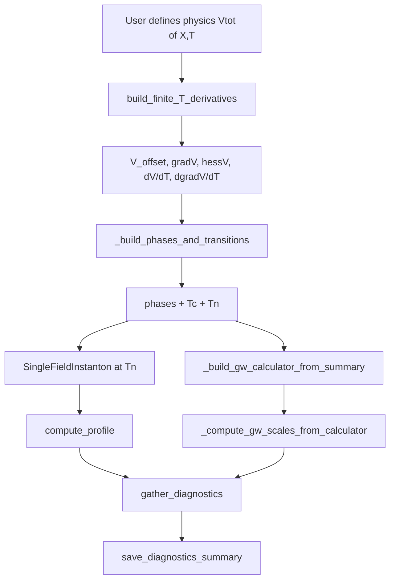

# `generic_potential`

This module provides **numerical-derivative utilities** for generic finite-temperature effective potentials $V(X, T)$.

It is intentionally “physics-agnostic”: **you** supply the physics (a callable potential), and this module supplies **consistent wrappers** (offset potential, gradients, Hessians, and temperature derivatives) with the exact I/O conventions expected by `transitionFinder`.

---

## Design goal (modernized CosmoTransitions)

In the legacy CosmoTransitions codebase, `generic_potential` bundled many concerns (1-loop corrections, thermal functions, plotting, phase tracing, transition finding, etc.). In this modernized project, we keep this module focused and reusable:

### What we build here
Numerical wrappers for:

- $V_{\rm offset}(X,T) = V(X,T) - V(X_{\rm ref},T)$
- $\nabla_X V(X,T)$
- $\nabla_X \nabla_X V(X,T)$
- $\partial V(X,T)/\partial T$
- $\partial(\nabla_X V(X,T))/\partial T$

### What we do *not* assume here
- any specific particle physics model,
- any loop-order structure,
- any thermal integral library,
- any preferred vacuum structure.

---

## Mental model (the “one-liner”)

You have a potential:
- `Vtot(X, T, *extra, **kwargs)`

You want “analysis-ready” callables:
- `V(X,T)`, `gradV(X,T)`, `hessV(X,T)`, `dV_dT(X,T)`, `dgradV_dT(X,T)`

with correct shapes, broadcasting, and robust handling of
- a **single point** $X$ vs a **cloud of points**,
- scalar $T$ vs array $T$.

That’s exactly what `build_finite_T_derivatives(...)` returns.

---

## Public API (what you should import)

- `PotentialDerivatives` (NamedTuple container of callables)
- `scalar_to_vector_potential_1d(V_scalar)`
- `build_finite_T_derivatives(Vtot, *, Ndim, x_eps, T_eps, deriv_order, X_ref)`

Plus a set of reusable workflow helpers used across examples/tests:
- `ensure_dir`, `savefig`, `tee_stdout`, `build_phi_grid`
- `compute_profile`, `gather_diagnostics`, `save_diagnostics_summary`

Internal utilities (prefixed with `_`) are still documented here because they encode the “house style” workflow:
- `_build_phases_and_transitions`, `_spinodal_data_for_phase`, `_build_gw_calculator_from_summary`, `_compute_gw_scales_from_calculator`, etc.

---

## Shape conventions (the contract with `transitionFinder`)

Let $N$ be the number of field dimensions (`Ndim`).

### Inputs
- $X$ can be:
  - a **single point** with shape `(N,)`,
  - a **point cloud** with shape `(..., N)`,
  - if `Ndim == 1`, also a scalar `phi` or a scan `(n,)` interpreted as a 1D cloud.

- $T$ can be:
  - scalar,
  - array-like broadcastable with `X[..., 0]`.

### Outputs
- `V(X,T)` returns:
  - `float` if $(X,T)$ is a single-point + scalar $T$,
  - otherwise an array broadcasted to the point cloud / temperature axes.

- `gradV(X,T)` returns an array with last axis size $N$:
  - `(N,)` for a single point + scalar $T$,
  - or `(..., N)` for general broadcasting.

- `hessV(X,T)` returns an array with last axes $(N,N)$:
  - `(N,N)` for a single point + scalar $T$,
  - or `(..., N, N)` otherwise.

---

## Quickstart example

### Case A: your physics is already vector-valued $V(X,T)$

```python
import numpy as np
from CosmoTransitions.generic_potential import build_finite_T_derivatives

def Vtot(X, T, m2=1.0, lam=0.1):
    # X: (..., Ndim). Here Ndim=2 for illustration.
    X = np.asarray(X, dtype=float)
    x, y = X[..., 0], X[..., 1]
    r2 = x**2 + y**2
    return 0.5*m2(T)*r2 + 0.25*lam*r2**2

def m2(T):
    return 1.0 - 0.02*T**2

ders = build_finite_T_derivatives(
    Vtot, Ndim=2, x_eps=1e-3, T_eps=1e-3, deriv_order=4, X_ref=[0.0, 0.0]
)

X0 = np.array([0.3, -0.2])
T0 = 50.0

print(ders.V(X0, T0))         # offset potential (float)
print(ders.gradV(X0, T0))     # shape (2,)
print(ders.hessV(X0, T0))     # shape (2,2)
print(ders.dV_dT(X0, T0))     # dV/dT (float)
print(ders.dgradV_dT(X0, T0)) # shape (2,)
````

### Case B: your physics is scalar-field $V(\phi,T)$ (very common)

Use `scalar_to_vector_potential_1d` to “lift” it into the vector convention.

```python
import numpy as np
from CosmoTransitions.generic_potential import scalar_to_vector_potential_1d, build_finite_T_derivatives

def V_scalar(phi, T, D=0.1, E=0.01, lam=0.1):
    # toy finite-T form: D(T^2 - T0^2)phi^2 - E T phi^3 + lam/4 phi^4
    T0 = 100.0
    return D*(T**2 - T0**2)*phi**2 - E*T*phi**3 + 0.25*lam*phi**4

Vtot = scalar_to_vector_potential_1d(V_scalar)

ders = build_finite_T_derivatives(Vtot, Ndim=1, deriv_order=4)

print(ders.V(1.0, 90.0))        # scalar X allowed when Ndim=1
print(ders.gradV([1.0], 90.0))  # vector form also OK
```

---

## Core components (deep dive)

### 1) `PotentialDerivatives`

**Type:** `NamedTuple`

**Purpose:** Return a single bundle of callables so downstream code can do:

* `V = ders.V`
* `dVdphi = ders.gradV`
* `d2V = ders.hessV`
* `dVdT = ders.dV_dT`
* `d(dVdphi)/dT = ders.dgradV_dT`

**Why this matters:** `transitionFinder` expects a consistent set of functions with compatible shapes.

---

### 2) `scalar_to_vector_potential_1d(V_scalar)`

#### Signature

`scalar_to_vector_potential_1d(V_scalar) -> V_vec`

#### Purpose

Lift a scalar-field potential $V(\phi,T)$ into vector form $V(X,T)$ with `Ndim = 1`, using $\phi = X[...,0]$.

#### Input rules (important)

It accepts `X` as:

* scalar $\phi$ (allowed),
* shape `(1,)` single point,
* shape `(...,1)` point cloud,
* shape `(N,)` scan is interpreted as a **scan in 1D**, not as an $N$-dimensional point.

#### Output

Returns an `ndarray` of floats matching the broadcasted shape.

#### Raises

* `ValueError` if `X` has last axis not equal to 1 for array inputs.

#### Why it exists

Many physics codes naturally write $V(\phi,T)$, but the CosmoTransitions ecosystem standardizes on vector $X$.

---

### 3) `build_finite_T_derivatives(...)`

#### Signature

```text
build_finite_T_derivatives(
    Vtot,
    *,
    Ndim,
    x_eps=1e-3,
    T_eps=1e-3,
    deriv_order=4,
    X_ref=None,
) -> PotentialDerivatives
```

#### Purpose

Construct a consistent suite of wrapper functions around `Vtot(X,T,...)`:

* offset potential
* field gradient / Hessian (via `gradientFunction` / `hessianFunction`)
* temperature derivative of potential
* temperature derivative of gradient

#### Key idea: offset potential

We define
$$
V_{\rm offset}(X,T) \equiv V(X,T) - V(X_{\rm ref},T).
$$

This is what you usually want in phase transition physics because only **free-energy differences** matter.

**Important:** `dV_dT` is computed for the **un-offset** potential $V(X,T)$, not $V_{\rm offset}$.
If you want $\partial_T V_{\rm offset}$, compute
$$
\partial_T V_{\rm offset}(X,T) = \partial_T V(X,T) - \partial_T V(X_{\rm ref},T).
$$

---

### 3.1) Input normalization: `_normalize_X(X)`

This private helper is the “shape police”.

It converts all valid `X` inputs into a point cloud array `X_pts` of shape `(..., Ndim)` and also returns flags:

* `is_single_point`: whether the user provided one point in field space,
* a hint used to decide whether returning a Python `float` is appropriate.

#### Behavior summary

**(a) scalar `X`**

* Allowed only if `Ndim == 1`.
* Interpreted as a single point.

**(b) 1D array `X`**

* If shape `(Ndim,)`: interpreted as a single point.
* If `Ndim == 1` and shape `(n,)`: interpreted as a scan (point cloud) of shape `(n,1)`.
* Otherwise ambiguous and rejected.

**(c) ND array**

* Must satisfy `X.shape[-1] == Ndim`.
* Treated as a point cloud.

#### Raises

* `ValueError` if shape is inconsistent or ambiguous.

---

### 3.2) Field derivatives: `gradV` and `hessV`

These wrappers delegate the heavy lifting to the modernized engines:

* `gradientFunction(Vtot, eps=x_eps, Ndim=Ndim, order=deriv_order)`
* `hessianFunction(Vtot, eps=x_eps, Ndim=Ndim, order=deriv_order)`

So the “physics function” `Vtot` remains pure, and this module provides the derivative interface.

#### What you control

* `x_eps`: finite-difference step in field space (scalar or per-dimension array)
* `deriv_order`: `2` or `4` controls stencil order for field derivatives inside those helper engines.

#### Shape post-processing

If you supplied a **single point**, the wrappers remove the singleton point axis so you get:

* `(N,)` for gradients,
* `(N,N)` for Hessians,
  when $T$ is scalar.

If $T$ is an array, outputs broadcast accordingly and remain array-like.

#### Raises (sanity checks)

* `RuntimeError` if the derivative engines return shapes inconsistent with `Ndim`.
  This is a deliberate “fail loudly” design: silent shape corruption is worse than a hard error.

---

### 3.3) Temperature derivatives: `dV_dT` and `dgradV_dT`

These are computed using **central finite differences in $T$** with step `T_eps`.

#### Second-order stencil (`deriv_order == 2`)

For any quantity $f(T)$:
$$
f'(T) \approx \frac{f(T+\epsilon) - f(T-\epsilon)}{2\epsilon}.
$$

#### Fourth-order stencil (`deriv_order == 4`)

$$
f'(T) \approx \frac{-f(T+2\epsilon) + 8f(T+\epsilon) - 8f(T-\epsilon) + f(T-2\epsilon)}{12\epsilon}.
$$

Here $f(T)$ is either:

* $V(X,T)$ for `dV_dT`, or
* $\nabla_X V(X,T)$ for `dgradV_dT`.

#### Return type convenience

For a single point + scalar $T$, `dV_dT` returns a Python `float` (optimizer-friendly).

---

### 3.4) Numerical knobs (how to not shoot yourself)

* `x_eps` too large:

  * gradients/Hessians become inaccurate, especially near thin barriers or steep curvature.
* `x_eps` too small:

  * catastrophic cancellation and floating-point noise.
* `T_eps` too large:

  * smears temperature dependence and biases $\partial_T$.
* `T_eps` too small:

  * the $T$-derivative becomes pure numerical noise.

**Practical rule of thumb:** pick `x_eps` and `T_eps` so that

* $V$ changes “noticeably” over $\epsilon$,
* but not so much that you are sampling a nonlinear region of the function.

---

## Generic workflow utilities (reused across examples)

These functions are intentionally boring: they exist so your examples are clean, consistent, and reproducible.

### `ensure_dir(path)`

Creates a directory if it does not exist, and returns `path` back (or `None` if no path given).

### `savefig(fig, save_dir, name, *, dpi=160)`

Saves `fig` as `save_dir/{name}.png` if `save_dir` is provided.

### `tee_stdout(save_dir, filename="showcase_log.txt")`

Context manager that duplicates all `print(...)` output to a log file.

This is how you get “paper-like” reproducibility: you save plots *and* the numerical summary from the run.

---

### `build_phi_grid(obj_or_phi_a, phi_b=None, *, margin=0.1, n=800)`

Builds a 1D field grid for plotting.

Two usage patterns:

1. Pass an instanton-like object with attributes `phi_metaMin` and `phi_absMin`.
2. Pass two endpoints `phi_a, phi_b`.

It expands the interval by `margin * span`.

---

## TransitionFinder pipeline helpers (Block A+B+C in one function)

### `_build_phases_and_transitions(...)`

#### Purpose

This function packages the standard finite-$T$ phase transition workflow:

1. **Seed minima** at several temperatures (cheap 1D scan).
2. **Trace phases** with `traceMultiMin` (thermal evolution of minima).
3. Compute **critical temperatures** with `findCriticalTemperatures`.
4. Compute **full transitions**, including nucleation temperature $T_n$, via `findAllTransitions`.

It returns a single summary dictionary that downstream code can reuse.

#### Step 1: seed minima

At a handful of temperatures $T_{\rm ref}$, it runs
`transitionFinder.findApproxLocalMin(...)` along a 1D field line.

This is not meant to be perfect. It is meant to be:

* cheap,
* robust,
* “good enough” to give `traceMultiMin` sensible starting points.

If no seeds are found, it falls back to trivial seeds at $X=0$.

#### Step 2: trace phases

Uses:

* `traceMultiMin(V_XT, dgradT_XT, hessV_XT, seeds, ...)`

This is the core “phase tracing” algorithm:
it follows each minimum as the Universe cools (or heats) in $T$.

Then it removes redundancies and identifies the start phase with:

* `removeRedundantPhases(...)`
* `getStartPhase(...)`

#### Step 3: critical temperatures

Uses:

* `findCriticalTemperatures(phases, V_XT, start_high=False)`

This finds temperatures where phases are degenerate in free energy (the usual $T_c$ logic).

#### Step 4: nucleation temperature $T_n$

Uses:

* `findAllTransitions(..., tunnelFromPhase_args=...)`

and supplies a default nucleation criterion:
$$
\frac{S(T)}{T} - 140 = 0.
$$

Concretely, the code uses:

```text
def _default_nucl(S, T):
    return S/(T+1e-100) - 140.0
```

So `tunnelFromPhase` tries to find $T$ such that the criterion crosses zero.

**Important:** The number “140” is a convention corresponding to an order-of-magnitude estimate of one bubble per Hubble volume per Hubble time in radiation domination. In this code, it is treated as a practical criterion, not a sacred constant.

#### Output

The returned dict contains:

* potential wrappers (`V_XT`, `dVdphi_XT`, `hessV_XT`, `dVdT_XT`, `dgradT_XT`)
* `phases`, `start_phase_key`, `start_phase`
* `critical_transitions`
* `full_transitions`
* `main_transition` (first first-order transition found)

---

## Spinodal helpers

### `_spinodal_data_for_phase(phase, hessV_XT, *, n_T_scan=300)`

#### Purpose

A spinodal is where the minimum stops being a minimum: the curvature goes unstable.

Operationally:

* compute the Hessian $H(X_{\min}(T),T)$ along the phase minimum,
* take the smallest eigenvalue:
  $$
  m^2(T) \equiv \min ,{\rm eig}, H(X_{\min}(T),T),
  $$
* find where $m^2(T)=0$.

#### Implementation details

* sample a temperature grid,
* compute $m^2(T)$ by `np.linalg.eigvalsh`,
* detect sign changes and refine roots with Brent’s method (`scipy.optimize.brentq`).

If no clean crossing is found, it returns the temperature where $|m^2|$ is minimal as a fallback.

#### Output

A dict with:

* `"T_grid"`: sampled temperatures
* `"m2"`: sampled smallest eigenvalues
* `"T_spinodals"`: estimated spinodal temperatures

---

### `_closest_spinodal_to_T(T_target, T_spinodals)`

Returns the spinodal temperature closest to `T_target` (or `None`).

---

## GW interface helpers (best-effort glue code)

These helpers exist because the “post-processing” stage often wants GW scales once a transition is known.

### `_build_gw_calculator_from_summary(transition_summary)`

#### Purpose

Construct a `GravitationalWaveCalculator` using:

* `V_XT`, `dVdphi_XT`, `dVdT_XT`,
* `phases`,
* the `high_phase_key` and `low_phase_key` of `main_transition`.

It returns `None` if the required information is missing.

#### Why “best-effort”

This module refuses to hard-depend on GW infrastructure:

* imports are local,
* exceptions are caught and converted to `None`,
  so core phase-transition workflows remain usable without GW extras.

---

### `_compute_gw_scales_from_calculator(gw_calc, transition_summary, *, g_star, v_w, dT_fraction=0.001)`

#### Purpose

Compute standard thermodynamic scales used in GW forecasts, via methods on `gw_calc`:

* $T_*$ (chosen here as $T_n$ when available),
* $\alpha$,
* $\beta/H_*$,
* $R_* H_*$,
* $\Gamma(T_*)$ (nucleation rate),
* peak frequencies for sound waves / turbulence / collisions (best-effort).

**Key point:** this function does **not** define the formulas itself; it delegates physics definitions to the `GravitationalWaveCalculator` methods. This keeps a single source of truth.

#### Temperature step selection for $\beta/H_*$ (numerical care)

It chooses a small $\Delta T$ around $T_*$, trying to remain inside any valid overlap domain stored in the calculator. If that domain is unknown, it defaults to:
$$
\Delta T \sim {\tt dT_fraction}\times \max(T_*, 1).
$$

#### Output

A dict with keys like:

* `gw_T_star_GeV`, `gw_alpha`, `gw_beta_over_H`, `gw_R_star_times_H`,
* `gw_nucleation_rate_GeV4`, plus peak frequencies.

If $T_*$ cannot be determined, it returns `NaN` values consistently.

---

## Bounce/profile glue (reusable wrappers)

### `compute_profile(inst, ...)`

#### Purpose

A thin wrapper around `inst.findProfile(...)` that standardizes the keyword defaults used across examples.

It assumes only that `inst` exposes the modernized `SingleFieldInstanton`-style API.

---

### `gather_diagnostics(inst, profile, label="", transition_summary=None)`

#### Purpose

Collect a compact, JSON-friendly dictionary that summarizes:

#### (A) vacuum structure

* $\phi_{\rm meta}$, $\phi_{\rm true}$, $\phi_{\rm top}$
* $V(\phi_{\rm meta})$, $V(\phi_{\rm true})$, $V(\phi_{\rm top})$
* $\Delta V = V(\phi_{\rm true}) - V(\phi_{\rm meta})$

#### (B) profile / geometry

* $r_0$, $\phi_0$, $d\phi_0$ (from `inst._profile_info` when available)
* curvature scales (from `inst._scale_info` when available)
* wall diagnostics: radius and thickness (when available)

#### (C) action decomposition

Uses `inst.actionBreakdown(profile)` which returns:

* `S_total`, `S_kin`, `S_pot`, `S_interior`

and reports
$$
\frac{S_3}{T} \equiv \frac{S_{\rm total}}{T}
$$
when it can infer $T$ from `inst.V` if it is a `functools.partial` carrying `T=...`.

#### (D) beta proxies

Calls `inst.betaEff(profile, method=...)` for:

* `"rscale"`, `"curvature"`, `"wall"`,

and stores them as:

* `beta_rscale`, `beta_curvature`, `beta_wall`.

#### (E) transitionFinder info (optional)

If `transition_summary` is provided, it also stores:

* $T_n$, $T_c$,
* spinodal temperatures (if included upstream),
* GW scales (computed on-demand if missing).

---

### `save_diagnostics_summary(di, save_dir, basename="diagnostics_summary", fmt="json")`

#### Purpose

Persist the diagnostic dict to disk.

Supported formats:

* `json` (recommended)
* `csv` (simple key,value)
* `txt` (pretty aligned)

Raises:

* `ValueError` for unknown format.

---

### Suggested module-level workflow (how everything fits)



This is the intended “clean path”:

* physics stays in `Vtot`,
* numerics stay in derivative wrappers,
* transition logic stays in `transitionFinder`,
* bounce logic stays in `tunneling1D` / `SingleFieldInstanton`,
* GW logic stays in `gravitational_Waves`,
* and this module provides the glue that makes the interfaces consistent.

---

## Common pitfalls (and how this code prevents them)

1. **Ambiguous `X` shapes**

* Solved by `_normalize_X` with strict rules + explicit errors.

2. **Silent broadcasting bugs**

* The wrappers aggressively reshape single points and validate last-axis sizes.

3. **Offset vs un-offset confusion**

* `V` is offset by design; `dV_dT` is explicitly un-offset and documented.

4. **Derivative noise**

* `deriv_order` and step sizes `x_eps`, `T_eps` are explicit knobs, not hidden magic.

---

## Summary

If you remember only one thing:

> This module is the adapter layer that makes your raw physics potential look like a clean, shape-consistent, derivative-complete object usable everywhere else in the pipeline.

Everything else is implementation detail in service of that contract.

