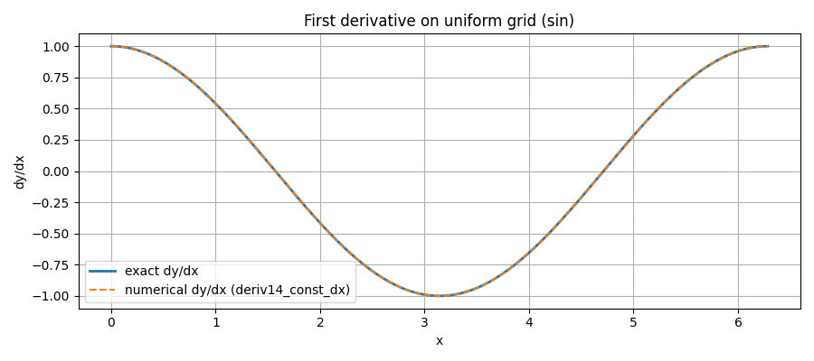
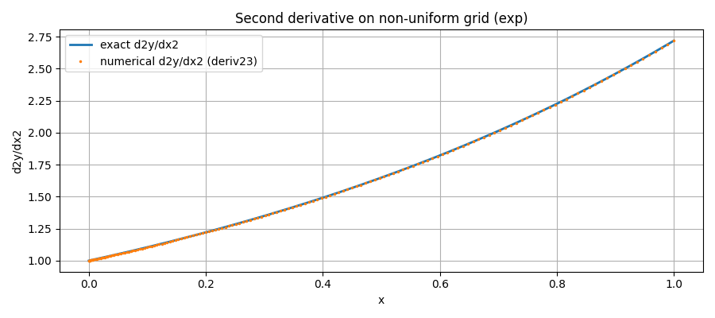
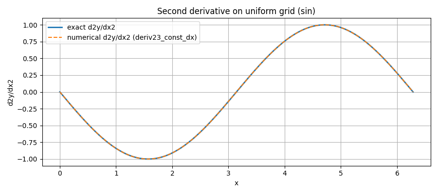
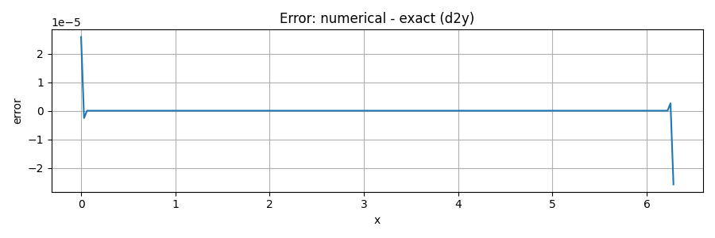
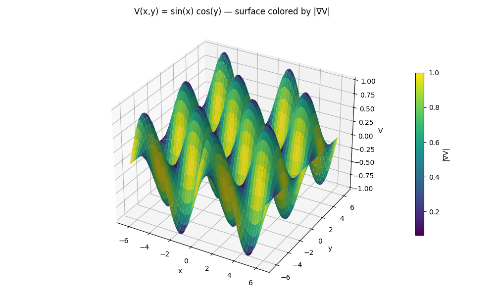
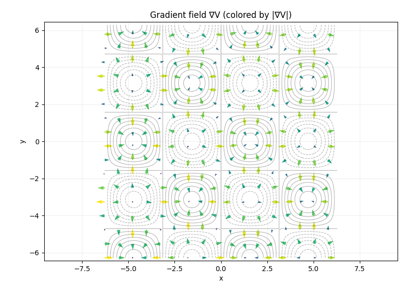
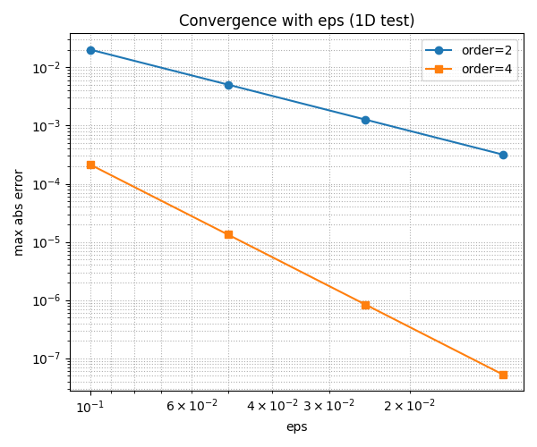
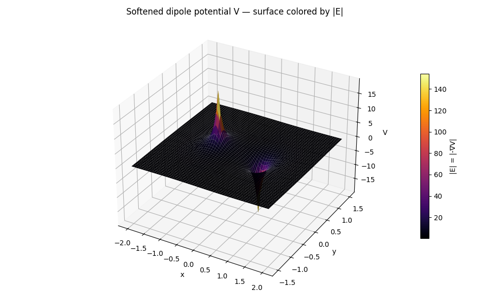

# Numerical Derivatives functions

---
## `fd_weights_1d`
### Signature

```python
fd_weights_1d(x_nodes: np.ndarray, x0: float, der: int) -> np.ndarray
```

### Purpose
Computes the **finite difference weithts** that approximate the `der`-th derivatie of a function at point `x0`
using an **aribtraty stencil** `x_nodes` (they do not need to be uniform or ordered).

It is the “engine” that the derivative routines use to form linear combinations of the type

$$f^{der}(x_0) \approx \sum_j w_j f(x_j) $$

### Parameters, returns and Raises
**Parameters**
- `x_nodes` (`array like`, shape `(m,)`): Distinct stencil nodes; **not** required to be uniform or sorted
- `x0` (`float`): Expansion point where the derivatie is approximated
- `der` (`int`): Derivative order (0,1,2,...)
Claim: In this project we typically use `der ∈ {1,2}`, but the algorithm supports `0 <= der <= m-1`

**Returns**
- `w` (`np,ndarray`, shape (`m,`)): Weights such that `f^(der)(x0) = \sum_j w[j]*f(x_nodes[j])` 

### Raises 
- `ValueError` if `der<0` or if `m-1<der` (need at least `m=der+1` nodes)
- `ZeroDivisionError` if two stencil nodes coincide (nodes must be **distinct**)

### How to use and Intuition
This function has no examples because it is called by others (e.g., deriv14, deriv1n, ...)

**intuition** (Where the coefficients come from): Build the **Lagrange interpolant** $p(x)=\sum_j f(x_j)L_j(x)$
The weiths are precisely $w_j = L_j ^{der}(x_0)$. *Fornberg's algorithm* computes these derivatives **recuservely and stably**
filling a table `c[j,k] ` (node **j**, derivative order **k**) and returning the column k=der chosen.

**Notes**

- **Typical accuracy (near-uniform stencils):** $\mathcal{O}$(h^{m-der}) for smooth functions, with h a characteristic spacing
- **Polynomial exactness:** Exact for all polynomials up do degree `m-1`

---

## `_stencil_indices`
### Signature

```python
_stencil_indices(n: int, k: int, m: int) -> np.ndarray
```

### Purpose
Returns a **contiguos, length-** `m` window of indices insied `[0,n-1]` that is as **centered around** `k` as possible.
Near the boundaries is **falls back** to left or right aligned windowns. For **even** `m`, the window is biased one step to the left of perfect centering.
Internal helper to choose the stencil for finite-difference weights/derivatives use it to obtain a centered window in the
interior and one-sided windows near the boundaries.

### Parameters, returns and Raises
**Parameters**
- `n (int)`: Total number of samples (valid indices are `0..n-1`)
- `k (int)`: Target center index
- `m (int)`: Stencil lenght (window size)

**Returns**
- `idx (np.ndarray[int])`, shape `(m,)`: Monotonically increasing, contiguous indices `start...start+m+1`

---

## `deriv14_const_dx`

### Signature

```python
deriv14_const_dx(y: np.ndarray, dx: float = 1.0) -> np.ndarray
```

### Purpose
Compute the **first derivative** along the **last axis** of `y` sampled on a **uniform grid**, using the **5-point, 4th-order** finite-difference scheme.
The routine is fully vectorized (no Python loops) and preserves the shape of `y`, making the function faster than `deriv14`.

> ⚠️ Unlike `deriv14`, This function doesn't call `fd_weights_1d`, so it doesn't go through any loops and therefore calculates derivatives much faster. 
> The price to pay for this is providing a uniform grid


* **Interior (k = 2..n−3)**: centered 5-point, 4th-order

  $$
  f'(x_k)\ \approx\ \frac{f_{k-2}-8f_{k-1}+8f_{k+1}-f_{k+2}}{12h}.
  $$
* **Boundaries**: standard **one-sided 5-point** formulas (also 4th-order) for `k∈{0,1,n−2,n−1}`.


### Parameters, returns and Raises

**Parameters**

* `y` (`array_like`, shape `(..., n)`): Samples on a **uniform** grid along the last axis.
* `dx` (`float`, optional): Uniform spacing `h` between consecutive samples (default `1.0`).

**Returns**

* `dy` (`np.ndarray`, same shape as `y`): Numerical approximation to **∂y/∂x** along the last axis.

**Raises / Assumptions**

* `ValueError` if `y.shape[-1] < 5` (needs at least five points).
* Assumes **uniform** spacing with finite `dx` and monotonic (increasing or decreasing).
* ⚠️ Error is **$\mathcal{O}(h^4)$** in the interior; at the ends it remains 4th-order but with typically larger constants.

### When to use and Examples

Use when your data are on a **uniform grid** and you want a **high-accuracy** first derivative with a small, explicit stencil and **fast vectorized** implementation.

see the full test script in `[tests/helper_functions/Numerical_derivatives](/tests/helper_functions/Numerical_derivatives.py)` for more

**Examples**

- **Derivative of (sin) using deriv14_const_dx**


- **Error of the derivative**


```python
'''
=== Test derivative: Uniform grid, first derivative (sin profile) ===
Grid: N=201, dx=3.142e-02, function: sin(kx), k=1.0
Max abs error (dy): 1.945e-07  (expected ~O(h^4) ~ 9.7e-07)
Note: boundary stencils are one-sided; error is typically larger at the ends than in the interior.
'''
```
---

## `deriv14`

### Signature

```python
deriv14(y: np.ndarray, x: np.ndarray) -> np.ndarray
```

### Purpose

Compute the **first derivative** along the **last axis** of `y` sampled at **non-uniform** coordinates `x`, using **5-point** finite-difference stencils.
The routine builds **Fornberg weights** per local stencil, yielding **4th-order accuracy in the interior** on smooth data (with one-sided high-order stencils at the boundaries).
Works for strictly **increasing or decreasing** `x`!! .

> ⚠️ Unlike `deriv14_const_dx`, This function call `fd_weights_1d`, so it goes through many loops and therefore calculates derivatives slower.
> What gains in return is the ability to compute on an arbitrary non-uniform grid

### Parameters, returns and Raises

**Parameters**

* `y` (`array_like`, shape `(..., n)`): Function values along the last axis.
* `x` (`array_like`, shape `(n,)`): Sample locations, **strictly monotonic** (increasing or decreasing). Requires `n ≥ 5`.

**Returns**

* `dy` (`np.ndarray`, same shape as `y`): Numerical approximation to **∂y/∂x** along the last axis.

**Raises / Assumptions**

* `ValueError` if `x` is not 1D, if `n < 5`, or if `x` is not **strictly** monotonic.
* Interior uses **centered** windows `[k-2..k+2]`; endpoints use **one-sided** 5-point stencils.
* Interior truncation error is typically **$\mathcal{0}(h^4)$** on near-uniform meshes (with $h$ a typical spacing), while boundary errors have larger constants.

### Notes

* Uses `fd_weights_1d` to obtain exact polynomial reproductions up to degree 4 on each stencil.
* Vectorized accumulation via `np.tensordot` along the last axis.

### When to use and Examples

Use when your samples lie on a **non-uniform** 1D grid and you want **high order interior accuracy** without resampling to a uniform mesh.

see the full test script in `[tests/helper_functions/Numerical_derivatives](/tests/helper_functions/Numerical_derivatives.py)` for more

**Examples** *(same structure as `deriv14_const_dx`; you can adapt the `x` grid to be non-uniform)*:

**Examples**

- **Derivative of (exp) using deriv14**


  
```python
'''
=== Test 3: Non-uniform grid, first derivatives (exp profile) ===
Non-uniform grid size: N=161
Max abs error (dy):  6.659e-09
=== Test 6: Expected error cases ===
Too few points (deriv14): deriv14 requires at least 5 samples.
x not 1D (deriv14): x must be 1D
Non-monotonic x (deriv14): x must be strictly monotonic (increasing or decreasing).
'''
```
---

awesome — keeping it super lean and non-repetitive, just pointing back to the previous functions and leaving a slot for your examples.

---

## `deriv23`

### Signature

```python
deriv23(y: np.ndarray, x: np.ndarray) -> np.ndarray
```

### Purpose

Same algorithmic idea, assumptions, and stencil policy as **`deriv14`**, but for the **second derivative** on a **non-uniform** 1D grid.
Uses **5-point stencils** with **Fornberg weights** (`der=2`): centered in the interior, one-sided near boundaries. Accuracy in smooth problems is typically **3rd–4th order** in the interior (exact for polynomials up to degree 4 on uniform stencils).

### Parameters, returns and Raises

* Parameters, shape constraints, monotonicity checks, and error handling are the **same pattern as `deriv14`**, with `der=2`.
* Returns an array with the **same shape** as `y`, containing **$\partial y^2/ \partial x^2$** along the last axis.

### When to use and Examples

Use when you need **second derivatives** on **non-uniform** grids with high-order interior accuracy and robust boundary handling.

see the full test script in `[tests/helper_functions/Numerical_derivatives](/tests/helper_functions/Numerical_derivatives.py)` for more

**Examples**

- **Second Derivative of (exp) using deriv23**


  
```python
'''
=== Test 3: Non-uniform grid, second derivatives (exp profile) ===
Non-uniform grid size: N=161
Max abs error (d2y): 2.625e-06

=== Test 6: Expected error cases ===
Too few points (deriv23): deriv23 requires at least 5 samples.
x not 1D (deriv23): x must be 1D
Non-monotonic x (deriv23): x must be strictly monotonic (increasing or decreasing).
'''
```
---

## `deriv23_const_dx`

### Signature

```python
deriv23_const_dx(y: np.ndarray, dx: float = 1.0) -> np.ndarray
```

### Purpose

Same idea as **`deriv14_const_dx`**, but computing the **second derivative** on a **uniform** grid using the **5-point, 4th-order** scheme.
Interior uses the standard centered 5-point formula,

$$
f''(x_k)\approx\frac{-f_{k-2}+16f_{k-1}-30f_k+16f_{k+1}-f_{k+2}}{12\,h^2},
$$

with one-sided 5-point stencils at the boundaries

### Parameters, returns and Raises

* Parameters and return shape mirror **`deriv14_const_dx`** (but for **$\partial y^2/ \partial x^2$**). Requires at least **5 points** along the last axis; raises `ValueError` otherwise.

### When to use and Examples

Use for **uniform grids** when you want a **fast, vectorized** second derivative with high accuracy and small stencil.

see the full test script in `[tests/helper_functions/Numerical_derivatives](/tests/helper_functions/Numerical_derivatives.py)` for more

**Examples**

- **Second Derivative of (sin) using deriv23_const_dx**


- **Error of the second derivative**


```python
'''
=== Test 2: Uniform grid, second derivative (sin profile) ===
Max abs error (d2y): 2.580e-05  (expected ~O(h^3) at edges ~ 3.1e-05)
Notes: The interior is still O(h^4) (see graph)
'''
```
---

## `deriv1n`

### Signature

```python
deriv1n(y: np.ndarray, x: np.ndarray, n: int) -> np.ndarray
```

### Purpose

General **first-derivative** on a **non-uniform** 1D grid using an **(n+1)-point** stencil with **Fornberg weights**.
Same overall idea/policies as `deriv14` (centered interior, one-sided near boundaries), but here the **stencil size is configurable** via `n` (so `m = n+1` points). 
For smooth data on near-uniform meshes, interior truncation error scales **$\approx \mathcal{O}(h^n)$* (e.g., `n=4` → 5-point, ~4th-order like `deriv14`).

**What’s different vs. `deriv14` / `deriv14_const_dx`:**

* You **choose** accuracy/stencil size with `n` (recommended **4 ≤ n ≤ 8**: good accuracy vs. stability).
* Larger stencils can be **more sensitive to noise** and **wider spacing**; extremely irregular nodes may degrade conditioning.
* Uses `_stencil_indices` to pick a centered window when possible, otherwise one-sided near edges.

### Parameters, returns and Raises (briefly)

* `y`: values along the last axis `(..., N)`.
* `x`: strictly **monotonic** 1D array `(N,)`; requires `N ≥ n+1`.
* `n`: desired accuracy order; stencil size is `m = n+1`.
* Returns `dy` with the **same shape** as `y` (∂y/∂x along the last axis).
* Raises `ValueError` if `x` not 1D/monotonic, if `N < n+1`, or if `n < 2`.
* Internally: Fornberg weights with `der=1`, accumulated via `np.tensordot`.

### When to use and Examples

When you want to **dial precision** (and stencil width) for first derivatives on **non-uniform** grids without resampling.

see the full test script in `[tests/helper_functions/Numerical_derivatives](/tests/helper_functions/Numerical_derivatives.py)` for more

**Examples**

```python
"""
=== Test 4: Accuracy vs stencil size (deriv1n on sin) ===
n=4 (stencil m=5): max abs error = 2.964e-07
n=6 (stencil m=7): max abs error = 2.573e-10
n=8 (stencil m=9): max abs error = 2.558e-13
Expected: error generally decreases as stencil size increases (for smooth functions).
"""
```
---

## `gradientFunction` (callable class)

### Signature

```python
ArrayLike = Union[np.ndarray, float]

class gradientFunction:
    def __init__(self, f: Callable, eps: ArrayLike, Ndim: int, order: int = 4) -> None: ...
    def __call__(self, x: ArrayLike, *args, **kwargs) -> np.ndarray: ...
```

### Purpose

Build a **callable gradient operator** for a scalar field $f:\mathbb{R}^{N}\to\mathbb{R}$ using **finite differences** of **order 2 or 4**, with **per-axis steps** `eps`.
Once constructed, `gradientFunction(...)` behaves like a function: `df(x) → ∇f(x)`.

> Intuition: along each coordinate $i$, evaluate $f$ at **symmetrically shifted points** $x \pm \alpha\,\varepsilon_i\,\hat e_i$ (second or fourth-order central differences). 
> Combine the batched evaluations with the precomputed coefficients to get the $i$-th partial derivative. All axes are processed **in one vectorized call**.

### Why a **class** (not just a function)?

* **Precomputation & reuse:** offsets and peraxis coefficients depend only on `(eps, Ndim, order)`. The class **builds them once** and reuses across many calls → less Python overhead in tight loops (optimization, sampling, PDE steps).
* **Stateful configuration:** keeps `f`, `Ndim`, `eps`, `order` together; the result is a **callable object** that plugs cleanly anywhere a function is expected.

### Parameters, returns and Raises

**`__init__(f, eps, Ndim, order=4)`**

* `f` (`callable`): scalar field; must accept arrays with last axis of length `Ndim` (any leading batch axes allowed) and return an array of the same leading shape (scalar per point).
* `eps` (`float | array_like`): FD step(s). Scalar is broadcast to all axes; or pass a length-`Ndim` array for peraxis steps.
* `Ndim` (`int`): dimensionality of the input points.
* `order` (`{2,4}`): FD accuracy. `2` uses $[-1,+1]$ with coefficients $[-1/2,+1/2]$; `4` uses (\[-2,-1,+1,+2]/12`with coefficients`\[+1,-8,+8,-1]/12\`.

**`__call__(x, *args, **kwargs)`**

* `x` (`array_like`, shape `(..., Ndim)`): evaluation points (1 or many).
* Returns `grad` (`np.ndarray`, shape `(..., Ndim)`): gradient $\nabla f(x)$.
* Any extra `*args/**kwargs` are forwarded to `f`.

**Raises / Assumptions**

* `ValueError` if `order ∉ {2,4}`, if `eps` is not scalar or `(Ndim,)`, if `x`’s last axis ≠ `Ndim`, or if `Ndim` is inconsistent.
* `f` must be **vectorized** enough to broadcast over the added stencil axes; the class constructs inputs of shape `(..., order, Ndim, Ndim)` and expects outputs `(..., order, Ndim)` (scalar per displaced point).

### Notes

* **Accuracy vs. step size:** truncation error decreases with smaller `eps`, but round-off grows—pick `eps` consistent with the scale of `x` and `f` (a common rule of thumb: start near $\sqrt{\varepsilon_\text{mach}} \times \text{scale}$ for order-2, and somewhat larger for order-4).
* **Anisotropic steps:** use an `eps` vector to reflect different physical scales per axis.
* **Performance/memory:** very large `Ndim` or huge batches may increase temporary array sizes; if needed, evaluate in tiles.

### When to use and Examples

Use when you need a **drop-in gradient** for a black-box scalar function (e.g., potentials $V(\phi)$ in multi-field models, without deriving/maintaining analytic gradients. It’s especially handy inside **optimizers**, **line searches**, or **field evolution** steps).

see the full test script in `[tests/helper_functions/Numerical_derivatives](/tests/helper_functions/Numerical_derivatives.py)` for more

**Examples**

- **Gradient of $V(x,y)=\sin(x)*\cos(y) [order=4]$**


- **Gradient field for intuition**


```python
"""
=== Test 7: Gradient on V(x,y) = sin(x) * cos(y) (order=4) ===
Grid: 101x101, eps=1e-4 (per axis), order=4
Max |grad error| = 4.145e-12,  Mean |grad error| = 1.757e-12
Notes: O(h^3) at edges
"""
```

- **Convergence with eps (1D)**


```python
# Convergence is faster with higher order, as expected
```
- **Physical example: Electrostatic Field**


- **Physical example: 2D anisotropic harmonic oscillator**


```python
"""
=== Test 11: Electrostatic potential (softened) and field via gradientFunction ===
Rel. error stats away from charges: max=1.394e-09, mean=2.493e-11

=== Test 12 (bonus): 2D anisotropic harmonic oscillator with rkqs and ∇V ===
Energy stats: Emin=1.000000, Emax=1.000001, ΔE=6.510e-07```
"""
```

```python
"""
=== Test 13: Expected error cases (gradient) ===
Invalid order (gradientFunction): order must be 2 or 4
Wrong eps shape (gradientFunction): `eps` must be scalar or have shape (2,)
x last axis mismatch (gradientFunction): Last axis of x must have length Ndim=2
Non-scalar f (gradientFunction): ValueError('operands could not be broadcast together with shapes (4,4,2,2) (4,2) ')
"""
```
---