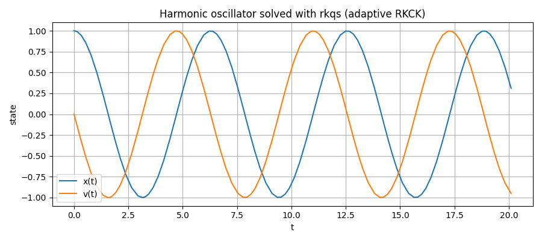
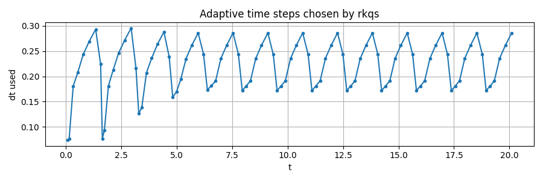

# Numerical Integration functions

---
## `_rkck`
### Signature

```python
_rkck(y: np.ndarray, dydt: np.ndarray, t: float,f: Callable, dt: float, args: tuple = ()) -> Tuple[np.ndarray, np.ndarray]
```

### Purpose
Perform **one** embedded Runge-Kutta **Cash-Karp** step (the classic 5th-order method with a 4th-order ebedded estimate)

### Parameters, returns and Raises
**Parameters**
- y  (array_like): Current state at time `t`.
- dydt (array_like): Derivative `dy/dt` at (y, t), usually `f(y, t)`.
- t (float): Current integration variable (independent variable).
- f (callable): Derivative function with signature `f(y, t, *args)`.
- dt (float): Step size.
- args (tuple, optional) Extra positional arguments for f (usualy defaults)


**Returns**
- `dyout` (ndarray): The 5th-order **increment** Δy to update the state: y_next ≈ y + dyout.
- `yerr` (ndarray): An estimate of the **local truncation error** for the increment (the difference between 5th and 4th order formulas)

### Raises

- No custom exceptions.

### When to use 
This function is used by the function below (`rkqs`) to solve the desired ODE and therefore is not called directly. 
(That's why there are no examples of it)

--- 
## `rkqs`
### Signature

```python
rkqs(y: np.ndarray, dydt: np.ndarray, t: float, f: callable, dt_try: float, epsfrac: float, epsabs: float, args: tuple = ()) -> _rkqs_rval
```

### Purpose
Perform **one adpative step** of the (RKCK) method **with error control**
It's the acceptance/rejection + step control wrapper around the low-leve `_rkck` step.
The function has larger steps when the error is very small and decreases the step when the error becomes large. 
This ensures accuracy and speed in solving the integral.

### Parameters, returns and Raises
**Parameters**
- Same as _rkck (y, dydt, t, f, dt and args) plus:
- dt_try  (float): Initial step-size guess 
- epsfrac (float): **Relative** error tolerance (dimensionless)
- epsabs (float): **Absolute** error tolerance (same units as `y`)


**Returns**
- named tuple `_rkqs_rval[Delta)y, Delta_t, dtxt]`
- `Delta_y ` (ndarray): 5th-order **increment** to advance the state: y_next ≈ y + Delta_y. 
- `Delta_t` (float): The actual step size used on the accepted step (may be smaller than dt_try).
- `dtxt` (float): A **suggested** step size for the next call (based on the observed error)

### Raises

- `IntegrationError`: If the step size underflows numerically (i.e., `t+dt==t`) after repeated shrinking)

### How to use and Examples

- The error is handled as follows:
 - With the relative error `epsfrac` evaluate `denom = y * epsfrac`
 - With the absolute error `epsabs` evaluate `err_ratio = |yerr| / max(denom, epsabs)`
 - Then take errmax = max(err_ratio) and `if errmax <1` accept pace. Otherwise compute a reduced dt until accepted
 - After acceptance, propose dtnxt (x5 if the step was extremely accurate and reduced if the error was not so accurate)

- Start with `epsfrac ~ 1e-6` (relative) and `epsfrac ~ 1e-9` (absolute) for typical float64 runs.
- There is no predefined formula for errors, just trial and error with the desired ODE


see the full test script in [tests/helper_functions/Numerical_integration](/tests/helper_functions/Numerical_integration.py) for more
There are one more image and two more prints examples there.
**Examples**
```python
# Minimal usage pattern (pseudo-code)
y = y0.copy()
t = t0
dt = dt_try
while t < t_end:
    dydt = f(y, t, *args)
    Delta_y, Delta_t, dtnxt = rkqs(y, dydt, t, f, dt, epsfrac, epsabs, args)
    y += Delta_y
    t += Delta_t
    dt = dtnxt

```
- **Harmonic oscillator test images**  



- **Adaptive step sizes**


---
