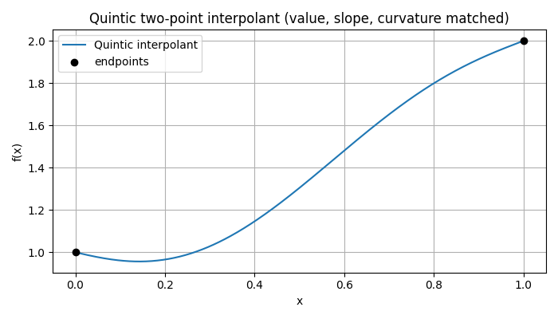

# Interpolation Functions

---
## `makeInterpFuncs`

### Signature

```python
makeInterpFuncs(y0, dy0, d2y0, y1, dy1, d2y1) -> Tuple[Callable, Callable]
```

### Purpose

Build a **quintic (5th-degree) interpolant** on the normalized domain **x ∈ \[0,1]** that matches **value, first, and second derivatives at both endpoints**:

$$
f(0)=y_0,\quad f'(0)=d y_0,\quad f''(0)=d^2 y_0,\qquad
f(1)=y_1,\quad f'(1)=d y_1,\quad f''(1)=d^2 y_1.
$$

It returns two callables:

* `f(x)`: the interpolating polynomial,
* `df(x)`: its first derivative.

> Intuition: a quintic has 6 coefficients, exactly the number of endpoint constraints (value/slope/curvature at 0 and 1).
> We **fix three** coefficients from the left-end constraints and **solve a small 3×3 linear system** for the remaining ones using the right-end constraints.
> This is the classic **Hermite-type two-point interpolation** with up to second derivatives.

### Parameters, returns and Raises

**Parameters**

* `y0, dy0, d2y0`: value, 1st and 2nd derivative at `x=0`.
* `y1, dy1, d2y1`: value, 1st and 2nd derivative at `x=1`.

**Returns**

* `f` (`callable`): evaluates the quintic at scalar/array `x` in `[0,1]`.
* `df` (`callable`): evaluates the first derivative at the same `x`.

*(No custom exceptions; the internal 3×3 system has a fixed, well-conditioned matrix.)*

### Notes

* The polynomial is $p(x)=a_0+a_1 x+a_2 x^2+a_3 x^3+a_4 x^4+a_5 x^5$.

  * From the left endpoint:

    $$a_0=y_0,\quad a_1= d y_0,\quad a_2=\tfrac{1}{2} d^2 y_0$$

  * The remaining $(a_3,a_4,a_5)$ come from the right endpoint via
    a **fixed** 3×3 system (hard-coded matrix), solved against the residuals
    after subtracting the known $a_0,a_1,a_2$.
* Both `f` and `df` use **Horner’s scheme** for numeric stability and speed.
* To interpolate over an arbitrary interval $[x_a,x_b]$, map $x$ to
  $s=(x-x_a)/(x_b-x_a)\in[0,1]$. Endpoint derivatives must be **scaled**:

$$\frac{df}{dx}\Big|_{x_a} = \frac{1}{h}\frac{df}{ds}\Big|_{s=0}\quad \frac{d^2 f}{dx^2}\Big|_{x_a} = \frac{1}{h^2}\frac{d^2 f}{ds^2}\Big|_{s=0}$$

  with $h=x_b-x_a$ (same at the right end).

### When to use and examples

Use when you need a **smooth segment** with **continuous value, slope, and curvature** at both ends (e.g., path stitching, potential profiles, or boundary-matched trajectories, without overshoot typical of low-order polynomials).

see the full test script in [tests/helper_functions/interpolation_functions](/tests/helper_functions/interpolation_functions.py) for more

**Example**

```python
# Endpoint constraints on x in [0,1]
y0, dy0, d2y0 = 1.0, -0.5,  0.75
y1, dy1, d2y1 = 2.0,  0.8, -0.25
f, df = makeInterpFuncs(y0, dy0, d2y0, y1, dy1, d2y1)
```

- **Quintic Interpolation**


---

## `cubicInterpFunction`

### Signature

```python
class cubicInterpFunction:
    def __init__(self, y0, dy0, y1, dy1) -> None: ...
    def __call__(self, t) -> np.ndarray: ...
```

### Purpose

Cubic two-point interpolant on the normalized parameter **t ∈ \[0,1]** that matches **value and first derivative at both ends**.
Implements the **Bézier form** that is algebraically equivalent to **Hermite** interpolation with endpoint slopes.

> Intuition: a cubic has 4 degrees of freedom—exactly the endpoint value/tangent pair at **t=0** and **t=1**.
> Writing it in Bézier form makes the geometry transparent: the middle control points are just the endpoints nudged in the tangent directions.

### Parameters, returns and Raises

**Parameters**

* `y0, dy0`: value and slope at `t=0`.
* `y1, dy1`: value and slope at `t=1`.
  All can be **scalar or array-like** (vectors/fields); shapes must be broadcastable to a common shape.

**Returns**

* Calling the instance: `y = cubic(t)` evaluates the interpolant at scalar/array `t`; the output shape follows `t` and the shapes of `y0/y1`.

### Notes

* **Bézier control points (from Hermite data):**

  $$P_0 = y_0,\quad P_1 = y_0 + \tfrac{1}{3}\,d y_0,\quad P_2 = y_1 - \tfrac{1}{3}\,d y_1,\quad P_3 = y_1 $$

  and

  $$B(t)=(1-t)^3P_0+3(1-t)^2 t P_1+3(1-t)t^2 P_2+t^3 P_3 $$

* **Endpoint slopes & reparameterization:** if you want slopes with respect to a physical coordinate $x\in[x_a,x_b]$ (not $t$), map $t=(x-x_a)/h$ with $h=x_b-x_a$ and set
  `dy0 = (dy/dx at x_a) * h`, `dy1 = (dy/dx at x_b) * h`.

### When to use and examples

Use when you need a **compact, slope controlled** segment between two states—great for smooth paths, schedules, or boundary-matched profiles—without the extra curvature constraints of the quintic.

see the full test script in [tests/helper_functions/interpolation_functions.py](/tests/helper_functions/interpolation_functions.py) for more

**Example**

```python
# 2) Cubic two-point interpolation (Bezier/Hermite): slope control
y0, y1 = 0.0, 1.0
dy0, dy1 = 2.0, -1.0
cubic = cubicInterpFunction(y0, dy0, y1, dy1)
ts = np.linspace(0, 1, 400)
ys = cubic(ts)
# Expected: curve starts rising fast (positive dy0) and ends with negative slope (dy1).
```
- **Cubic Interpolation**


---

## `_safe_div`

### Signature

```python
_safe_div(num, den) -> np.ndarray
```
### Purpose

Elementwise division with broadcasting that **returns 0 where `den == 0`**.
Used inside the Cox–de Boor recursion to safely handle **repeated knots** (zero denominators) without producing NaNs.

**Returns**

* Array with the broadcasted shape of `num` and `den`, containing `num/den` where `den≠0` and `0` where `den=0`.

---

## `Nbspl`

### Signature

```python
Nbspl(t, x, k: int = 3) -> np.ndarray
```

### Purpose

Evaluate the **B-spline basis functions** of **degree `k`** for a given **knot vector** `t` at points `x`, using the **Cox–de Boor recursion**.
This returns the **basis matrix** $N$ so you can build a spline curve or field as

$$
S(x_j)\;=\;\sum_{i=0}^{\text{nb}-1} c_i\,N_{i,k}(x_j),
$$

where $\text{nb} = m - k - 1$ is the number of degree-`k` basis functions (with m=len(t)) and $c_i$ are your control coefficients.

> Intuition (how it works):
> • **Degree 0 (piecewise constants):** each $N_{i,0}$ is 1 on the knot interval $(t_i, t_{i+1}]$ and 0 elsewhere (this code uses a **right-closed** convention to mirror the legacy behavior).
> • **Elevate degree recursively:** for $p=1..k$,
>
> $$
> N_{i,p}(x)\;=\;\frac{x-t_i}{t_{i+p}-t_i}\,N_{i,p-1}(x)\;+\;\frac{t_{i+p+1}-x}{t_{i+p+1}-t_{i+1}}\,N_{i+1,p-1}(x).
> $$
> 
> The helper `_safe_div` makes each fraction **zero** if its denominator vanishes (e.g., repeated knots), which is the standard convention.

### Parameters, returns and Raises

**Parameters**

* `t` (`array_like`, shape `(m,)`): **Non-decreasing** knot vector. Repeated knots are allowed (lower continuity).
* `x` (`array_like`, shape `(n,)`): Points where you want the basis evaluated.
* `k` (`int`, default `3`): **Degree** of the spline (cubic by default). Must satisfy `k <= len(t) - 2`.

**Returns**

* `N` (`np.ndarray`, shape `(n, m-k-1)`):
  Basis matrix with **rows = evaluation points** and **columns = basis functions**. Entry `N[j, i]` is $N_{i,k}(x_j)$.

**Raises / Assumptions**

* `ValueError` if `k > len(t) - 2`.
* Assumes `t` is non-decreasing. If many knots are identical, the corresponding denominators are zero and the code returns 0 for those fractions (as desired).

### Notes & properties (useful facts)

* **Local support:** $N_{i,k}(x)$ is nonzero only on the interval $[t_i,\,t_{i+k+1}]$. Hence each row of `N` has at most `k+1` nonzeros.
* **Partition of unity:** for $x$ strictly inside the knot span, $\sum_i N_{i,k}(x)=1$. At exact knot locations the right-closed convention assigns the mass to the **right** interval:

  * At $x = t_0$: all zeros (no interval to the left),
  * At $x = t_{m-1}$: the **last** basis evaluates to 1.
* **Continuity:** with **simple knots** (no repetition), splines are $C^{k-1}$. A knot of multiplicity `r` reduces continuity to $C^{k-r}$.

### When to use and examples

Use B-splines when you need **smooth, local-control** interpolation/approximation with tunable continuity via the knot vector—ideal for smooth paths, potentials, or any 1D field where you want **stability** and **partition-of-unity** behavior.

see the full test script in [tests/helper_functions/Interpolation_functions](/tests/helper_functions/interpolation_functions.py) for more

**Examples**

- **B-spline bases: partition of unity, non-negativity, local support**

```python
""""
=== Test 3: B-spline bases (partition of unity & local support) ===
knots =  [0.  0.  0.  0.  0.2 0.4 0.6 0.8 1.  1.  1.  1. ]
Partition of unity: max|sum_i N_i(x)-1| = 1.0
Non-negativity: min(N) = 0.0  (should be >= 0)
"""
```


**What the figure shows:**

* **Partition of unity:** at every `x`, the colored curves sum to **1** (visually, one “stack” fills the unit height).
* **Non-negativity:** each basis is ≥ 0.
* **Local support:** at any `x` only **`k+1=4`** curves are nonzero (for cubic). This is why changing one coefficient `c_i` only affects a small neighborhood in the final spline.


- **Exact interpolation via `N($x_i$) c = y` (Greville collocation)**


```python
f  = lambda x: np.sin(2*np.pi*x) + 0.2*x
y  = f(Xi)

# Square collocation system (nb x nb)
N_colloc = Nbspl(t, Xi, k=k)
c = np.linalg.solve(N_colloc, y)             # exact at Xi

# Evaluate on a fine grid
xf = np.linspace(0, 1, 600)
Nf = Nbspl(t, xf, k=k)
Sf = Nf @ c
"""
=== Test 5: Exact interpolation via B-splines (solve for coefficients) ===
Max residual at collocation points (should be ~1e-12): 2.220e-16
Max abs error on fine grid (approx. quality, not necessarily tiny): 2.234e-03
"""
```


**What the figure shows (caption/notes):**

* The **red dashed** spline matches the **black** target **exactly at the blue Greville points** (interpolation).
* Between collocation points the match is **approximate** (still very good here because we used 10 cubic bases on `[0,1]`).

* For **exact interpolation**, use **Greville points** to build a square, well-conditioned system and solve `N @ c = y`.
* For **fitting/denoising**, solve `min_c ||N c − y||` (possibly with a smoothness regularizer).

---

## `Nbspld1`

### Signature

```python
Nbspld1(t: np.ndarray, x: np.ndarray, k: int = 3) -> Tuple[np.ndarray, np.ndarray]
```

### Purpose

Same idea as `Nbspl`, but also returns the **first derivatives** of the degree-`k` B-spline basis with respect to `x`. 
Internally it builds and caches all bases up to degree `k`, then uses the **closed-form derivative**:


$$\frac{d}{dx}N_{i,k}(x) = \frac{k}{t_{i+k}-t_i}\,N_{i,k-1}(x) - \frac{k}{t_{i+k+1}-t_{i+1}}\,N_{i+1,k-1}(x) $$

with the convention that any term with zero denominator contributes **0** (repeated knots).

### Parameters, returns and Raises

**Parameters** — same as `Nbspl(t, x, k)`.

**Returns**

* `N`  (`ndarray`, shape `(n, m-k-1)`): basis values $N_{i,k}(x_j)$.
* `dN` (`ndarray`, shape `(n, m-k-1)`): first derivatives $\partial_x N_{i,k}(x_j)$.

**Raises / Notes**

* `ValueError` if `k > len(t) - 2`.
* Uses the same **right-closed** seed for the degree-0 basis as `Nbspl`.
* At clamped ends (`open` knots), derivatives near the extreme knots are well-defined but finite-difference checks must avoid crossing the boundary row (see fix below).

---

## `Nbspld2`

### Signature

```python
Nbspld2(t: np.ndarray, x: np.ndarray, k: int = 3) -> Tuple[np.ndarray, np.ndarray, np.ndarray]
```

### Purpose

As above, but also returns the **second derivatives**. It first computes all first-derivative tables for degrees `0..k`, then applies the same closed-form again on `dN_{*,k-1}`:

$$\frac{d^2}{dx^2}N_{i,k}(x)= \frac{k}{t_{i+k}-t_i}\,\frac{d}{dx}N_{i,k-1}(x)- \frac{k}{t_{i+k+1}-t_{i+1}}\,\frac{d}{dx}N_{i+1,k-1}(x),
$$

with the same zero-denominator convention.

### Parameters, returns and Raises

**Parameters** — same as `Nbspl`.

**Returns**

* `N`   (`ndarray`, shape `(n, m-k-1)`): basis values.
* `dN`  (`ndarray`, shape `(n, m-k-1)`): first derivatives.
* `d2N` (`ndarray`, shape `(n, m-k-1)`): second derivatives.

**Raises / Notes**

* `ValueError` if `k > len(t) - 2`.
* For `k=0` or `k=1`, the second derivative is identically **0** (as expected).


### Examples
see the full test script in [tests/helper_functions/Interpolation_functions](/tests/helper_functions/interpolation_functions.py) for more

- **Basis Functions derivatives (first and second)**

```python
"""
=== Test 4: dN/dx and d²N/dx² vs finite differences (sanity) ===
Max |dN - FD|  = 1.374e-03
Max |d2N - FD| = 3.208e-01
Expected: small (method consistent); edges less accurate (central FD not applicable).
"""
```


- *Basis Functions with repeated knots (reduce smoothness)*

```python
"""
=== Test 6: Repeated interior knot reduces smoothness (see jump in derivatives) ===
Interior knot at x≈0.5: left slope=-11.423134, right slope=-11.644709
Expected: visible change in slope at the repeated knot (reduced continuity).
"""
```


```python
"""
=== Test 7: Expected error cases ===
k too large (Nbspl): Nbspl: require k <= len(t)-2
x not 1D (may raise/behave unexpectedly): ValueError('operands could not be broadcast together with shapes (2,1,3) (9,) ')
knot length invalid (Nbspl): Nbspl: require k <= len(t)-2

(Equal for Nbspl, Nbspld1 and Nbspld2)
"""
```


---


