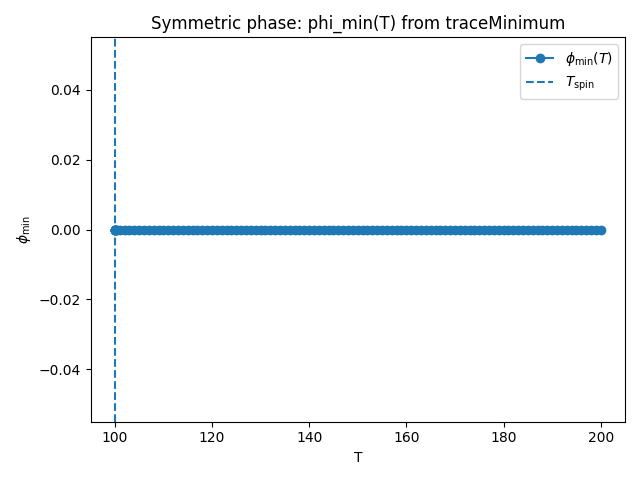
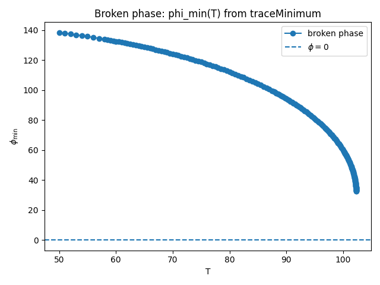
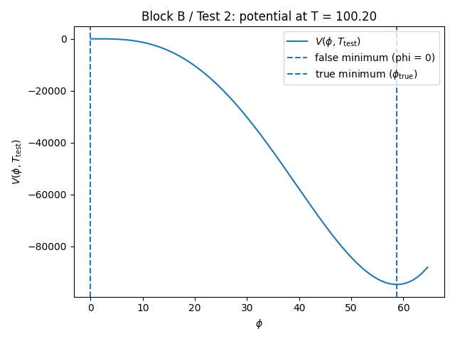

# tests Transition Finder

This document summarizes the tutorial-style tests for the `transitionFinder`
module, focusing on the **visual outputs** (plots) and the physical intuition
behind them.

The goal is that, by reading this file and looking at the figures, a user can
understand what the Block A primitives (`traceMinimum`, `Phase`, `traceMultiMin`,
`findApproxLocalMin`, `removeRedundantPhases`, `getStartPhase`) are doing in a
concrete, finite-temperature scalar-field model.

---

## Block A – Landau–Ginzburg toy model and phase tracing

All tests in Block A use the same 1D finite-temperature potential

$$
V(\phi, T) = D (T^2 - T_0^2)\,\phi^2 \;-\; E\,T\,\phi^3 \;+\; \frac{\lambda}{4}\,\phi^4
$$

with $D > 0$, $\lambda > 0$, and a small cubic term $E > 0$.
This is the standard Landau–Ginzburg toy model for a first-order phase
transition:

- At high temperature, there is a unique minimum at $\phi = 0$ (symmetric phase).
- At lower temperature, non-trivial minima at $\phi \neq 0$ appear
  (broken phase).
- In an intermediate range, symmetric and broken phases coexist, separated by a barrier.
- Below a spinodal temperature, the symmetric minimum disappears.

The tests are organized to show how Block A routines reconstruct this structure.

---

### Test 1 – Potential shape and minima at high and low temperature

**Script:** `test_blockA_1_potential_shape_and_minima`

**What it does**

- Evaluates $V(\phi, T)$ on a grid in $\phi$ for two temperatures:
  - $T_\text{high} = 200$ (well above $T_0$),
  - $T_\text{low} = 50$ (well below $T_0$).
- Finds numerically:
  - the minimum near $\phi \simeq 0$ at high T,
  - the broken minimum at low T.
- Checks the curvature $m^2 = d^2V/d\phi^2$ at these points to verify stability.

**Expected plot**

A single figure with two curves:

- Horizontal axis: $\phi$.
- Vertical axis: $V(\phi, T)$.
- Curves:
  - $V(\phi, T_\text{high})$: single well at $\phi \approx 0$.
  - $V(\phi, T_\text{low})$: double-well structure with a deeper minimum at $\phi \neq 0$.

**What to look for**

- At **high T**:
  - the curve has a single minimum at (or extremely close to) $\phi = 0$.
- At **low T**:
  - the origin becomes unstable (local maximum or shallow region),
  - a new **broken minimum** appears at $\phi > 0$.

**Placeholder for figure**


---

### Test 2 – `traceMinimum` on the symmetric phase (descending in T)

**Script:** `test_blockA_2_traceMinimum_symmetric_phase_downwards`

**What it does**

* Starts from the symmetric minimum:

  * initial condition: $\phi = 0$ at (T = 200).
* Uses `traceMinimum` to follow this minimum **downwards in temperature** until it
  becomes unstable.
* Records:

  * the temperature grid `T`,
  * the traced minimum $\phi_{\min}(T)$,
  * the curvature $m^2(T) = d^2V/d\phi^2|*{\phi*{\min}(T)}$.
* Compares the numerically extracted spinodal temperature `res.overT` with the
  analytic spinodal (for the symmetric phase) at $T_\text{spin} = T_0$.

**Expected plots**

1. **Symmetric branch $\phi_{\min}(T)$**

   * Horizontal axis: (T).
   * Vertical axis: $\phi_{\min}(T)$.
   * Markers along the traced points from `traceMinimum`.
   * Vertical dashed line at $T = T_0$ (analytic spinodal).

   Behaviour:

   * $\phi_{\min}(T)$ should stay very close to 0 at all temperatures where
     the symmetric minimum exists.
   * Near $T \approx T_0$, the branch ends (spinodal).

2. **Curvature $m^2(T)$ along the symmetric trace**

   * Horizontal axis: (T).
   * Vertical axis: $m^2(T) = d^2V/d\phi^2|*{\phi*{\min}(T)}$.
   * A horizontal line at $m^2 = 0$ indicating the stability threshold.

   Behaviour:

   * For $T \gg T_0$, $m^2 > 0$: the symmetric minimum is stable.
   * As $T \to T_0$, $m^2 \to 0$.
   * This signals the **spinodal point** where the symmetric phase loses stability.

**Placeholders for figures**




---

### Test 3 – `traceMinimum` on the broken phase (ascending in T)

**Script:** `test_blockA_3_traceMinimum_broken_phase_upwards`

**What it does**

* First finds a broken minimum at low temperature:

  * (\phi_b(T=50)) via a 1D minimization.
* Uses `traceMinimum` starting from $\phi_b(50)$ at (T = 50), and follows this
  broken minimum **upwards in temperature**.
* Records the branch until the broken phase disappears or becomes unstable.
* Computes the curvature $m^2(T)$ along the broken branch.

**Expected plot**

1. **Broken branch $\phi_{\min}(T)$**

   * Horizontal axis: (T).
   * Vertical axis: $\phi_{\min}(T)$ for the broken phase.
   * A horizontal line at $\phi = 0$.

   Behaviour:

   * At low T, $\phi_{\min}(T)$ is significantly away from 0
     (spontaneous symmetry breaking).
   * As T increases, $|\phi_{\min}(T)|$ decreases, tending towards 0 as you
     approach the region where the symmetric phase dominates.
   * The branch ends near the broken-phase spinodal temperature `res.overT`.

**Placeholder for figure**





---

### Test 5 – `traceMultiMin` and `Phase`: global phase structure

**Script:** `test_blockA_5_traceMultiMin_and_Phase_structure`

**What it does**

* Builds the phase structure in the interval $T \in [50, 200]$ using:

  * seeds at $(\phi = 0, T = 200)$ (symmetric),
  * and $(\phi_b(T=50), T = 50)$ (broken).

* Runs `traceMultiMin` to trace all minima that arise from these seeds, and
  then `removeRedundantPhases` to clean up duplicates.

* Constructs `Phase` objects for each branch and checks that:

  * there is exactly one symmetric-like phase (with $\phi \approx 0$ at high T),
  * at least one broken-like phase.

* Uses `getStartPhase` to identify the high-temperature phase.

* For each `Phase`, compares the spline-based `valAt(T)` with a direct
  minimization of $V(\phi, T)$ at a few T values (sanity check).

**Expected plot**

**Phase structure: $\phi_{\min}(T)$ from `Phase` splines**

* Horizontal axis: (T).
* Vertical axis: $\phi_{\min}(T)$.
* One curve per `Phase` object, plotted as a function of T over its domain.

Behaviour:

* A **symmetric** branch:

  * stays near $\phi \approx 0$ over a wide range of temperatures,
  * is present at the highest T.
* A **broken** branch:

  * exists at lower T with $\phi \neq 0$,
  * bends towards $\phi \to 0$ as T increases,
  * terminates at its own spinodal.

This plot is the closest thing to a “phase diagram in T” in Block A: it shows how
each phase’s vacuum expectation value evolves with temperature.

**Placeholder for figure**


---

### Test 6 – `findApproxLocalMin` on a simple segment

**Script:** `test_blockA_6_findApproxLocalMin_on_simple_segment`

**What it does**

* Focuses on a fixed temperature $T = 150 > T_0$, where the potential has a
  **unique** minimum at $\phi = 0$.

* Considers a straight segment in field space:

  $$
  \phi \in [-3, +3]
  $$

  and calls `findApproxLocalMin` along this segment.

* `findApproxLocalMin` samples the segment, looks for discrete local minima in
  $V(\phi, T)$, and returns approximate positions of minima between the
  segment endpoints.

**Expected plot**

**Potential along the segment and found approximate minima**

* Horizontal axis: $\phi$.
* Vertical axis: $V(\phi, T)$ for fixed (T = 150).
* Curve: $V(\phi, 150)$ over $\phi \in [-3, 3]$.
* Markers: positions returned by `findApproxLocalMin` (approximate minima).

Behaviour:

* The curve should be a single well centred at $\phi = 0$.
* `findApproxLocalMin` should identify minima very close to $\phi = 0$.
* If it finds more than one minimum, they should cluster around the origin,
  reflecting the discrete sampling.

**Placeholder for figure**


---

If you want to see the full test script of this block go to [tests/transitionFInder](/tests/transitionFinder/Lot_A.py)

---

---

## Block B – Tunneling core: bounce solutions and nucleation

In Block A we *only* described **where** the phases lie along $T$.
Block B goes one level deeper: given this phase panorama, what does the theory
*do* with it? **It tunnels.**

Here we test exactly that:

* how to identify the critical temperature at which two phases become
  degenerate;
* how to solve the 1D *bounce* corresponding to a false → true tunnel;
* how to stitch everything into a high-level function that provides the
  **nucleation temperature** with the standard criterion
  $S_3(T_n)/T_n \simeq 140$.

All tests still use the same Landau–Ginzburg potential from Block A,
so that we can connect directly:

> *“This phase curve I saw in Block A is the same one that is now
> nucleating a bubble with some action at $T_n$.”*

---

### Test B1 – Critical temperature and free-energy differences

**Script:** `test_blockB_1_potential_diff_and_Tcrit`

**Physical goal**

Given a `start_phase` (here, the symmetric high-temperature phase),
we want to identify the temperature at which **some** other phase becomes
energetically degenerate with it:

$$
\Delta V(T) \equiv V_\text{other}(T) - V_\text{start}(T) = 0.
$$

This point defines a **critical temperature** for that phase — the boundary
where it ceases to be the most favorable in free energy.

**What the test does**

1. Builds the phases with `traceMultiMin` (as in Block A) and identifies the
   high-$T$ phase with `getStartPhase`.
2. Uses `_maxTCritForPhase` to find the temperature $T_\text{crit}$
   at which the `start_phase` ties with some competing phase.
3. Evaluates `_potentialDiffForPhase(T, start_phase, other_phases, V)` at
   $T_\text{crit}$ to check that $\Delta V(T_\text{crit}) \approx 0$.
4. Scans an interval in $T$ and plots $\Delta V(T)$, marking the point
   where it crosses zero.

**Interpretation**

* For $T > T_\text{crit}$ we expect $\Delta V(T) > 0$:
  the starting phase is still energetically preferred.
* For $T < T_\text{crit}$ some other minimum is deeper:
  the starting phase becomes metastable or unstable.
* The test numerically ensures that:

  ```text
  DV(Tcrit) = V(other) - V(start) ≈ 0
   Critical temperature T_c  ≈ 102.0621
  ΔV(T_c) = V(other) - V(start) ≈ 3.5406e-01 (should be ~ 0)
  ```

  within the specified tolerance.

**Expected plot**

* Horizontal: $T$
* Vertical: $\Delta V(T) = V_\text{other} - V_\text{start}$.
* A smooth curve $\Delta V(T)$ crossing the zero axis.
* A horizontal line at $\Delta V = 0$.
* A vertical line at $T = T_\text{crit}$.

Visually, you are seeing the moment when the two phases “tie” in
free energy.

**Placeholder for figure**


---

### Test B2 – `_solve_bounce` in a 1D metastable configuration

**Script:** `test_blockB_2_solve_bounce_single_field_example`

**Physical goal**

Before using the full nucleation machinery, we want to look closely at the
**numerical core**: given a false vacuum and a true vacuum in 1D,
does the backend `_solve_bounce` actually find a bounce with finite action?

More concretely, we look for a $T$ such that:

* $\phi = 0$ is still a **local minimum** (metastable),
* there exists a deeper minimum at $\phi = \phi_\text{true} > 0$,
* the two are separated by a barrier.

This is the classic scenario for a **first-order tunnel**.

**What the test does**

1. Scans $T$ values slightly above $T_0$ until it finds:

   * $m^2(\phi=0,T) > 0$ (positive curvature → local minimum),
   * an analytic minimum $\phi_\text{true} > 0$ with
     $V(\phi_\text{true},T) < V(0,T)$.

2. Defines:

   * `x_high = [0.0]` as the false vacuum,
   * `x_low = [phi_true]` as the true vacuum.

3. Builds scalar wrappers:

   ```text
   def V_fixed(x): return V(x, T_test)
   def dV_fixed(x): return dV_dphi(x, T_test)
   ```

4. Calls `_solve_bounce(...)`, which internally:

   * tries to use `pathDeformation` if available,
   * otherwise falls back to `tunneling1D.SingleFieldInstanton` in the 1D direction.

5. Checks that:

   * `trantype == 1` (first-order transition),
   * the returned `action` is finite and positive,
   * a valid `instanton` object is returned.

6. Plots the potential at $T_\text{test}$ with both minima highlighted.

**Interpretation**

* If `trantype = 1` and `action > 0`:

  * the backend successfully solved the bounce equation with the correct
    boundary conditions,
  * the result is consistent with the physical interpretation of a
    false → true tunnel.

* This is the local check that **SingleFieldInstanton is really delivering
  a physical solution** for the test potential.

**Expected plot**

* Horizontal: $\phi$ (region between $0$ and slightly above
  $\phi_\text{true}$).
* Vertical: $V(\phi, T_\text{test})$.
* Curve: $V(\phi, T_\text{test})$.
* Vertical lines marking:

  * $\phi = 0$: false vacuum,
  * $\phi = \phi_\text{true}$: true vacuum.

This plot lets you see the “landscape” in which the bounce lives: two
basins separated by a little hill (the barrier).

**Placeholder for figure**



**Space for important prints**

Importants Terminal output:

```text
  Chosen T_test = 100.2000
  V(false, T_test) at phi=0         = 0.0000e+00
  V(true,  T_test) at phi=58.7571 = -9.4718e+04
  m^2(phi=0, T_test) = 8.0080e+00 (> 0 ⇒ metastable origin)
  _solve_bounce returned trantype = 1
  Bounce action S3(T_test)        ≈ 2.9944e+01
  instanton object type           = <class 'CosmoTransitions.tunneling1D.SingleFieldInstanton'>
```

to reinforce that the scenario is genuinely metastable with a nontrivial bounce.

---

### Test B3 – `tunnelFromPhase` and the nucleation temperature $T_n$

**Script:** `test_blockB_3_tunnelFromPhase_default_criterion`

**Physical goal**

Now we use the high-level tool `tunnelFromPhase` to:

* take the phase panorama from Block A,

* search in $T$ for possible bounces between the symmetric and broken phases,

* apply a nucleation criterion of the form

  $$
  \text{nuclCriterion}(S_3(T), T)
  = \frac{S_3(T)}{T} - 140 \approx 0,
  $$

* and identify the **nucleation temperature** $T_n$.

In other words: here we see the passage
“**metastable phase + bounce → cosmological phase transition**”.

**What the test does**

1. Reconstructs the phases with `_build_phases()` and uses `getStartPhase` to
   take the high-$T$ symmetric phase as `start_phase`.

2. Calls `tunnelFromPhase(...)` with:

   * `V`, `dV_dphi`,
   * `Tmax ≃ 200`,
   * `overlapAngle = 45°` (pruning of nearly collinear directions in field
     space),
   * explicit nucleation criterion $S_3/T - 140$.

3. `tunnelFromPhase` internally:

   * scans temperatures between the lower bound of the phase and `Tmax`
     looking for bounce solutions via `_tunnelFromPhaseAtT`,
   * at each $T$, uses `_solve_bounce` (which in turn uses `pathDeformation`
     or `SingleFieldInstanton`),
   * stores in a dictionary `outdict[T]` the best (lowest-action) bounce
     found.

4. If it finds a first-order transition (`trantype == 1`):

   * it returns a dictionary with:

     * `Tnuc`,
     * `low_vev`, `high_vev`,
     * `low_phase`, `high_phase`,
     * `action` (i.e. $S_3(T_n)$),
     * `instanton` (object from the bounce routine).

5. The test then:

   * prints $T_n$, $S_3(T_n)$ and $S_3(T_n)/T_n$,
   * checks that `trantype == 1`,
   * verifies that $S_3/T$ is **close** to $140$ (it need not be millimetric),
   * compares $T_n$ with $T_\text{crit}$ from Test B1, requiring
     $T_n \lesssim T_\text{crit}$
     (moderate supercooling, as expected in a first-order transition),
   * checks that, at $T_n$, the “low” phase indeed has smaller free energy
     than the “high” one.

6. For visual intuition, it plots the potential at $T = T_n$ with both
   minima marked.

**Interpretation**

* `tunnelFromPhase` is the “glue” between:

  * **phase vs. $T$ information** (Block A),
  * **bounce solving** (SingleFieldInstanton / pathDeformation),
  * **cosmological nucleation criterion** (here, $S_3/T \sim 140$).

* The test shows that:

  * the code finds a $T$ where the bounce is efficient enough to satisfy
    the criterion;
  * this temperature is indeed *below* the critical degeneracy temperature;
  * at $T_n$, the “low” minimum is physically the true one (smaller
    free energy).

**Expected plot**

* Horizontal: $\phi$ in the neighborhood of both minima at $T_n$.
* Vertical: $V(\phi, T_n)$.
* Curve: $V(\phi, T_n)$.
* Vertical lines marking:

  * `high_vev` (false vacuum),
  * `low_vev` (true vacuum).

This is the analogue of Test B2, but now at the “special” temperature $T_n$
defined by the nucleation criterion instead of an arbitrary $T$.

**Placeholder for figure**


**Space for important prints**

It is worth recording something like:

```text
 --- tunnelFromPhase result ---
  T_nuc              ≈ 101.8969
  S3(T_nuc)          ≈ 14191.6326
  S3(T_nuc) / T_nuc  ≈ 139.2744
  low_phase key      = 0
  high_phase key     = 1
  trantype           = 1 (1 = first order)
  S3/T - 140 ≈ -0.726
  Critical temperature T_crit ≈ 102.0621
  We expect T_nuc < T_crit for a supercooled first-order transition.
  V(false, T_nuc) at phi=-0.0000 = 1.2320e-35
  V(true,  T_nuc) at phi=43.5502  = -5.7643e+03

```

to illustrate numerically:

* how close $S_3/T$ is to $140$,
* how far below $T_\text{crit}$ the $T_n$ sits,
* and that the “low” phase is indeed the energetically favored one.

---

### Demo – Alternative nucleation criterion (pedagogical example)

**Functions:** `ew_like_nuclCriterion`, `demo_blockB_alternative_nucleation_criterion`

Besides the tests, the file includes a **non-pytest demo** that shows how to
replace the standard nucleation criterion with another one, for example:

$$
\frac{S_3(T)}{T} = 4 \ln\left(\frac{M_\text{eff}}{T}\right)
$$

with some arbitrary scale $M_\text{eff}$. The goal here is **not** to be
realistic for the toy model, but rather to:

* show the signature that `nuclCriterion(S,T)` must have;
* illustrate how the choice of criterion can shift $T_n$.

The function `demo_blockB_alternative_nucleation_criterion()`:

1. calls `tunnelFromPhase` with the standard criterion $S/T - 140$;
2. calls it again with `ew_like_nuclCriterion`;
3. prints both $T_n$ values and both $S_3/T$ values, allowing a comparison.

This demo is useful as a *template* for plugging in your favorite nucleation
criterion without touching the main code.

---

If you want to see the full script for these tests (Block B), see [tests/transitionFinder](/tests/transitionFinder/Lot_B.py)

---

## Block C – Transition history: from phase structure to cosmic history

Block C takes everything we built in Blocks A and B and pushes it one step further:

* From **phase structure** (`Phase` objects, traced minima),
* Plus **tunneling information** (bounce actions and nucleation temperatures),
* To a **full thermal history**: a sequence of phase transitions as the Universe cools.

The central routines are:

* `secondOrderTrans` – convenience wrapper for second-order transitions.
* `findAllTransitions` – builds the *actual* transition history using bounces.
* `findCriticalTemperatures` – finds all degeneracy temperatures `Tcrit`.
* `addCritTempsForFullTransitions` – matches `Tcrit` to `Tnuc` to quantify supercooling.

All tests in this block still use the same 1D Landau–Ginzburg potential as Blocks A and B.

---

### Test 0 – `secondOrderTrans`: dictionary layout and conventions

**Script:** `test_blockC_0_secondOrderTrans_basic_structure`

**What it does**

* Builds the phase structure using `traceMultiMin` (symmetric + broken branches).

* Picks two phases and constructs a “second-order transition” dictionary by calling:

  ```text
  tdict = secondOrderTrans(high_phase, low_phase, Tstr="Tnuc")
  ```

* Checks that:

  * The dictionary contains the expected keys: `Tnuc`, `high_vev`, `low_vev`,
    `high_phase`, `low_phase`, `action`, `instanton`, `trantype`.
  * `trantype == 2` (second order).
  * `action == 0.0` and `instanton is None` (no barrier, no bounce).
  * `Tnuc` is defined as the *midpoint* between the end of the high-T branch
    and the start of the low-T branch:
    $$
    T_\text{nuc} = \tfrac12\bigl(T_\text{high}(T_0) + T_\text{low}(T_\text{end})\bigr).
    $$
  * `high_vev` and `low_vev` coincide with the high-T phase vev at its upper end.

**Physical intuition**

For a strictly second-order transition, there is no tunneling and no action; the order parameter changes continuously and the “critical temperature” is where the curvature changes sign. `secondOrderTrans` encodes this in a simple dictionary so that second-order steps can live in the same pipeline as first-order (bounce-driven) transitions.

**Placeholder for output**

```text

[Block C / Test 0] secondOrderTrans: basic structure and fields
Tracing phase starting at x = [138.38962553], T = 50.0
  Tracing minimum up in T
Tracing phase starting at x = [1.35525272e-19], T = 102.47832031250125
  Tracing minimum down in T
  Tracing minimum up in T
  Constructed second-order transition dictionary:
          Tnuc : 125.0
       low_vev : [138.38962553]
      high_vev : [138.38962553]
     low_phase : 1
    high_phase : 0
        action : 0.0
     instanton : None
      trantype : 2

```

---

### Test 1 – `findAllTransitions`: full thermal history with nucleation

**Script:** `test_blockC_1_findAllTransitions_full_history`

**What it does**

* Rebuilds the phase structure (`Phase` objects) with `traceMultiMin`.

* Uses `getStartPhase(phases, V)` to identify the **high-temperature phase**.

* Calls

  ```text
  transitions = findAllTransitions(phases, V, dV_dphi, tunnelFromPhase_args=...)
  ```

  which internally:

  1. Starts from the high-T phase.
  2. Attempts tunneling via `tunnelFromPhase` to all lower-energy phases.
  3. Chooses the **lowest-action** transition and moves to that phase.
  4. Repeats from the new phase, stepping down in temperature, until no further
     transitions occur.
  5. Falls back to `secondOrderTrans` if there is a continuous (second-order) branch.

* Prints a compact table:

  * `idx` – index in the history (0 = earliest, highest T).
  * `Tnuc` – nucleation temperature.
  * `type` – `1` (first order, tunneling) or `2` (second order).
  * `high_phase → low_phase` – phase labels.
  * `S(Tnuc)` – bounce action at nucleation.

* Checks that:

  * There is at least one transition.
  * `Tnuc` is **non-increasing** along the history (Universe cools).
  * Phase keys in the table are valid entries of the `phases` dictionary.

**Expected plot**

**Phase structure with nucleation markers**

* Horizontal axis: `T`.

* Vertical axis: $\phi_{\min}(T)$ for each `Phase`.

* For each phase:

  * A smooth curve $\phi_{\min}(T)$ from the spline representation.

* For each transition in `transitions`:

  * A vertical line at `Tnuc`.
  * A circle marker at `(Tnuc, high_vev)`.
  * A square marker at `(Tnuc, low_vev)`.

**What to look for**

* At high T, the symmetric phase ($\phi \approx 0$) is occupied.
* As T decreases, at some `Tnuc` the code jumps from the symmetric branch
  to the broken branch (or to another low-T phase).
* The printed `S(Tnuc)` values tell you whether nucleation happens close to the
  “canonical” criterion (e.g. `S/T ≈ 140`) or at a different strength,
  depending on the chosen `nuclCriterion`.

**Placeholder for figure**


---

### Test 2 – `findCriticalTemperatures`: degeneracy temperatures `Tcrit`

**Script:** `test_blockC_2_findCriticalTemperatures_degeneracies`

**What it does**

* Reuses the same `phases` dictionary.

* Calls

  ```text
  crit_trans = findCriticalTemperatures(phases, V, start_high=False)
  ```

  which:

  * Loops over all ordered pairs of phases `(phase1, phase2)` with overlapping
    temperature ranges.
  * For each pair, defines
    $$
    \Delta V(T) = V(\phi_1(T), T) - V(\phi_2(T), T),
    $$
    where $\phi_i(T) = \text{phase}_i.\text{valAt}(T)$.
  * Uses a 1D root finder (`brentq`) to find `Tcrit` such that
    $\Delta V(Tcrit) = 0$ whenever the sign of $\Delta V$ changes across the overlap.
  * Assembles a dictionary

    ```text
    {
      "Tcrit": Tcrit,
      "high_vev": phase1.valAt(Tcrit),
      "low_vev" : phase2.valAt(Tcrit),
      "high_phase": phase1.key,
      "low_phase" : phase2.key,
      "trantype": 1,
    }
    ```

* Prints a summary table:

  * `Tcrit`, `trantype`, `high_phase → low_phase`,
  * and the free-energy difference
    $$
    \Delta V = V(\phi_\text{high}, T_\text{crit}) - V(\phi_\text{low}, T_\text{crit}),
    $$
    which should be numerically close to zero.

* Asserts that for each first-order entry `abs(ΔV) < 1e-3` (degeneracy).

**Physical interpretation**

`findCriticalTemperatures` ignores *dynamics* and nucleation rates. It simply asks:

> *For which temperatures do two phases have identical free energy?*

This is the equilibrium notion of a first-order transition line `Tcrit`, which
is then compared with the actual **nucleation temperature** `Tnuc` in Test 3.

**Expected plot**

**Phase structure with `Tcrit` markers**

* Same background curves $\phi_{\min}(T)$ for each `Phase`.
* For each critical transition dictionary in `crit_trans`:

  * A vertical dashed line at `Tcrit`.

This plot is the purely thermodynamic “phase diagram in T”: the vertical lines
show where phases swap their free-energy ordering.

**Placeholder for figure**


---

### Test 3 – `addCritTempsForFullTransitions`: matching `Tcrit` and `Tnuc`

**Script:** `test_blockC_3_addCritTemps_match_Tcrit_and_Tnuc`

**What it does**

* Rebuilds `phases`.

* Computes:

  * `full_trans` = `findAllTransitions(...)`
    → *actual* transition history with nucleation temperatures `Tnuc`.
  * `crit_trans` = `findCriticalTemperatures(...)`
    → thermodynamic degeneracy temperatures `Tcrit`.

* Calls

  ```text
  addCritTempsForFullTransitions(phases, crit_trans, full_trans)
  ```

  which:

  * Analyses the *ancestry* of phases (`parents_dict`) in terms of sequences of
    critical transitions.
  * For each full transition (nucleation step) in `full_trans`, searches for a
    compatible critical transition in `crit_trans` (matching high/low branches
    up to common parents).
  * Attaches the best match as `tdict["crit_trans"]` (or `None` if no match).

* Prints a detailed table:

  * For each full transition:

    * `type` (`trantype`),
    * `Tcrit` (if found),
    * `Tnuc`,
    * `ΔT = Tcrit − Tnuc`,
    * phase labels `high_phase → low_phase`.

* For first-order transitions with a matched `Tcrit`, checks that `Tcrit >= Tnuc`
  (you cannot nucleate *before* degeneracy).

**Physical interpretation**

This test quantifies **supercooling** in a clean way:

* `Tcrit` – the temperature at which phases are thermodynamically degenerate.
* `Tnuc`  – the temperature at which bubbles actually nucleate efficiently.
* `ΔT = Tcrit − Tnuc` – how far below the equilibrium transition temperature
  the Universe cools before tunneling kicks in.

In strongly first-order transitions, `ΔT` can be substantial, which is precisely
what controls the strength of the phase transition and many gravitational-wave
signatures.

**Expected plot**

**Phase structure with both `Tcrit` and `Tnuc`**

* Background: $\phi_{\min}(T)$ curves for all phases.

* From `crit_trans`:

  * Vertical dashed lines at each `Tcrit`.

* From `full_trans`:

  * Vertical solid lines at each `Tnuc`.
  * Circle and square markers for `high_vev` and `low_vev` at `Tnuc`.

**What to look for**

* For each first-order transition:

  * a dashed line at `Tcrit`,
  * a solid line (with markers) at `Tnuc`,
  * with `Tnuc` at or below `Tcrit` (supercooling or equality).

* The size of `ΔT` gives you an immediate, visually intuitive measure of how
  strong the supercooling is in this toy model.

**Placeholder for figure**


```text

[Block C / Test 2] findCriticalTemperatures – phase degeneracies
Tracing phase starting at x = [138.38962553], T = 50.0
  Tracing minimum up in T
Tracing phase starting at x = [1.35525272e-19], T = 102.47832031250125
  Tracing minimum down in T
  Tracing minimum up in T
  Number of critical-temperature transitions found: 1

  Summary of critical transitions (sorted by decreasing Tcrit):
    idx |  Tcrit   | type | high_phase -> low_phase | ΔV(high-low)
    ----+----------+------+-------------------------+--------------
      0 |  102.062 |  1   | 1 ->        0 |    3.347e-10

[Block C / Test 3] addCritTempsForFullTransitions – matching Tcrit and Tnuc
Tracing phase starting at x = [138.38962553], T = 50.0
  Tracing minimum up in T
Tracing phase starting at x = [1.35525272e-19], T = 102.47832031250125
  Tracing minimum down in T
  Tracing minimum up in T
  Number of full transitions: 1
  Number of critical transitions: 1

  Matching Tcrit and Tnuc for each full transition:
    idx |  type |  Tcrit   |  Tnuc    |  ΔT=Tcrit-Tnuc | high_phase -> low_phase
    ----+-------+----------+----------+----------------+------------------------
      0 |  1    |  102.062 |  101.895 |          0.167 | 1 -> 0

[Block C] All example tests executed.
```

---

If you want to see the full Block C test script, including all prints and plots, see
[`tests/transitionFinder/Lot_C.py`](/tests/transitionFinder/Lot_C.py).


---
