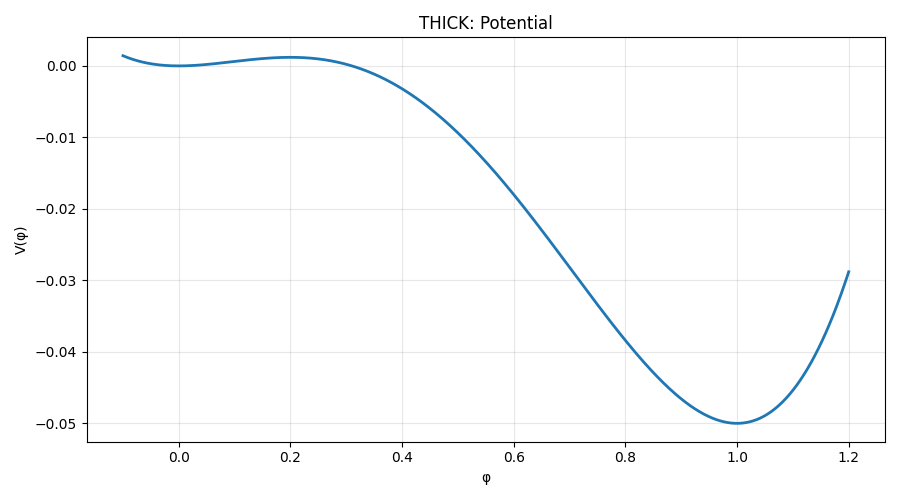

# Examples — Single Field Instanton

This page collects **hands-on examples** for the Single Field Instanton module, organized by lot. 
Each example states the **physical meaning**, the **expected outcome**, a slot for the **console output/code** and (when applicable) an **image** slot.

> These examples correspond to the class SingleFieldInstaton only.

---

## Lot SF-1 — Potential Interface & Validations

See the full, executable script for this lot here: [`tests/single_field/Lot_SF_1.py`](/tests/tunneling1D/single_field/Lot_SF1.py).
for all example the potential chosen was:

$$\text{THIN}: \frac{1}{4}\phi ^4 - 0.49\phi ^3 + 0.235 \phi ^2 $$

$$\text{THICK}:  \frac{1}{4}\phi ^4 - \frac{2}{5}\phi^3 + \frac{1}{10}\phi^2 $$

**How to run just this case**

```bash
python -m tests.tunneling1D.single_field.Lot_SF1 
```

### Example 1 — Metastability validation (exception path)

**What it shows (physics):**
A tunneling solution exists only if the **false (metastable) vacuum is higher** in energy than the **true (absolute) vacuum**: $(V(\phi_{\text{meta}}) > V(\phi_{\text{abs}}))$. 
Swapping them violates metastability and must raise a clear error.

**Expected result:**
Constructing `SingleFieldInstanton` with `V(phi_metaMin) ≤ V(phi_absMin)` raises a `PotentialError` explaining that the configuration is “stable, not metastable.”

**Console output:**

```text
=== Test 1: Metastability validation ===
OK: PotentialError raised as expected -> ('V(phi_metaMin) <= V(phi_absMin); tunneling cannot occur.', 'stable, not metastable')
```

---

### Example 2 — Accuracy of derivative helpers (o4 vs o2) & near-minimum blend (Tests 3 + 4)

**What it shows (physics):**

* For smooth potentials, **4th-order FD** (our default) is more accurate than 2nd-order for both (V') and (V'').
* Very close to the absolute minimum, the helper **`dV_from_absMin`** smoothly blends to the local linear behavior $(V'(\phi)\approx V''(\phi),\Delta\phi)$
, improving numerical stability where finite differences can be noisy.

**Expected result:**

* Reported max errors for o(4) are **lower** than for o(2) when compared to analytic (V') and (V'') (both **thin** and **thick** quartic examples).
* The lines `delta=... -> dV_from_absMin=..., ref≈d2V*delta=..., rel.err=...` show **tiny relative errors** (≪ 1% for the tiny offsets used).

**Console output:**

```text
=== Test 3: Built-in FD vs analytic derivatives ===
[THIN] max|dV_fd4 - dV_true|  = 1.253e-13
[THIN] max|d2V_fd4 - d2V_true|= 3.888e-10
[THIN] max|dV_fd2 - dV_true|  = 7.100e-07
[THIN] max|d2V_fd2 - d2V_true|= 5.002e-07
[THIN] barrier check: V(phi_bar) - V(phi_metaMin) = +2.602e-12

[THICK] max|dV_fd4 - dV_true|  = 1.127e-13
[THICK] max|d2V_fd4 - d2V_true|= 3.779e-10
[THICK] max|dV_fd2 - dV_true|  = 8.000e-07
[THICK] max|d2V_fd2 - d2V_true|= 5.002e-07
[THICK] barrier check: V(phi_bar) - V(phi_metaMin) = +3.056e-11

=== Test 4: dV_from_absMin near φ_absMin ===
delta=1.0e-06 -> dV_from_absMin=5.300e-07, ref≈d2V*delta=5.300e-07, rel.err=4.538e-10
delta=5.0e-06 -> dV_from_absMin=2.650e-06, ref≈d2V*delta=2.650e-06, rel.err=5.739e-11
delta=1.0e-05 -> dV_from_absMin=5.300e-06, ref≈d2V*delta=5.300e-06, rel.err=3.055e-09
delta=5.0e-05 -> dV_from_absMin=2.651e-05, ref≈d2V*delta=2.651e-05, rel.err=3.604e-07
```

---

### Example 3 — Visual check: $(V(\phi)), (V'(\phi)), (V''(\phi))$ (Test 5)

**What it shows (physics):**

* **Potential shapes** for thin vs thick cases.
* Agreement between **analytic** and **built-in** derivative operators for (V') and (V'').
* This is a pre-instanton sanity check that the potential interface + derivative helpers behave as expected.

**Expected result:**

* Curves for analytic vs built-in (V') and (V'') **visually overlap**.
* Residuals printed by the script are **small** (implementation- and BLAS-dependent, typically in the (10^{-8})–(10^{-6}) range on these quartics).


**Image slots:**

*Thin-wall — Potential*


*Thin-wall — First derivative*


*Thin-wall — Second derivative*


*Thick-wall — Potential*


*Thick-wall — First derivative*


*Thick-wall — Second derivative*


**Console output:**

```text
=== Test 5: Plots (potential and derivatives) ===
[THIN] residuals: max|V'_fd - V'_ref|=1.253e-13, max|V''_fd - V''_ref|=3.888e-10
[THICK] residuals: max|V'_fd - V'_ref|=1.127e-13, max|V''_fd - V''_ref|=3.779e-10

---------- END OF TESTS: Lot SF-1 ----------
```

---

## Lot SF-2 — Barrier & scales

**Goal.** Visualize the **potential barrier geometry** and report the **characteristic length scale(s)** used by the solver:

* Vertical markers for:

  * $( \phi_{\rm top} )$: location of the barrier maximum between $( \phi_{\rm meta} )$ and $( \phi_{\rm bar} )$;
  * $( \phi_{\rm bar} )$: “edge” on the downhill side where $( V(\phi_{\rm bar}) = V(\phi_{\rm meta}) )$.
* Horizontal line at $( V(\phi_{\rm meta}) )$.
* Printed diagnostics:

  * `phi_top`, `phi_bar`, $( \Delta V_{\rm top} \equiv V(\phi_{\rm top}) - V(\phi_{\rm meta}) )$;
  * `rscale_cubic` (robust/legacy) and, when defined, `rscale_curv` from $(V''(\phi_{\rm top}))$.

Physics intuition:

* **Thin wall** (nearly degenerate minima) → **sharper** barrier (more negative (V'') at the top) → **smaller** length scale (wall is thinner).
* **Thick wall** (more separated minima) → **broader** barrier → **larger** length scale.

See the full, executable script for this lot here: [`tests/single_field/Lot_SF_1.py`](/tests/tunneling1D/single_field/Lot_SF2.py).
for all example the potential chosen was:

$$\text{THIN}: \frac{1}{4}\phi ^4 - 0.49\phi ^3 + 0.235 \phi ^2 $$

$$\text{THICK}:  \frac{1}{4}\phi ^4 - \frac{2}{5}\phi^3 + \frac{1}{10}\phi^2 $$


**Script:** `tests/tunneling1D/single_field/Lot_SF2.py`

**How to run just this case (Run both examples at once)**

```bash
python -m tests.single_field.Lot_SF_2  # it includes thin- and thick-wall cases
```

---

### Test A — Thin-wall: barrier markers & scales

**What this shows**

* $(V(\phi))$ with the barrier **top** and **edge** identified.
* Console readout with the **barrier height** and the two characteristic scales.

**Expected outcome (physics)**

* $(\phi_{\rm top})$ sits between $(\phi_{\rm meta}=0)$ and $(\phi_{\rm abs}=1)$.
* $(V(\phi_{\rm top}) > V(\phi_{\rm meta}))$ so $( \Delta V_{\rm top} > 0 )$.
* `rscale_cubic` is finite and typically **smaller** than in the thick-wall case (thinner wall).
* `rscale_curv` is reported **finite** if $(V''(\phi_{\rm top})<0)$; otherwise shown as ∞ (flat top).


**Example console output**

```
========================================================================
CASE: Thin-wall demo
========================================================================
Barrier diagnostics:
  phi_metaMin = 0,  V(phi_metaMin) = 0
  phi_top     = 0.46999999834,  ΔV_top ≡ V(top)-V(meta) = 0.0132374325
  phi_bar     = 0.837171431377  (V equals V(phi_metaMin) on downhill side)
Scale diagnostics:
  rscale_cubic (legacy/robust) = 1.66770930502
  rscale_curv  (from V'' at top)= 2.00360975005  with  V''(top) = -0.249099999801
```

**Figure**
*“Thin-wall demo: Potential with barrier markers.”*


---

### Test B — Thick-wall: barrier markers & scales

**What this shows**

* Same plot/diagnostics as Test A, now for a **broader** barrier.

**Expected outcome (physics)**

* $(\phi_{\rm top})$ again lies between $(\phi_{\rm meta})$ and $(\phi_{\rm abs})$.
* Barrier height and curvature differ from the thin-wall case; you should observe a **larger** `rscale_cubic` (thicker wall).
* `rscale_curv` is finite if the barrier top is genuinely curved; otherwise ∞ for a flat-ish top.


**Example console output (you will paste your run here)**

```
========================================================================
CASE: Thick-wall demo
========================================================================
Barrier diagnostics:
  phi_metaMin = 0,  V(phi_metaMin) = 0
  phi_top     = 0.200000001967,  ΔV_top ≡ V(top)-V(meta) = 0.0012
  phi_bar     = 0.310102050146  (V equals V(phi_metaMin) on downhill side)
Scale diagnostics:
  rscale_cubic (legacy/robust) = 2.35702262713
  rscale_curv  (from V'' at top)= 2.49999998156  with  V''(top) = -0.16000000236
```

**Figure**
*“Thick-wall demo: Potential with barrier markers.”*


---

