# Tests — Single Field Instanton

This page collects **hands-on examples** for the Single Field Instanton module, organized by lot. 
Each example states the **physical meaning**, the **expected outcome**, a slot for the **console output/code** and (when applicable) an **image** slot.

> These examples correspond to the class SingleFieldInstaton only.

---

## Lot SF-1 — Potential Interface & Validations

See the full, executable script for this lot here: [`tests/single_field/Lot_SF_1.py`](/tests/tunneling1D/single_field/Lot_SF1.py).
for all example the potential chosen was:

$$\text{THIN}: \frac{1}{4}\phi ^4 - 0.49\phi ^3 + 0.235 \phi ^2 $$

$$\text{THICK}:  \frac{1}{4}\phi ^4 - \frac{2}{5}\phi^3 + \frac{1}{10}\phi^2 $$

**How to run just this case**

```bash
python -m tests.tunneling1D.single_field.Lot_SF1 
```

### Example 1 — Metastability validation (exception path)

**What it shows (physics):**
A tunneling solution exists only if the **false (metastable) vacuum is higher** in energy than the **true (absolute) vacuum**: $(V(\phi_{\text{meta}}) > V(\phi_{\text{abs}}))$. 
Swapping them violates metastability and must raise a clear error.

**Expected result:**
Constructing `SingleFieldInstanton` with `V(phi_metaMin) ≤ V(phi_absMin)` raises a `PotentialError` explaining that the configuration is “stable, not metastable.”

**Console output:**

```text
=== Test 1: Metastability validation ===
OK: PotentialError raised as expected -> ('V(phi_metaMin) <= V(phi_absMin); tunneling cannot occur.', 'stable, not metastable')
```

---

### Example 2 — Accuracy of derivative helpers (o4 vs o2) & near-minimum blend (Tests 3 + 4)

**What it shows (physics):**

* For smooth potentials, **4th-order FD** (our default) is more accurate than 2nd-order for both (V') and (V'').
* Very close to the absolute minimum, the helper **`dV_from_absMin`** smoothly blends to the local linear behavior $(V'(\phi)\approx V''(\phi),\Delta\phi)$
, improving numerical stability where finite differences can be noisy.

**Expected result:**

* Reported max errors for o(4) are **lower** than for o(2) when compared to analytic (V') and (V'') (both **thin** and **thick** quartic examples).
* The lines `delta=... -> dV_from_absMin=..., ref≈d2V*delta=..., rel.err=...` show **tiny relative errors** (≪ 1% for the tiny offsets used).

**Console output:**

```text
=== Test 3: Built-in FD vs analytic derivatives ===
[THIN] max|dV_fd4 - dV_true|  = 1.253e-13
[THIN] max|d2V_fd4 - d2V_true|= 3.888e-10
[THIN] max|dV_fd2 - dV_true|  = 7.100e-07
[THIN] max|d2V_fd2 - d2V_true|= 5.002e-07
[THIN] barrier check: V(phi_bar) - V(phi_metaMin) = +2.602e-12

[THICK] max|dV_fd4 - dV_true|  = 1.127e-13
[THICK] max|d2V_fd4 - d2V_true|= 3.779e-10
[THICK] max|dV_fd2 - dV_true|  = 8.000e-07
[THICK] max|d2V_fd2 - d2V_true|= 5.002e-07
[THICK] barrier check: V(phi_bar) - V(phi_metaMin) = +3.056e-11

=== Test 4: dV_from_absMin near φ_absMin ===
delta=1.0e-06 -> dV_from_absMin=5.300e-07, ref≈d2V*delta=5.300e-07, rel.err=4.538e-10
delta=5.0e-06 -> dV_from_absMin=2.650e-06, ref≈d2V*delta=2.650e-06, rel.err=5.739e-11
delta=1.0e-05 -> dV_from_absMin=5.300e-06, ref≈d2V*delta=5.300e-06, rel.err=3.055e-09
delta=5.0e-05 -> dV_from_absMin=2.651e-05, ref≈d2V*delta=2.651e-05, rel.err=3.604e-07
```

---

### Example 3 — Visual check: $(V(\phi)), (V'(\phi)), (V''(\phi))$ (Test 5)

**What it shows (physics):**

* **Potential shapes** for thin vs thick cases.
* Agreement between **analytic** and **built-in** derivative operators for (V') and (V'').
* This is a pre-instanton sanity check that the potential interface + derivative helpers behave as expected.

**Expected result:**

* Curves for analytic vs built-in (V') and (V'') **visually overlap**.
* Residuals printed by the script are **small** (implementation- and BLAS-dependent, typically in the (10^{-8})–(10^{-6}) range on these quartics).


**Image slots:**

*Thin-wall — Potential*
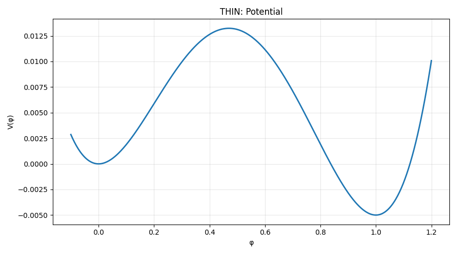

*Thin-wall — First derivative*


*Thin-wall — Second derivative*


*Thick-wall — Potential*


*Thick-wall — First derivative*


*Thick-wall — Second derivative*
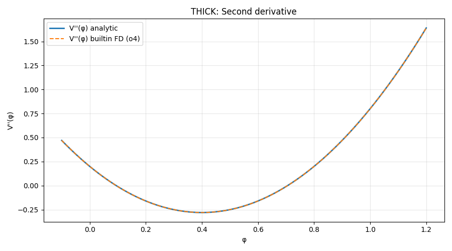

**Console output:**

```text
=== Test 5: Plots (potential and derivatives) ===
[THIN] residuals: max|V'_fd - V'_ref|=1.253e-13, max|V''_fd - V''_ref|=3.888e-10
[THICK] residuals: max|V'_fd - V'_ref|=1.127e-13, max|V''_fd - V''_ref|=3.779e-10

---------- END OF TESTS: Lot SF-1 ----------
```

---

## Lot SF-2 — Barrier & scales

**Goal.** Visualize the **potential barrier geometry** and report the **characteristic length scale(s)** used by the solver:

* Vertical markers for:

  * $( \phi_{\rm top} )$: location of the barrier maximum between $( \phi_{\rm meta} )$ and $( \phi_{\rm bar} )$;
  * $( \phi_{\rm bar} )$: “edge” on the downhill side where $( V(\phi_{\rm bar}) = V(\phi_{\rm meta}) )$.
* Horizontal line at $( V(\phi_{\rm meta}) )$.
* Printed diagnostics:

  * `phi_top`, `phi_bar`, $( \Delta V_{\rm top} \equiv V(\phi_{\rm top}) - V(\phi_{\rm meta}) )$;
  * `rscale_cubic` (robust/legacy) and, when defined, `rscale_curv` from $(V''(\phi_{\rm top}))$.

Physics intuition:

* **Thin wall** (nearly degenerate minima) → **sharper** barrier (more negative (V'') at the top) → **smaller** length scale (wall is thinner).
* **Thick wall** (more separated minima) → **broader** barrier → **larger** length scale.

See the full, executable script for this lot here: [`tests/single_field/Lot_SF2.py`](/tests/tunneling1D/single_field/Lot_SF2.py).
for all example the potential chosen was:

$$\text{THIN}: \frac{1}{4}\phi ^4 - 0.49\phi ^3 + 0.235 \phi ^2 $$

$$\text{THICK}:  \frac{1}{4}\phi ^4 - \frac{2}{5}\phi^3 + \frac{1}{10}\phi^2 $$


**Script:** `tests/tunneling1D/single_field/Lot_SF2.py`

**How to run just this case (Run both examples at once)**

```bash
python -m tests.tunneling1D.single_field.Lot_SF2  # it includes thin- and thick-wall cases
```

---

### Test A — Thin-wall: barrier markers & scales

**What this shows**

* $(V(\phi))$ with the barrier **top** and **edge** identified.
* Console readout with the **barrier height** and the two characteristic scales.

**Expected outcome (physics)**

* $(\phi_{\rm top})$ sits between $(\phi_{\rm meta}=0)$ and $(\phi_{\rm abs}=1)$.
* $(V(\phi_{\rm top}) > V(\phi_{\rm meta}))$ so $( \Delta V_{\rm top} > 0 )$.
* `rscale_cubic` is finite and typically **smaller** than in the thick-wall case (thinner wall).
* `rscale_curv` is reported **finite** if $(V''(\phi_{\rm top})<0)$; otherwise shown as ∞ (flat top).


**Example console output**

```
========================================================================
CASE: Thin-wall demo
========================================================================
Barrier diagnostics:
  phi_metaMin = 0,  V(phi_metaMin) = 0
  phi_top     = 0.46999999834,  ΔV_top ≡ V(top)-V(meta) = 0.0132374325
  phi_bar     = 0.837171431377  (V equals V(phi_metaMin) on downhill side)
Scale diagnostics:
  rscale_cubic (legacy/robust) = 1.66770930502
  rscale_curv  (from V'' at top)= 2.00360975005  with  V''(top) = -0.249099999801
```

**Figure**
*“Thin-wall demo: Potential with barrier markers.”*


---

### Test B — Thick-wall: barrier markers & scales

**What this shows**

* Same plot/diagnostics as Test A, now for a **broader** barrier.

**Expected outcome (physics)**

* $(\phi_{\rm top})$ again lies between $(\phi_{\rm meta})$ and $(\phi_{\rm abs})$.
* Barrier height and curvature differ from the thin-wall case; you should observe a **larger** `rscale_cubic` (thicker wall).
* `rscale_curv` is finite if the barrier top is genuinely curved; otherwise ∞ for a flat-ish top.


**Example console output (you will paste your run here)**

```
========================================================================
CASE: Thick-wall demo
========================================================================
Barrier diagnostics:
  phi_metaMin = 0,  V(phi_metaMin) = 0
  phi_top     = 0.200000001967,  ΔV_top ≡ V(top)-V(meta) = 0.0012
  phi_bar     = 0.310102050146  (V equals V(phi_metaMin) on downhill side)
Scale diagnostics:
  rscale_cubic (legacy/robust) = 2.35702262713
  rscale_curv  (from V'' at top)= 2.49999998156  with  V''(top) = -0.16000000236
```

**Figure**
*“Thick-wall demo: Potential with barrier markers.”*


---

## Lot 3 — Quadratic local solution & initial conditions

See the full, executable script for this lot here: [`tests/single_field/Lot_SF3.py`](/tests/tunneling1D/single_field/Lot_SF3.py).
for all example the potential chosen was:

$$\text{THIN}: \frac{1}{4}\phi ^4 - 0.49\phi ^3 + 0.235 \phi ^2 $$

$$\text{THICK}:  \frac{1}{4}\phi ^4 - \frac{2}{5}\phi^3 + \frac{1}{10}\phi^2 $$


This lot illustrates the *local* (small-radius) analytic solution used by `SingleFieldInstanton.exactSolution` and how we choose
practical starting points via `SingleFieldInstanton.initialConditions`. We work with the same thin- and thick-wall toy potentials from previous lots.

**How to run just this case (Run both examples at once)**

```bash
python -m tests.tunneling1D.single_field.Lot_SF3  # it includes all tests (more than the ones here)
```

---

### Test 1 — Local quadratic solution near the true minimum (stable curvature)

**What it shows**

* Around the stable minimum, $(V''(\phi_0)>0)$, the non-singular solution behaves smoothly with $(\phi'(0)=0)$ and a quadratic rise at small (r).
* The plot overlays $(\phi(r)-\phi_0)$ and $(\phi'(r))$ computed by `exactSolution`.

**Expected result**

* $(\phi'(0)=0)$ numerically.
* $(\phi(r)-\phi_0)$ grows $(\propto r^2)$ for very small (r); $(\phi'(r)\propto r)$.

**Console excerpts (typical)**

```
=== Test 1: Local quadratic solution near abs minimum (d2V > 0) ===
 Thin: dV(phi0)=5.315e-04, d2V(phi0)=5.331e-01, rscale≈1.668e+00
  Expectation: phi'(0)=0, smooth quadratic rise; numerical curve should be regular.

 Thick: dV(phi0)=8.018e-04, d2V(phi0)=8.036e-01, rscale≈2.357e+00
  Expectation: phi'(0)=0, smooth quadratic rise; numerical curve should be regular.
```

**Figure**

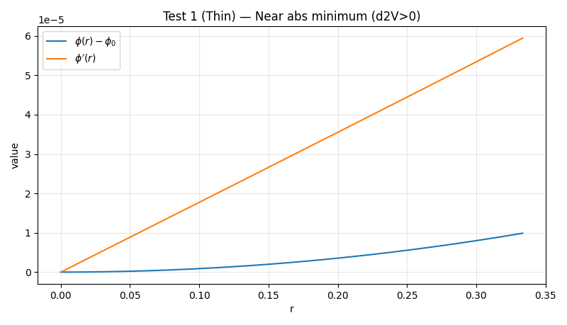

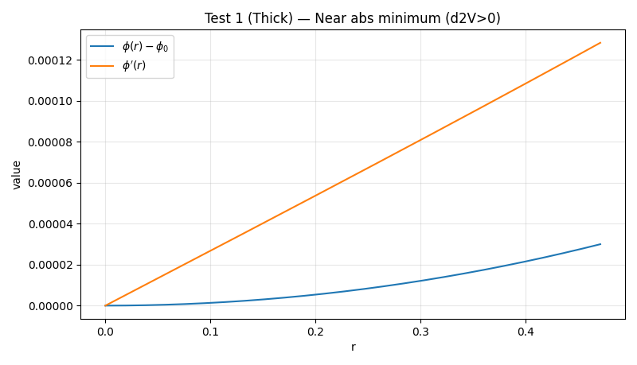

---

### Test 2 — Local solution near the barrier top (unstable curvature)

**What it shows**

* At the barrier top $(\phi_{\text{top}})$, $(V'(\phi_{\text{top}})\approx 0)$ and $(V''(\phi_{\text{top}})<0)$.
* `exactSolution` switches to the $(J_\nu)$ branch; the solution remains regular at (r=0) with $(\phi'(0)=0)$, 
* but the local shape reflects the inverted curvature.

**Expected result**

* Printed curvature satisfies $(d^2V(\phi_{\text{top}})<0)$ (up to near-flat numerical cases).
* Plots show a small-(r) “inverted” profile relative to $(\phi_{\text{top}})$, still smooth at the origin.

**Console excerpts (typical)**

```
=== Test 2: Local solution near barrier top (d2V < 0) ===
 Thin: phi_top=0.470000, dV(phi_top)=-1.268e-10, d2V(phi_top)=-2.491e-01
  Expectation: d2V < 0 → oscillatory (J_ν) behavior; still regular at r=0 with phi'(0)=0.

 Thick: phi_top=0.200000, dV(phi_top)=-2.250e-11, d2V(phi_top)=-1.600e-01
  Expectation: d2V < 0 → oscillatory (J_ν) behavior; still regular at r=0 with phi'(0)=0.
```

**Figure**

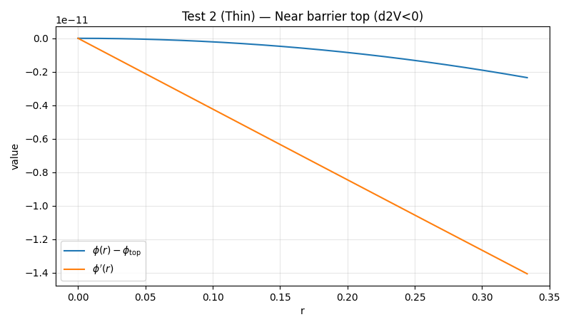

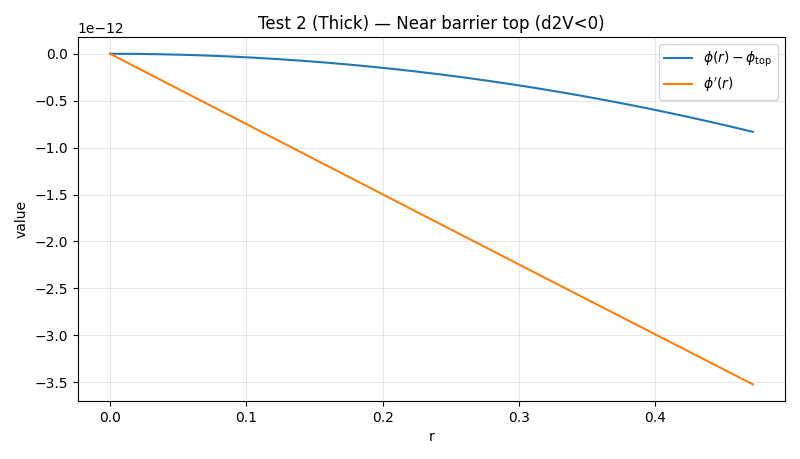


---

### Test 4 — `initialConditions`: pick $((r_0,\phi(r_0),\phi'(r_0)))$ and visualize the short path

**What it shows**

* Given an interior offset $(\Delta\phi_0)$ and a target cutoff $(|\Delta\phi(r_0)|)$, we solve for a practical $(r_0)$.
* The short trajectory from (r=0) to $(r=r_0)$ is plotted using the same local quadratic solution; the chosen starting point is marked.

**Expected result**

* $|\phi(r_0)-\phi_{\text{abs}}|\gtrsim $ cutoff.
* $sign(\phi'(r_0))=\operatorname{sign}(\Delta\phi_0)$.

**Console excerpts (typical)**

```
=== Test 4: initialConditions (r0, phi(r0), phi'(r0)) ===
 Thin: r0=1.667709e-03, phi(r0)=1.018316e+00, phi'(r0)=5.685050e-06
  Expectation: |phi(r0)-phi_absMin| ≳ cutoff, and phi'(r0) has the same sign as delta_phi0.

 Thick: r0=2.357023e-03, phi(r0)=1.018316e+00, phi'(r0)=1.199135e-05
  Expectation: |phi(r0)-phi_absMin| ≳ cutoff, and phi'(r0) has the same sign as delta_phi0.
```

**Figure**

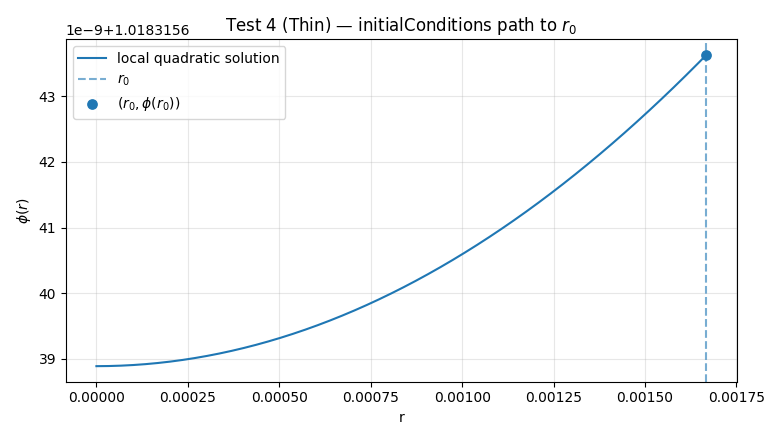

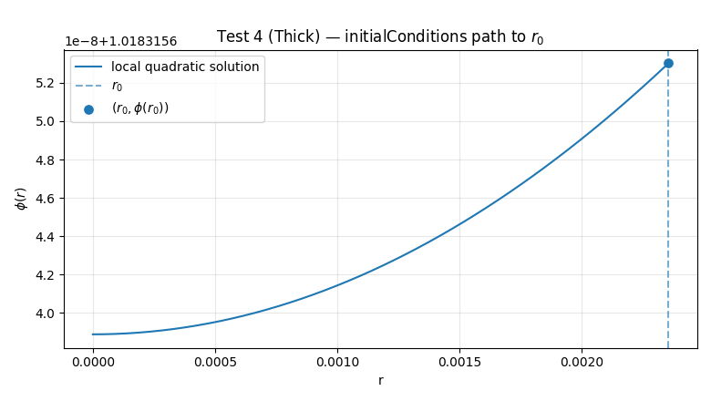

---

### Test 5 — `initialConditions` error path (unreachable cutoff)

**What it shows**

* If $(\Delta\phi_0=0)$ exactly (starting right at the true minimum) and the cutoff is strictly positive, 
* the local model never reaches the cutoff; the function raises a clear `IntegrationError`.

**Expected result**

* A caught `IntegrationError` with an informative message.

**Console excerpts (typical)**

```
=== Test 5: initialConditions error (unreachable cutoff) ===
 Thin: Caught expected IntegrationError:
   initialConditions: failed to bracket r0 (no crossing found).

 Thick: Caught expected IntegrationError:
   initialConditions: failed to bracket r0 (no crossing found).
   
---------- END OF TESTS: Lot SF-3 ----------
```

* For more context (potential, barrier, and scaling) see Lots **SF1** and **SF2** above.

---

## Lot SF-4 — ODE core (EOM, event detection, sampler)

**Goal.** Exercise the heart of the solver:

* The **equation of motion** (EOM) used everywhere:

$$\frac{d^2\phi}{dr^2} + \frac{\alpha}{r}\frac{d\phi}{dr} = b\frac{dV}{d\phi}(\phi)$$

  written as a first-order system in $(y=(\phi,\phi'))$.
* The **adaptive RKQS driver** that advances the solution and classifies steps as
  **undershoot** (turning point before reaching the false vacuum) or **overshoot**
  (crosses $(\phi_{\rm meta})$ within the step).
* The **sampler** that records $((\phi,\phi'))$ on a user grid (R) using cubic
  Hermite interpolation between accepted RK steps.

**Physics intuition.**

* For the bounce, the field starts near the **true** minimum $(\phi_{\rm abs})$ and tries to “climb” toward the **false** minimum $(\phi_{\rm meta})$.
* If it **turns around** $((\phi'\to 0))$ before it ever reaches $(\phi_{\rm meta})$, we say **undershoot**.
* If it **crosses** $(\phi_{\rm meta})$ at finite radius, that’s an **overshoot**.
* The friction term $(\alpha,\phi'/r)$ is large at small (r), so the outcome depends delicately on the starting offset and slope.

**Script:** `tests/tunneling1D/single_field/Lot_SF4.py`
**Run all examples in this lot:**

```bash
python -m tests.tunneling1D.single_field.Lot_SF4
```

We keep the same toy potentials as before:

$$\textbf{THIN}: \quad \tfrac14\phi^4 - 0.49\phi^3 + 0.235\phi^2$$

$$\textbf{THICK}: \quad \tfrac14\phi^4 - \tfrac{2}{5}\phi^3 + \tfrac{1}{10}\phi^2$$

**Notes on tolerances.** In the examples we build
$(\texttt{epsfrac}=[\texttt{phitol},\texttt{phitol}])$ and
$(\texttt{epsabs}=[\texttt{phitol}\cdot|\Delta\phi|,\texttt{phitol}\cdot|\Delta\phi|/r_{\rm scale}])$.
If you see a “step size underflow” in thin-wall cases, relaxing to `phitol=1e-4` is often enough.

---

### Test B — Thin-wall: event detection (two undershoots)

**What this shows**

* How `integrateProfile` detects **turning points** on a thin-wall potential.
* Two runs with different “shooting” parameters (x) (mapped internally to the initial offset $(\Delta\phi_0 = e^{-x}(\phi_{\rm meta}-\phi_{\rm abs})))$.
* For this potential and the chosen cutoff, both choices typically **undershoot** (large friction and small initial energy).

**Expected outcome**

* Printed classification: `undershoot` in both panels, with an event radius $(r_{\rm evt})$ where $(\phi'(r_{\rm evt})\approx 0)$.
* Plots show $(\phi(r))$ decreasing from near (\phi_{\rm abs}), then flattening at the turning point before reaching $(\phi_{\rm meta})$ (dashed line).

**How the figure is built**

* We integrate until the event is detected, then call `integrateAndSaveProfile` to **sample** $(\phi(r))$ densely up to $(r_{\rm evt})$.
* The event is marked with a vertical dotted line and a dot at $((r_{\rm evt},\phi(r_{\rm evt})))$.

**Console excerpt**

```
=== Test B: Event detection on thin-wall potential ===
[thin-wall :: x=6.00] event = undershoot at r=1.566617e+01 (phi=2.441311e-01, dphi=6.852158e-17)
[thin-wall :: x=0.20] event = undershoot at r=1.046569e-02 (phi=1.812700e-01, dphi=1.498745e-04)
```

**Figure**
*Thin-wall: two trajectories that undershoot (turning point before the false vacuum).*

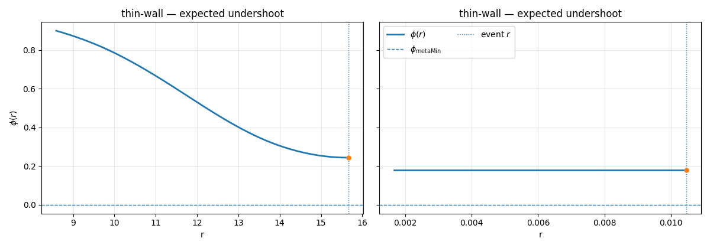

---

### Test C — Thick-wall: one undershoot, one overshoot

**What this shows**

* On the thick-wall potential, different (x) give **opposite outcomes**:

  * A smaller initial offset (low energy) → **undershoot**;
  * A larger offset (high energy) → **overshoot** (crossing of $\phi_{meta}$ ).

**Expected outcome**

* Left panel: `undershoot` with $(\phi'(r_{\rm evt})\approx 0)$ at finite (r), and $(\phi(r))$ still above $(\phi_{\rm meta})$.
* Right panel: `overshoot` with a detected root of $(\phi(r)-\phi_{\rm meta}=0)$; the crossing point is annotated.

**Console excerpt**

```
=== Test C: Event detection on thick-wall potential ===
[thick-wall :: x=0.20] event = undershoot at r=4.714045e-03 (phi=1.812693e-01, dphi=4.642159e-06)
[thick-wall :: x=6.00] event =  overshoot at r=1.218941e+01 (phi=-4.989932e-15, dphi=-1.713411e-01)
```

**Figure**
*Thick-wall: undershoot (left) and overshoot (right); both events detected and marked.*
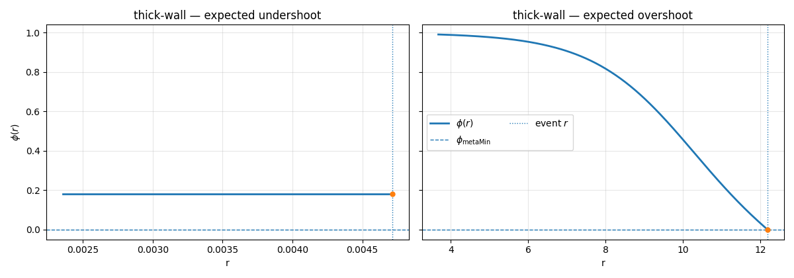


---

### Test D — Sampling with `integrateAndSaveProfile` on a user grid

**What this shows**

* You provide a **monotone grid** $(R={r_i})$ and a starting state $((r_0,\phi(r_0),\phi'(r_0)))$.
* The solver advances with adaptive RK and **fills every requested point** using **cubic Hermite** interpolation (the same shape preserved internally for events).

**Expected outcome**

* A smooth curve $(\phi(r))$ across the whole user grid.
* `Rerr` is `None` in typical runs; if the step would fall below `drmin`, the step is clamped and `Rerr` reports the **first** radius where this happened.

**Console excerpt (paste your run)**

```
=== Test D: integrateAndSaveProfile on a user R-grid ===
Profile sampled at 300 points.
Rerr (first clamped step radius) = None
```

**Figure**
*“Sampling $\phi(r)$ on a fixed grid provided by the user.*


---

### Test F — Explicit initial conditions (thin-wall)

**What this shows**

* Instead of deriving $((r_0,\phi(r_0),\phi'(r_0)))$ from a shooting parameter (x), we **set them explicitly** to demonstrate that the event classification logic does not depend on how the initial state was chosen.
* Two examples:

  * A gentle start near the true minimum with a small negative slope → often **undershoot**.
  * A more aggressive start with sizable downhill slope → tends to **overshoot** (depending on details of the potential and tolerances).

**Expected outcome**

* Clear printed event classification with the detected $(r_{\rm evt})$.
* Plots up to the event look consistent with the classification (turning point vs. crossing).

**Console excerpt (paste your run)**

```
=== Test F: Explict Initial Conditions on thin-wall potential ===
[thin-wall :: x=[0.001, [0.9, -0.1]]] event = undershoot at r=1.045860e+01 (phi=3.544355e-01, dphi=0.000000e+00)
[thin-wall :: x=[1, [0.3, -2]]] event =  overshoot at r=1.176781e+00 (phi=-1.040834e-17, dphi=-1.439106e+00)
---------- END: Lot SF-4 examples ----------
```

**Figure**
*Thin-wall with explicit initial states: undershoot (left) and overshoot (right).*
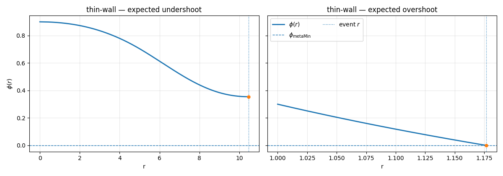

---

**See more:** full executable script at
[`tests/single_field/Lot_SF4.py`](/tests/tunneling1D/single_field/Lot_SF4.py).

---

## Lot SF-5 — Profile search (`findProfile`)

**Goal.** Demonstrate the full **overshoot/undershoot** shooting procedure that determines the instanton profile $( \phi(r) )$,
and show how two knobs—`thinCutoff` and the optional “interior fill”—affect only the very small-( r ) part of the curve in thin-wall situations.

*Solver recap (physics):* We want the regular (non-singular) solution that starts near the true minimum $( \phi_{\rm abs} )$ at ( r=0 ) and asymptotes to the false minimum $( \phi_{\rm meta} )$ as $( r\to\infty )$. 
`findProfile` varies the “shooting” parameter ( x ) (equivalently $( \Delta\phi_0 \propto e^{-x} )$ ) 
and repeatedly integrates the ODE.

* If the trajectory **crosses** $( \phi_{\rm meta} )$ within a step ⇒ **overshoot** (initial kick too large).
* If it **turns around** (hits $( \phi'(r)=0 )$ ) before reaching $( \phi_{\rm meta} )$ ⇒ **undershoot** (kick too small).
  Bisection on ( x ) lands on the unique critical trajectory; then the profile is sampled densely.

See the full, executable script here: [`tests/tunneling1D/single_field/Lot_SF5.py`](/tests/tunneling1D/single_field/Lot_SF5.py).

For all examples we reuse the same toy potentials:

$$\textbf{THIN:}\quad \tfrac{1}{4}\phi^4 - 0.49,\phi^3 + 0.235,\phi^2$$

$$\textbf{THICK:}\quad \tfrac{1}{4}\phi^4 - \tfrac{2}{5}\phi^3 + \tfrac{1}{10}\phi^2$$

with $( \phi_{\rm abs}=1 )$ and $( \phi_{\rm meta}=0 )$, and $( \alpha=2 )$ (O(3) bounce).

**Script:** `tests/tunneling1D/single_field/Lot_SF5.py`
**How to run just this lot**

```bash
python -m tests.tunneling1D.single_field.Lot_SF5
```

---

### Test 1 — Legacy demo: thin & thick walls (default settings)

**What this shows**

* A faithful reproduction of the legacy quick-start: one call per potential,

```
  profile = SingleFieldInstanton(1.0, 0.0, V, dV).findProfile()
```

  and a plot of $( \phi(r) )$.
* Horizontal guides at $( \phi_{\rm abs} )$ and $( \phi_{\rm meta} )$ for context.
* Console diagnostics: start/end radii, terminal residual $( |\phi(r_f)-\phi_{\rm meta}| )$.

**Physical expectations**

* **Thin-wall**: The field sits near $( \phi_{\rm abs} )$ until a relatively sharp transition (“thin” wall) then approaches $( \phi_{\rm meta} )$.
* **Thick-wall**: Transition is more gradual; the wall is “thicker.”
* Both runs should converge without manual tuning (defaults are chosen to be robust).

**Paste your console excerpt here**

```
=== Test 1: Legacy demo — thin & thick walls ===
=== Test 1: Legacy demo — thin & thick walls ===
[thin-wall] profile: R[0]=0.000000e+00, R[-1]=6.193054e+01
         φ(r0)=1.000000e+00, φ(rf)=-1.857581e-04, |φ(rf)-φ_meta|=1.858e-04, φ'(rf)=-1.679e-04
         Rerr=None

[thick-wall] profile: R[0]=0.000000e+00, R[-1]=2.089406e+01
         φ(r0)=7.420233e-01, φ(rf)=9.449128e-06, |φ(rf)-φ_meta|=9.449e-06, φ'(rf)=-1.251e-04
         Rerr=None
```

**Figure**
*“findProfile — legacy thin/thick demos; horizontal guides at $\phi_{abs}$ and $\phi_{meta}$.”*
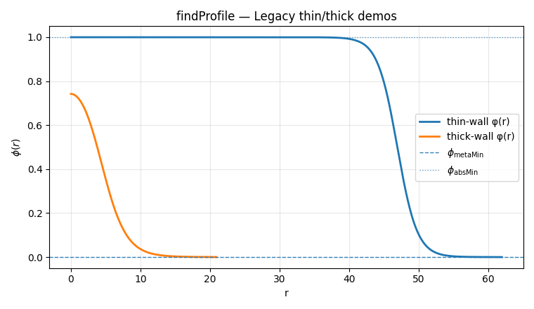

---

### Test 2 — Sensitivity to `thinCutoff` and interior fill (thin wall)

**What this shows**

* Two thin-wall profiles with identical physics but different handling of the **tiny-radius** region:

  * **Case A:** `thinCutoff=0.01`, `max_interior_pts=None` (default). The solver places synthetic points inside the bubble using the local quadratic solution to illustrate the smooth $( r\to0 )$ behavior.
  * **Case B:** `thinCutoff=0.15`, `max_interior_pts=0`. We start farther from the origin (bigger cutoff) and **disable** interior fill, so the curve begins at $( r=r_0>0 )$.

**Physical expectations**

* The two curves should **match** once ( r ) is beyond the artificially chosen $( r_0 )$. Only the very small-( r ) portion differs—this is numerical bookkeeping, not different physics.
* The terminal residual and action should be essentially unchanged; only $( r_0 )$ and the early segment of $( \phi(r) )$ shift.

**Paste your console excerpt here**

```
=== Test 2: Sensitivity to thinCutoff and interior fill (thin wall) ===
[thin (A: thinCutoff=0.01, interior ON)] profile: R[0]=0.000000e+00, R[-1]=6.323233e+01
         φ(r0)=1.000000e+00, φ(rf)=-2.498747e-20, |φ(rf)-φ_meta|=2.499e-20, φ'(rf)=-1.572e-05
         Rerr=None

[thin (B: thinCutoff=0.15, interior OFF)] profile: R[0]=3.469565e+01, R[-1]=5.052437e+01
         φ(r0)=8.500000e-01, φ(rf)=1.395670e-04, |φ(rf)-φ_meta|=1.396e-04, φ'(rf)=4.599e-18
         Rerr=None
```

**Figure**
*Effect of `thinCutoff` & interior fill in a thin-wall case — curves overlay for $r \gtrsim r_0$.*


---

## Lot SF-6 — Action & post-processing

**Goal.** Take a computed bounce profile and extract physically meaningful, easy-to-compare summaries:

* Total Euclidean action via `findAction`.
* A full **action breakdown** (kinetic, potential, interior bulk) and **per-r densities** via `actionBreakdown`.
* A **uniform φ-grid** view of the wall via `evenlySpacedPhi`.
* **Wall geometry** (location and thickness) via `wallDiagnostics`.
* Order-of-magnitude **β-proxies** via `betaEff` (`rscale`, `curvature`, `wall`).

We continue to use the same benchmark potentials as in earlier lots:

$$\textbf{THIN:}\quad V(\phi)=\tfrac14\phi^4 - 0.49\phi^3 + 0.235\phi^2 $$

$$ \textbf{THICK:}\quad V(\phi)=\tfrac14\phi^4 - 0.40\phi^3 + 0.10\phi^2 $$

with $(\phi_{\rm abs}=1)$ (true vacuum) and $(\phi_{\rm meta}=0)$ (false vacuum).

**Script:** `tests/tunneling1D/single_field/Lot_SF6.py`
**Run all examples:**

```bash
python -m tests.tunneling1D.single_field.Lot_SF6
```

---

### Test A — Action & density breakdown

**What this shows**

* For each potential, we compute the profile, then:

  * `findAction(profile)` → total Euclidean action (S).
  * `actionBreakdown(profile)` → numerical values of (S_{\rm kin}), (S_{\rm pot}), interior bulk, and arrays of per-r **densities**:

$$\text{kin density}=\tfrac12(\phi')^2r^{\alpha}\Omega_\alpha $$

$$\text{pot density}=\big[V(\phi)-V(\phi_{\rm meta})\big]r^{\alpha}\Omega_\alpha$$

* Plots of the densities vs (r) highlight **where** the action accumulates (typically in the wall).

**Expected outcome (physics)**

* The **thin-wall** case shows a **narrow, high** density peak (sharper wall).
* The **thick-wall** case shows a **broader** distribution (wall spread out).
* Console check: $(S_{\rm total}\approx S_{\rm kin}+S_{\rm pot}+S_{\rm interior})$ (within numerical accuracy).

**Example console excerpt**

```
=== Test A: Actions and density breakdown ===
[thin-wall]
  S_total    = 1.093093e+03
   S_kin     = 1.639021e+03
   S_pot     = -5.459281e+02
   S_interior= 0.000000e+00
  (check) S_kin + S_pot + S_interior = 1.093093e+03
[thick-wall]
  S_total    = 6.630329e+00
   S_kin     = 9.946114e+00
   S_pot     = -3.315785e+00
   S_interior= 0.000000e+00
  (check) S_kin + S_pot + S_interior = 6.630329e+00
```

**Figure**
*“Action densities vs (r): thin (left) and thick (right). The peak localizes around the wall.”*
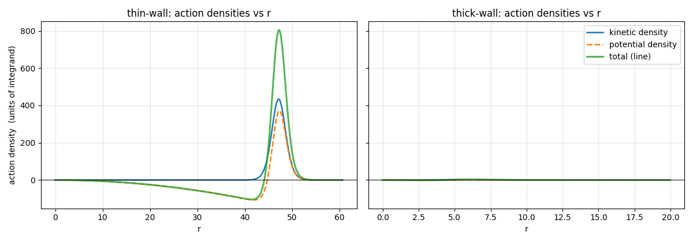

---

### Test B — Uniform φ-grid resampling (`evenlySpacedPhi`)

**What this shows**

* We resample $((\phi,\phi'))$ on an **evenly spaced grid in $(\phi)$** rather than (r):

  * This gives a clean, potential-centric view of the wall: $(d\phi/dr)$ vs $(\phi)$.
  * Helpful to compare how quickly the field *sweeps* through field space.

**Expected outcome (physics)**

* Thin-wall: a **sharper feature** in $(d\phi/dr)$ near mid-$(\phi)$ (rapid transition).
* Thick-wall: a **smoother, broader** shape in $(d\phi/dr)$ across $(\phi)$.

**Figure**
*“Resampled $(d\phi/dr)$ vs $(\phi)$: thin and thick. Both curves start/end with zero slope at the vacua.”*
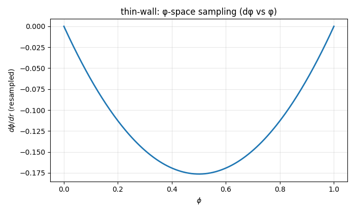


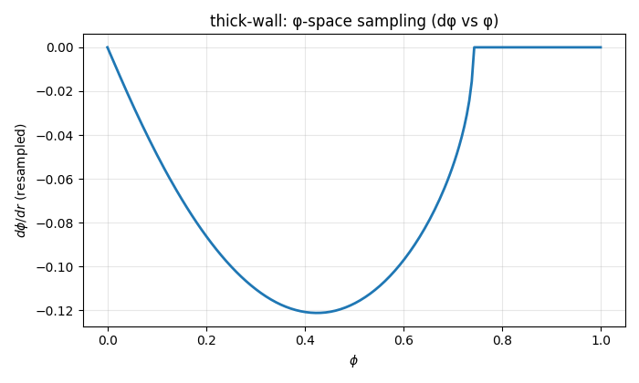


---

### Test C — Wall diagnostics (location & thickness)

**What this shows**

* `wallDiagnostics(profile, frac=(0.1,0.9))` reports:

  * `r_peak`: where $(|\phi'|)$ is maximal (wall center),
  * `r_lo`/`r_hi`: radii where $(\phi)$ reaches 10% and 90% of the total excursion,
  * `thickness` = $(|r_{\rm hi}-r_{\rm lo}|)$
  * `r_mid`: where $(\phi)$ is halfway between the vacua.

**Expected outcome (physics)**

* Thin-wall → **smaller** thickness; `r_peak` between `r_lo` and `r_hi`.
* Thick-wall → **larger** thickness; markers spaced farther apart.

**Example console excerpt**

```
=== Test C: Wall diagnostics (location & thickness) ===
[thin-wall] r_peak=4.706284e+01, r_mid=4.707676e+01, r_lo=4.396172e+01, r_hi=5.019140e+01, thickness=6.229675e+00 (phi_lo=0.900, phi_hi=0.100)
[thick-wall] r_peak=4.399554e+00, r_mid=3.787229e+00, r_lo=0.000000e+00, r_hi=7.990970e+00, thickness=7.990970e+00 (phi_lo=0.900, phi_hi=0.100)
```

**Figure**
*“(\phi(r)) with vertical markers at `r_lo`, `r_mid`, `r_hi`, and `r_peak`.”*
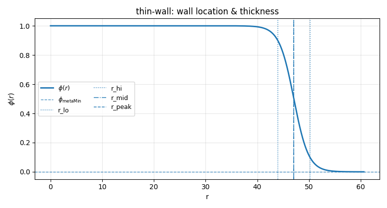


---

### Test D — $(\beta_{\rm eff})$ proxies: `rscale` vs `curvature` vs `wall`

**What this shows**

We compare three quick *inverse-length* scales (proxies for a nucleation timescale):

1. **`rscale`**: $(\beta_{\rm eff}=1/r_{\rm scale})$ (always defined, robust).
2. **`curvature`**: $(\beta_{\rm eff}=\sqrt{|V''(\phi_{\rm top})|})$ (requires a well-defined barrier top).
3. **`wall`**: $(\beta_{\rm eff}=1/\text{thickness})$ (from `wallDiagnostics`).

**Expected outcome (physics)**

* Thin-wall: **larger** $(\beta_{\rm eff}(\text{wall}))$ (thinner wall → shorter scale).
* `rscale` and `curvature` are often comparable within $(\mathcal{O}(1))$ factors.
* Thick-wall: all three proxies tend to be **smaller**.

**Example console excerpt**

```
=== Test D: β_eff proxies (rscale, curvature, wall) ===
[thin-wall] β_rscale=5.996249e-01, β_curv=4.990992e-01, β_wall=1.605220e-01
[thick-wall] β_rscale=4.242641e-01, β_curv=4.000000e-01, β_wall=1.251412e-01
---------- END: Lot SF-6 examples ----------
```

**Figure**
*“Grouped bars of $(\beta_{\rm eff})$ for thin vs thick, comparing the three proxies.”*
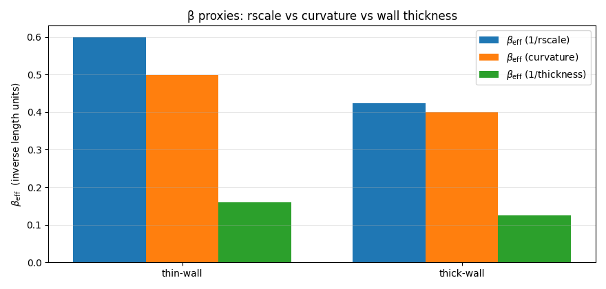

---

**See the full, executable script for this lot here:**
[`tests/single_field/Lot_SF6.py`](/tests/tunneling1D/single_field/Lot_SF6.py)

*Tip:* When comparing different models or temperatures, keep the **same plotting and diagnostics** so differences in actions, wall thickness, and $(\beta_{\rm eff})$ are immediately visible and quantitatively comparable.
