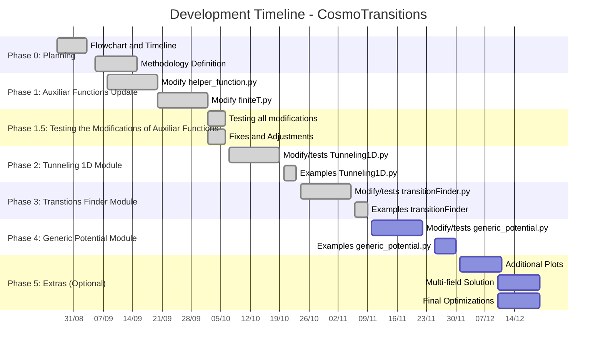
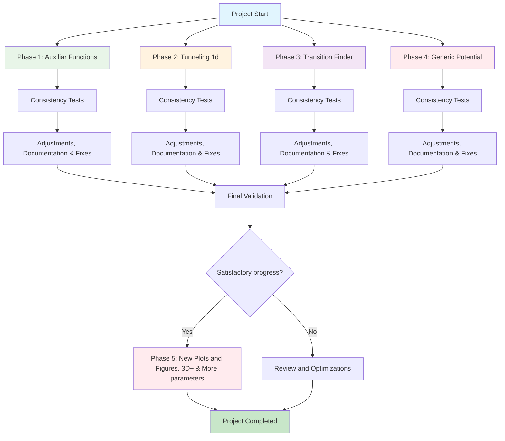

# 📅 Roadmap & Schedule

**Approach**: The project’s timeline and flowchart are presented below. The main idea is to split this long task into four primary phases, each lasting up to ~2 weeks, while running consistency tests throughout development and after finishing each phase. Each phase follows the cycle: Modification → Testing → Fixes → Validation.

- See also: [Architecture & Module Flow](architecture.md)

---
## Phases (overview)
  The **first phase** aims to update CosmoTransition's **auxiliary modules**, which are called by the main modules. The **second phase** and **third phase**, the codes that find the bounce solution and the thermodynamic parameters (**two main modules**). Finally, the **fourth and final phase** aims to modify the functions that create the **generic potential** and the plots generated given the initial parameters. Everything will be done for the 1D part for now; the 2D part will remain as before.

Depending on the progress of the project, a **fifth phase** will be carried out to add new plots and graphs to the code, as well as update the part that calculates multiple fields.

---

## 📖 Documentation & Recommended Reading (pre-modifications)
Before modifying any module, consult the official documentation and/or the original paper to understand the algorithms:

- **Official Documentation:**[https://clwainwright.net/CosmoTransitions/index.html](https://clwainwright.net/CosmoTransitions/index.html)
- **Original Paper (arXiv):** [arXiv:1109.4189](https://arxiv.org/abs/1109.4189)
- **Computer Physics Communications:** [10.1016/j.cpc.2012.04.004](https://doi.org/10.1016/j.cpc.2012.04.004)

---
## Project Timeline

---

## Milestones & Checklist
- [x] **Phase 0**: Planning and first meeting 
  - [x] Create dependency flowchart 
  - [x] Create refactoring schedule 

- [x] **Phase 1**: Auxiliary functions 
  - [x] Refactor `helper_functions.py`
  - [x] Refactor `finiteT.py`

- [x] **Phase 1.5**: Modification tests 
  - [x] Validate isolated functions with simple analytic examples  
  - [x] exercise error paths and validations

- [x] **Phase 2**: Tunneling 1D Core Module 
  - [x] Refactor `tunneling1D.py` 
  - [x] Examples modernized `tunneling1D.py` 

- [x] **Phase 3**: Transtions Finder Core Module 
  - [x] Refactor `transtionFinder.py` 
  - [x] Test modernized `transtionFinder.py`

- [ ] **Phase 4**: Generic Potential Core Module  
  - Refactor `generic_potential.py` 
  - Test modernized `generic_potential.py`
  - Run all old examples and validate cosistency between versions

- [ ] **Phase 5** *(optional)*: Extensions
  - Update plotting, add energy density and other figures useful for paper/thesis and other parameters
  - New plot types (e.g., direct GW spectrum, GW energy density vs T, etc.) 
  - Modernize multi-field plotting codes `mult_field_plotting.py` and `path_deformation.py`
---

