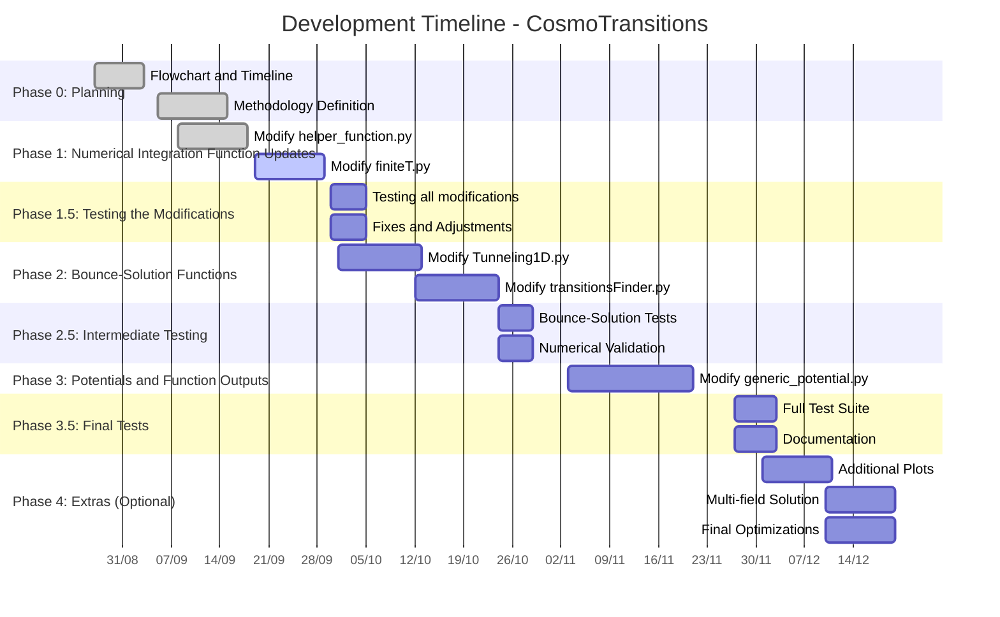
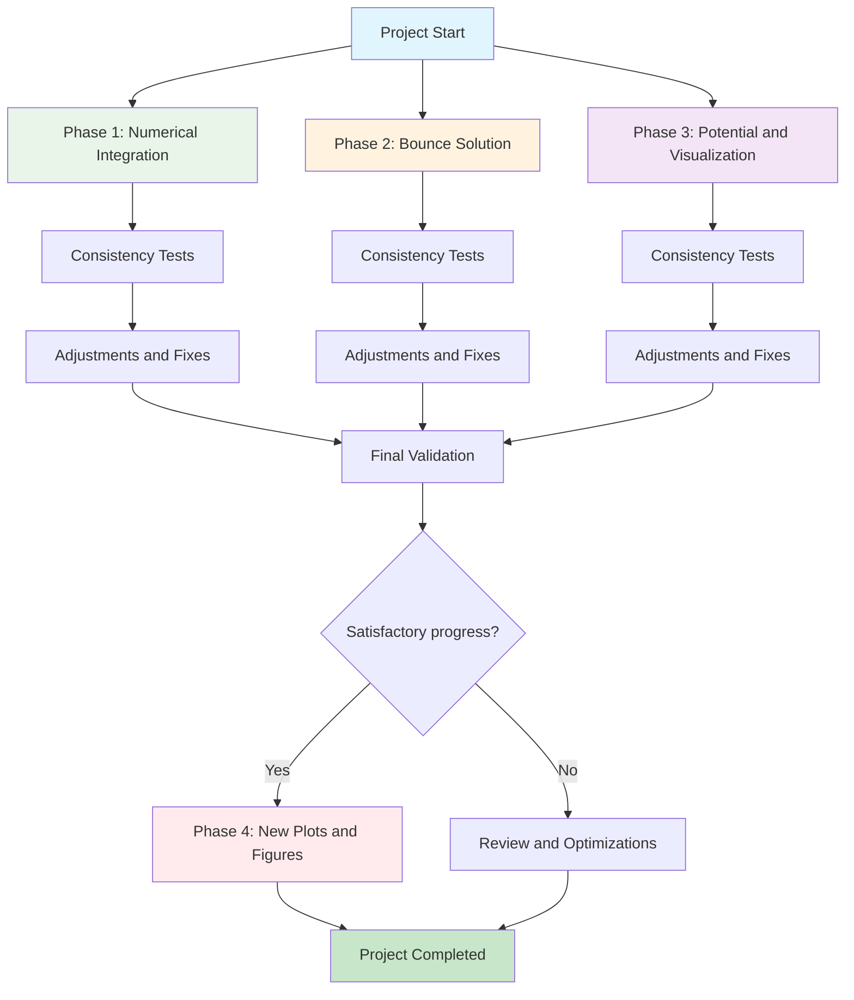

📅 Schedule & Approach: The project’s timeline and flowchart are presented below. The main idea is to split this long task into three primary phases, each lasting up to one month, while running consistency tests throughout development and after finishing each phase. Each phase follows the cycle: Modification → Testing → Fixes → Validation.

The first phase aims to update CosmoTransition's auxiliary modules, which are called by the main modules. The second phase, the codes that find the bounce solution and the thermodynamic parameters (two main modules). Finally, the third and final phase aims to modify the functions that create the generic potential and the plots generated given the initial parameters. Everything will be done for the 1D part for now; the 2D part will remain as before.

Depending on the progress of the project, a fourth phase will be carried out to add new plots and graphs to the code, as well as update the part that calculates multiple fields.

### 📖 Documentation & Recommended Reading (pre-modifications)
Before modifying any module, consult the official documentation and/or the original paper to understand the algorithms:

* **Official Documentation:**[https://clwainwright.net/CosmoTransitions/index.html](https://clwainwright.net/CosmoTransitions/index.html)
* **Original Paper (arXiv):** [arXiv:1109.4189](https://arxiv.org/abs/1109.4189)
* **Computer Physics Communications:** [10.1016/j.cpc.2012.04.004](https://doi.org/10.1016/j.cpc.2012.04.004

## Project Timeline

- [x] **Phase 0**: Planning and first meeting 
  - Create dependency flowchart 
  - Create refactoring schedule 

- [ ] **Phase 1**: Numrical core (auxiliary functions) 
  - Refactor `helper_functions.py` 
  - Refactor `finiteT.py`

- [ ] **Phase 1.5**: Modification tests 
  - Validate isolated functions with simple analytic examples  
  - exercise error paths and validations

- [ ] **Phase 2**: Bounce solution and transition parameters 
  - Refactor `tunneling1D.py`  
  - Improve `transitionFinder.py` (more efficiente search algorithms)  

- [ ] **Phase 2.5**: Intermediate tests  
  - Reproduce example results (`fullTunneling.py`)  
  - Compare critical actions with the legacy version 

- [ ] **Phase 3**: Potential and outputs  
  - Modernize `generic_potential.py` 
  - Update plotting, add energy density and other figures useful for paper/thesis

- [ ] **Phase 3.5**: Final tests
  - Run all examples and validate cosistency 
  - Create notebooks replacing scripts

- [ ] **Phase 4** *(optional)*: Extensions
  - New plot types (e.g., direct GW spectrum, GW energy density vs T, etc.) 
  - Modernize multi-field plotting codes `mult_field_plotting.py` and `path_deformation.py`

