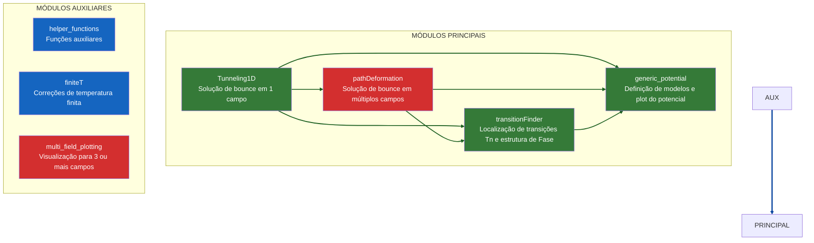
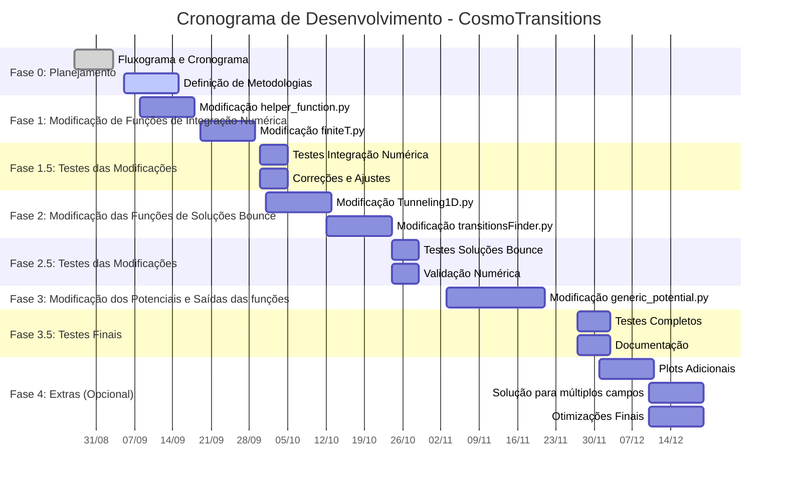
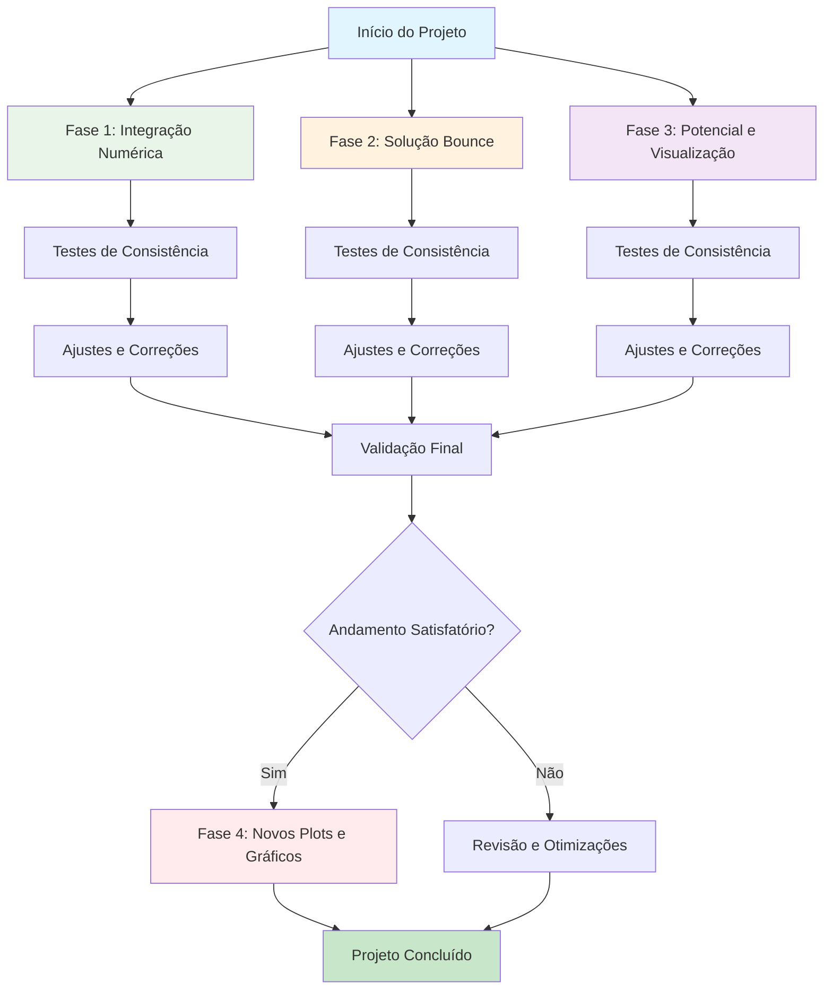

## Flowchart of the modules

## Cronograma do Projeto

- [x] **Fase 0**: Planejamento e Primeira reunião 
  - Criar fluxograma de dependências  
  - Criar cronograma de refatoração  

- [ ] **Fase 1**: Núcleo numérico (Funções auxiliáres) 
  - Refatorar `helper_functions.py` (usar SciPy para integrais e raízes)  
  - Vetorizar `finiteT.py` (substituir loops por NumPy e atualizar correções)  

- [ ] **Fase 1.5**: Testes de Modificações  
  - Validar funções isoladas com exemplos analíticos simples  
  - Comparar saídas numéricas com versão original  

- [ ] **Fase 2**: Solução do bounce e parâmetros de transição  
  - Refatorar `tunneling1D.py` (usar `scipy.solve_ivp` no solver ODE)  
  - Melhorar `transitionFinder.py` (algoritmos de busca mais eficientes)  

- [ ] **Fase 2.5**: Testes intermediários  
  - Reproduzir resultados dos exemplos (`fullTunneling.py`)  
  - Comparar ações críticas com versão antiga  

- [ ] **Fase 3**: Potencial e saídas  
  - Modernizar `generic_potential.py` (usar `abc.ABC` para interface clara)  
  - Atualizar gráficos plotados, acrescentar densidade de energia e outros úteis para o artigo/tese 

- [ ] **Fase 3.5**: Testes finais  
  - Rodar todos os exemplos e validar consistência  
  - Criar notebooks substituindo scripts  

- [ ] **Fase 4** *(opcional)*: Extensões
  - Novos tipos de plots (ex.: espectro GW direto, densidade de GW no espaço para diferentes T e outros)  
  - Modernizar os códigos que fazem plots para múltiplos campos `mult_field_plotting.py` e `path_deformation.py`

**Problemas ainda em aberto:** Decidir como será testado as modificações, i.e, como iremos comparar o antigo código com o novo que estamos fazendo e termos um teste de consistência. Ideia inicial é:
  - Teste 1: Dentro da própria módulo modificado fazer um teste simples que chamem a função e deem um resultado comparativo de antes e depois do seu output
  - Teste 2: Testar o exemplo de modelo simples, do próprio cosmotransitions
  - Teste 3: Comparar gráficos da forma do potencial antes e depois da modificação e observar as alterações. Possivelmente testar modelos conhecidos como o do próprio artigo do Glauber.

